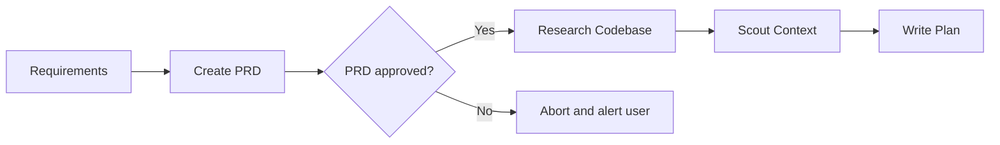
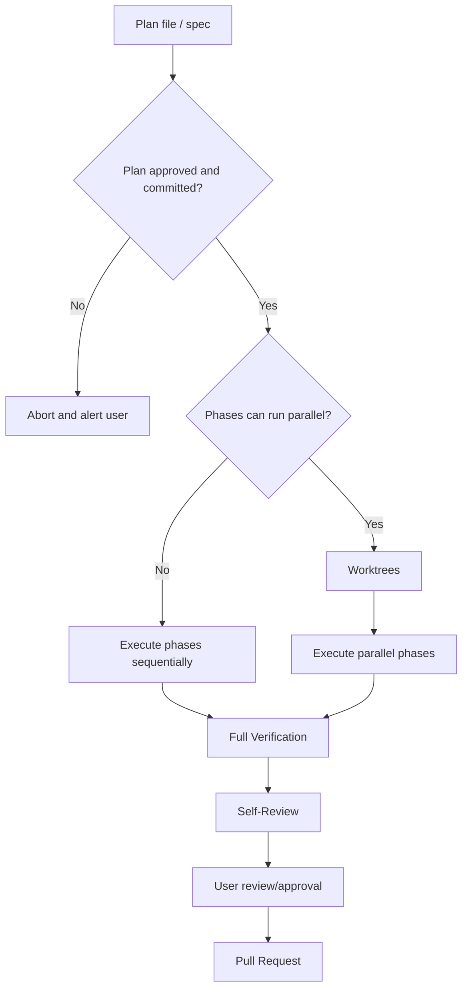

# dangerpowers

> Actually, my name is Dave Powers. Danger is my middle name.

Dissecting popular frameworks like superpowers and building my own - to learn and to implement a process tailored to my own preferences.

---

**STATUS**: About 75% done with the skills and workflows I wanted for this project, but discovered some issues that prevent this library from being useful on other projects besides this very repository.

I moved all of the old skill definitions to `skills.old` directory and I'm currently folding them back into the proper `skills` directory one-at-a-time, starting with an improved `writing-skills`.

---

## Motivation

When I first installed [superpowers](https://github.com/obra/superpowers), I was amazed by how consistently the skills fired, and how well they enforced the operational rules without the AI rationalizing or working around the constraints and rules.

The skills I had written before would not fire consistently (especially across models), and the AI would frequently chose to work around the operational policy rules and prohibitions. This resulted in adding more and more instructions and corner-cases until the `SKILL.md` files started to grow out of control. Not only did this make my custom skills way more complex than they needed to be, it also did not solve the core problems of firing and following the process exactly.

But `superpowers` seems to be able to do this with relatively simple, concise skill definitions and metadata. So I started reading how their skills were organized, what important sections they contained, etc. Eventually, I came across their `writing-skills` skill, which had most of the skill design wisdom baked-in. This is where I learned about concepts like "pressure", "rationalization", "goal obsession", and prompt interpretation issues.

By adding `superpowers` to my agent, I suddenly had a solid, structured process that the AI naturally followed. An end-to-end system for planning, executing, and iterating on tasks, backed by actual research and real-world experience.

Then I watched a presentation from `humanlayer`: [Advanced Context Engineering for Coding Agents](https://www.humanlayer.dev/blog/advanced-context-engineering). They describe a system that is designed specifically for large and complex codebases, which is where I've been having the most trouble producing results that are actually satisfying. This process involves researching and scouting the codebase and building a detailed spec, which takes out decision making at implementation time, that a human must review and approve. They champion the concepts of "human in the loop" and "don't outsource your thinking."

I wanted something like `superpowers`, but with the planning and execution system described by `humanlayer`.

But, mostly, I wanted to take these skills apart and put them back together myself, so I can learn how and why they work, and any interesting concepts or idioms that I had not heard of.

---

## Workflows

I decided to implement the entire process with skills, like `superpowers`, but not to forcibly inject new rules into the system prompt, like `superpowers` does. Skills can be chained and composed into workflows and pipelines while still allowing you to use the individual skills independently or to stop/restart between steps.

Instead, we rely on the user to use specific trigger phrases or to tell the agent to invoke a skill by name. I've done trigger testing under multiple models to make sure these trigger on specific phrases but do not trigger on vague catch-all phrases like `superpowers` does.

Once the skills are in place we can develop custom agents for specialized tasks instead of running them in the main session, where the "general coding assistant" system prompt might conflict with the specific behavior we want that skill to follow.

### Writing Skills

The first step is to adapt how `superpowers` writes quality skills. Then we can use this to bootstrap all the skills in the library.

- Optimize descriptions to trigger consistently
- Preference to add rules as you see issues, vs over-specifying when you write the skill
- Classification of different skill 'types', which need different testing strategies
- Matching failure to form (how to word proposed improvements for best results)
- Close loopholes _explicitly_ - Don't just state the rule, forbid the workarounds
- Accounting for "rationalization" - "spirit-vs-letter" rules, rationalizations table
- Red-flags, so agents can self-check
- Adding validation to the description so agent can abort before loading the wrong skill
- Self-check verification lists the agent must complete before claiming to be 'done'
- Test discipline with "Iron Laws" and pressure testing

I added another step, trigger testing, which is an automated process to verify how effectively the skills trigger when we want them to, and that they don't trigger when we don't want them.

#### Trigger Testing

#### Pressure Testing

#### Output Quality Testing

> TODO: See https://agentskills.io/skill-creation/evaluating-skills

### Primary Workflow

### Planning Pipeline:

### Execution Pipeline

## Skills

## Custom Agents
