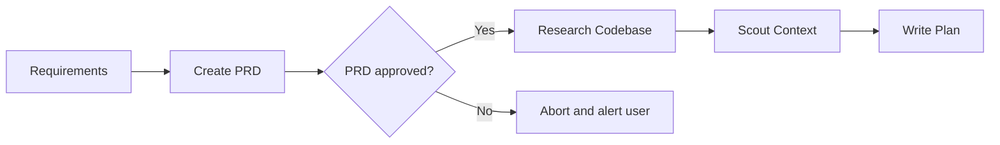
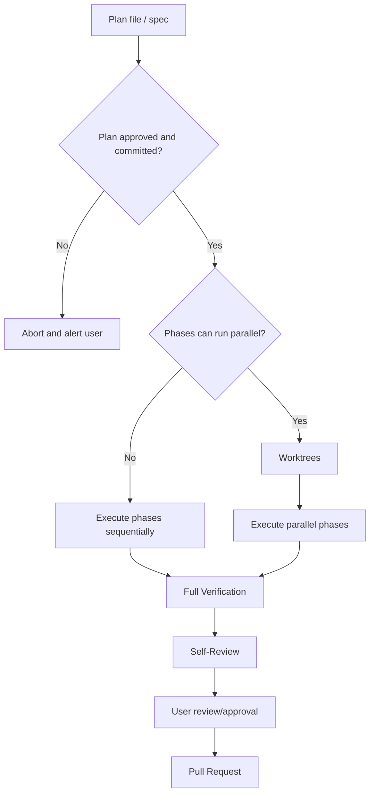

# dangerpowers

> Actually, my name is Dave Powers. Danger is my middle name.

Dissecting popular frameworks like superpowers and building my own - to learn and to implement a process tailored to my own preferences.

A "foundational" plugin for agentic coding: core development and orchestration system implemented as skills, inspired by `superpowers` and `humanlayer`.

I've also been writing about the concepts I've learned and applied along the way [in a series of blog-like documents](./docs/README.md).

## Motivation

When I first installed [superpowers](https://github.com/obra/superpowers), I was amazed by how consistently the skills fired, and how well they enforced the operational constraints without the AI rationalizing or working around the rules.

(Read about "rationalization" and why agents break your rules [here](./docs/rationalization-and-non-determinism.md)).

Then I watched a presentation from `humanlayer`: [Advanced Context Engineering for Coding Agents](https://www.humanlayer.dev/blog/advanced-context-engineering). They describe a system that is designed specifically for large and complex codebases, which is where I've been having the most trouble producing results that are actually satisfying. This process involves researching and scouting the codebase and building a detailed spec, which takes out decision making at implementation time, that a human must review and approve. They champion the concepts of "human in the loop" and "don't outsource your thinking."

I wanted a full end-to-end development system, designed to work on complex codebases, inspired by the `humanlayer` approach. I decided to implement a similar system of my own using a small collection of 'core' skills, and I would use the `superpowers` method of writing effective skills to do it.

The heart of this plugin is the `writing-skills` skill, based heavily off the `superpowers` skill by the same name. Every skill in this plugin is developed and tested using my own `writing-skills` plugin.

Core Skills (building blocks, auto-trigger, no orchestration):
- `writing-skills`
- `writing-prds`
- `writing-plans`
- `shaping-prompts`
- `iterating-plans`
- `isolating-worktrees`
- `researching-codebase`
- `scouting-context`
- `executing-plans`
- `reviewing-changes`

Orchestration skills (no auto-trigger):
- `writing-detailed-plans`
- `prd-to-plan`
- `plan-to-execution`
- `finalizing-implementation`

The scope of this plugin is intentionally very slim: these skills are intended to be loaded in EVER development session and not bloat your context window.

---

## Workflows

### Writing Skills

The first step is to adapt how `superpowers` writes quality skills. Then we can use this to bootstrap all the skills in the library.

(Read about writing effective skills [here](./docs/writing-skills/part-1/README.md)).

1. A _HUMAN_ writes an initial skill definition.
2. The `writing-skills` skill ensures the new skill follows established conventions.
3. A "trigger-testing" campaign tests and optimizes how well your skill description triggers.
4. A "pressure-testing" campaign test and optimizes how well your skill's discipline rules hold up when the agent is under pressure (countering "rationalization").

#### Trigger Testing

[TODO](./docs/writing-skills/part-2/README.md)

#### Pressure Testing

#### Output Quality Testing

> TODO: See https://agentskills.io/skill-creation/evaluating-skills

### Primary Workflow

The primary workflow implements an end-to-end development process using a series of orchestration skills that stop at key points to let the human approve or take over. This is a "human in the loop" system.

### Planning Pipeline:

Making a plan is the most important step in implementing a complex changes.

Planning philosophy:
- Detailed implementation plans with reference locations, diffs and code blocks, and exact commands to be run.
- Surface any decisions or assumptions the AI made during planning.
- Collect context about the project, architecture, conventions, etc.
- Produce plan files according to a consistent document template.
- Optionally, slice plans into phases and identify which phases could safely be run in parallel.

This philosophy ensures that a human can review the plan and correct any bad assumptions, decisions, or implementation details. It also guarantees that the agent session that implements the plan doesn't have to make any decisions or do any reasoning, just execute.

The `writing-plans` skill is kind of like planning mode in Claude Code or OpenCode. It follows the conventions I listed above but does not implement the full pipeline, described below, which can be quite token-intensive.

When you are working on a more complex codebase, especially a legacy or brownfield project, the plan becomes more important. My primary concern when it comes to AI-generated changes in a code base like this is preventing the agent from duplicating code or architectural constructs, and otherwise turning it from "legacy" to "slop" (which is worse). You can reduce this slopification process by systematically scouting ahead for details about architecture and conventions, and use that as part of the planning context.

Complex planning pipeline:

1. (Optional) `writing-prds`: Gather requirements, use-cases, and other product-related details and use this skill to flesh out a formal PRD document. The PRD must be reviewed and approved by a human before continuing.
2. `prd-to-plan`: Orchestrator skill that creates an implementation plan from a PRD document by enforcing a workflow and subagent dispatch process for the following core skills:
    a. `researching-codebase`: Analyzes the codebase architectural structure, conventions, and structure. Does not change anything. Does not suggest improvements. Only explains what currently exists. Produces a "research" bundle file and exits.
    b. `scouting-context`: Analyzes a "research" bundle and PRD, looks for gaps in the plan, verifies references/locations, tests that commands are valid, and several other concerns to produce a comprehensive "context" bundle.
    c. `writing-plans`: You can use this as a stand-alone skill for simple tasks, or you can invoke it with a context bundle. The planner doesn't have to do any research or context mining.
    d. The skill prompts the user for instructions on how to slice the plan into discreet phases, offering a suggested breakdown of its own.
    e. The resulting plan document needs to be reviewed and approved by a human before continuing.
    f. Use the `iterating-plans` skill to make changes to complex plan documents.

### Execution Pipeline

The planning pipeline did all the hard work. The execution pipeline is mostly about orchestrating subagents to execute the plan phases efficiently and doing thorough verification and quality review.

