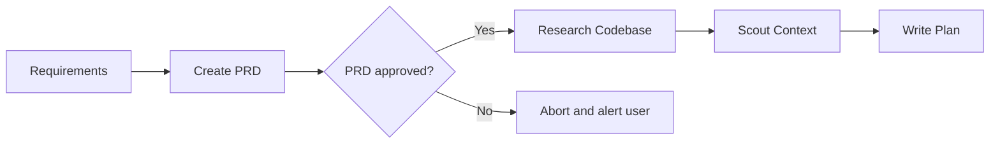
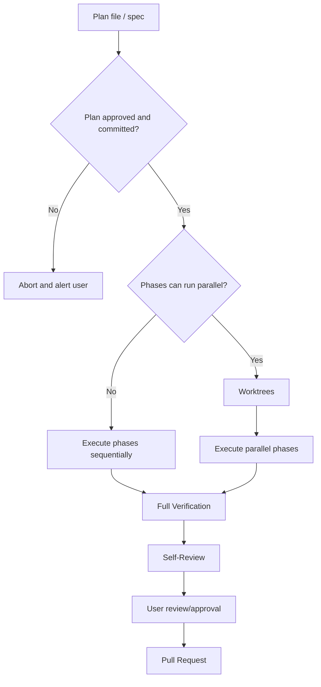

# dangerpowers

> Actually, my name is Austin Powers. Danger is my middle name.

## Motivation

This is intended to be a bespoke foundational, personal system and toolkit for agentic engineering. Similar in spirit to customizing your `vim` configuration, or your window manager, or your shell, etc. By putting everything together manually, I'm forced to learn every concept in detail.

I've also been writing about the concepts I've learned and applied along the way [in a series of blog-like documents](./docs/README.md). The main reason for writing these articles is to verify my own learning as I go. Trying to explain something concretely surfaces the areas where your mental model is weak or your domain knowledge is lacking. I can't say it makes me an industry expert, but it did a lot to refine my own mental models.

I wanted something like [superpowers](https://github.com/obra/superpowers) - effective skills and a system for writing and optimizing skills, and an end-to-end systematic agentic development flow. But I don't like the way superpowers injects itself into your system prompt. I just want to use the skills like commands, and I want to be able to override or disable actions that trigger superpowers skills.

I wanted a development flow more like what I read from [Advanced Context Engineering for Coding Agents](https://www.humanlayer.dev/blog/advanced-context-engineering), which has some really interesting ideas for working well with large, complex codebases. So I'm combining superpowers' skills system with a development flow based on humanlayer's advanced context engineering ideas.

## Objective

Primarily implemented as skills, bootstrapped by a 'writing-skills' skill and a suite of testing/optimization skills.

Most skills should be "commands" and not auto-invoked by the agent.

1. A system for writing and hardening skills. Skills are the primary method for extending the capabilities of a model or enforcing your own standards and conventions. Your skills need to be effective and reliable.
2. Planning and spec development. The better the plan, the better the results. The objective here is to provide multiple granularities of planning processes, depending on the scope of the changes, and to provide a full planning process that reduces slopification of large, complex codebases by identifying relevant architecture, conventions, code to reuse, etc.
3. Plan execution: from simple single-agent execution to complex multi-agent implementation pipeline.
4. A system for reviewing code - not just a standard code and security reviews, but also trying to counter some annoying agent habits, like comment hygine, duplication, bad type design, etc.
5. Reflection: reviewing and analyzing past sessions and suggesting optimizations to the processes, configuration, or agent rules.
6. Misc supporting skills, such as managing git worktrees and testing and optimizing skills.

---

## Workflows

### Writing Skills

The first step is to adapt how `superpowers` writes quality skills. Then we can use this to bootstrap all the skills in the library.

Read about writing effective skills [Writing Skills Deep Dive Part 1: Basics](./docs/writing-skills/part-1/README.md).

```mermaid
flowchart LR
    desc[Skill Definition]
    skills[writing-skills]
    trigger-test[Trigger Testing Campaign]
    retrieval-test[Retrieval Testing Campaign]
    shape-test[Shape Testing Campaign]
    pressure-test[Pressure Testing Campaign]

    desc --> skills
    skills --> trigger-test
    trigger-test --> retrieval-test
    retrieval-test --> shape-test
    shape-test --> pressure-test
```

1. A _human_ writes an initial skill definition.
2. The `writing-skills` skill ensures the new skill follows established conventions.
3. A "trigger-testing" campaign tests and optimizes how well your skill description triggers (only required if you want the skill to auto-trigger).
4. A "retrieval testing" campaign to verify your model can find and apply facts from your skill.
5. A "shape testing" campaign to verify your skill produces output that matches the requirements defined in your skill.
6. A "pressure testing" campaign to test and optimizes how well your skill's discipline rules hold up when the agent is under pressure (countering "rationalization").

Read about testing skills:
- [Writing Skills Deep Dive Part 2: Trigger Testing](./docs/writing-skills/part-2/README.md)
- [Writing Skills Deep Dive Part 3: Bulletproofing](./docs/writing-skills/part-3/README.md)

All of these test campaigns implement an ablation process - we run control groups without the skill rule/fact to verify every line of the skill is actually required, and delete things that are never needed.

### Primary Workflow

The primary workflow implements an end-to-end development process using a series of orchestration skills that stop at key points to let the human approve or take over. This is a "human in the loop" system.

```mermaid
flowchart LR
    spec[Create PRD]
    plan[Create Plan]
    exec[Execute Plan]
    verify[Full Verification]
    review[Self-Review]
    pr[Pull Request]
    reflect[Self-Reflection]

spec --> plan
plan --> exec
exec --> verify
verify --> review
review --> pr
pr --> reflect
```

### Planning Pipeline:

Making a plan is the most important step in implementing a complex changes.

Planning philosophy:
- Detailed implementation plans with reference locations, diffs and code blocks, and exact commands to be run.
- Surface any decisions or assumptions the AI made during planning.
- Collect context about the project, architecture, conventions, etc.
- Produce plan files according to a consistent document template.
- Optionally, slice plans into phases and identify which phases could safely be run in parallel.

This philosophy ensures that a human can review the plan and correct any bad assumptions, decisions, or implementation details. It also guarantees that the agent session that implements the plan doesn't have to make any decisions or do any reasoning, just execute.

The `writing-plans` skill is kind of like planning mode in Claude Code or OpenCode. It follows the conventions I listed above but does not implement the full pipeline, described below, which can be overkill for small or simple changes.

When you are working on a more complex codebase, especially a legacy or brownfield project, the plan becomes more important. My primary concern when it comes to AI-generated changes in a codebase like this is preventing the agent from duplicating code or architectural constructs, and otherwise turning it from "legacy" to "slop" (which is worse). You can reduce this slopification process by systematically scouting ahead for details about architecture and conventions, and use that as part of the planning context.

Complex planning pipeline:

```mermaid
flowchart LR
    reqs[Requirements]
    prd[Create PRD]
    research[Research Codebase]
    scout[Scout Context]
    plan[Write Plan]
    abort[Abort and alert user]

    reqs --> prd
    prd --> prd-approved{PRD approved?}
    prd-approved -->|Yes| research
    research --> scout
    scout --> plan

    prd-approved -->|No| abort
```

1. (Optional) `writing-prds`: Gather requirements, use-cases, and other product-related details and use this skill to flesh out a formal PRD document. The PRD must be reviewed and approved by a human before continuing.
2. `prd-to-plan`: Orchestrator skill that creates an implementation plan from a PRD document by enforcing a workflow and subagent dispatch process for the following core skills:
    1. `researching-codebase`: Analyzes the codebase architectural structure, conventions, and structure. Does not change anything. Does not suggest improvements. Only explains what currently exists. Produces a "research" bundle file and exits.
    2. `scouting-context`: Analyzes a "research" bundle and PRD, looks for gaps in the plan, verifies references/locations, tests that commands are valid, and several other concerns to produce a comprehensive "context" bundle.
    3. `writing-plans`: You can use this as a stand-alone skill for simple tasks, or you can invoke it with a context bundle. The planner doesn't have to do any research or context mining.
    4. The skill prompts the user for instructions on how to slice the plan into discreet phases, offering a suggested breakdown of its own.
    5. The resulting plan document needs to be reviewed and approved by a human before continuing.
    6. Use the `iterating-plans` skill to make changes to complex plan documents.

### Execution Pipeline

The planning pipeline did all the hard work. The execution pipeline is mostly about orchestrating subagents to execute the plan phases efficiently and doing thorough verification and quality review.

```mermaid
flowchart TD
    plan[Plan file / spec]
    isolate[Worktrees]
    exec-parallel[Execute parallel phases]
    exec[Execute phases sequentially]
    verify[Full Verification]
    review[Self-Review]
    user-approval[User review/approval]
    pr[Pull Request]
    abort[Abort and alert user]

plan --> approved?{Plan approved and committed?}
approved? --> |Yes| parallel?{Phases can run parallel?}
approved? --> |No| abort

parallel? --> |Yes| isolate
isolate --> exec-parallel

parallel? --> |No| exec

exec --> verify
exec-parallel --> verify
verify --> review
review --> user-approval
user-approval --> pr
```
