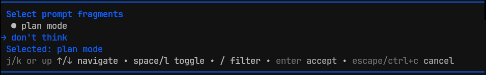
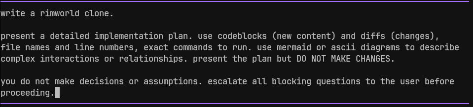

# Proompting

A presentation of common prompt-engineering conventions and advice, how they map to the concepts we covered when [writing and bulletproofing skills](../writing-skills/part-3/README.md), and analysis of the current state of prompt engineering.

I think most people would present prompt engineering first, then apply it to writing skills. But by starting with skills, we begin with a formal discipline and prompt engineering is essentially an informal subset of the things we've already learned.

If you search for guides on prompt engineering, you will find a lot of the same advice we covered in the [writing-skills](../writing-skills/part-1/README.md) series, but we also see a lot of curious "folk-wisdom" and possibly superstitious practices - or things that used to work, but are no longer necessary with modern LLMs and harnesses.

## What is Prompt Engineering?

I was originally under the impression that prompt engineering was a bunch of "tips and tricks" that people use to try to make the model do a better job on a task. I was also under the impression that most of these techniques were either debunked or obsolete as modern frontier models have improved and developed complex reasoning capabilities.

But prompt engineering really refers to anything you do to improve model or agent performance based purely on inputs to a model, rather than changing the actual weights. This includes the entire field of "context engineering", hardening and optimizing skills, and making detailed specs and execution plans for the agent to run.

## Prompt Engineering Techniques

> I'm not sure if verbally abusing a model is actually helpful or not but sometimes it is cathartic.

Many of the early techniques have become obsolete with modern frontier models, or were never empirically proven in the first place - "no mistakes or you go to jail", "you are an expert java developer", threatening the agent's grandmother if a task doesn't work out perfectly, etc. I'm not sure if verbally abusing a model is actually helpful or not but sometimes it is cathartic.

But we have already experienced that you need to word your prompts/skills very carefully and tailor to the specific model to get the results you want. Additionally, when working with local models, or small models without reasoning capabilities, even many of the "old" prompt engineering tricks are still useful. Prompt engineering is not dead, it has just become so integral to working with AI that we don't always think about it as a distinct discipline, especially since the newer models we're using are so much better at reasoning.

### Still Useful for Frontier Models

While many practices are now unnecessary when working with large frontier models, here are a few that are still worth using.

#### Specificity

If you want to do something specific, you need to write a prompt that effectively instructs the AI to do it. That implies shaping and discipline rules, and they do apply here, but it's also largely about describing what you want effectively (remember our [shaping tests](../writing-skills/part-3/README.md)).

> EDITOR: example of vague vs. specific prompt and why the specific one is better

Specificity in your prompts reduces ambiguity that requires implementing agents to make decisions and form assumptions, improves accuracy of final product, and saves time - fixing something after the AI writes it is more expensive than properly forming the prompt first. But just like we discussed in [writing skill part 1](../writing-skills/part-1/README.md), you need to tailor the specificity to the task fragility - give freedom where there are multiple ways to the solution, be more specific when there is only one way to do it correctly.

Specifics include, but are not limited to:
- Detailed description of the task to be executed
- Constraints and failure conditions
- Output shape requirements like format, length, target audience, etc.
- Discipline rules for constraints that have a compliance cost

#### Context and Grounding

Context engineering is a critical part of learning to apply agentic coding effectively. The model has a limited amount of context it can hold, which is usually far less than what would be required to keep your entire project and all documentation in context at once. Even if you could, the model can't use all of that context effectively (recency bias) and contradictions and similar-but-distinct facts in that context cause additional problems.

Context engineering deserves it's own dedicated article, but it's all about feeding the model the context that it needs, when it needs it (progressive discloser), while minimizing the amount of info in the context window that is not actually required at the time.

Some common context engineering practices:

- Intentional compaction: explicitly saving a summary and compacting the session (or starting a clean session) at certain breakpoints when you notice the context window starting to fill up.
- Wrapping tools and commands so they produce compacted output - [context-effective backpressure](https://www.humanlayer.dev/blog/context-efficient-backpressure).
- Writing rules files (CLAUDE.md/AGENTS.md) and separating them by subdirectory or subsystem so they are only used when the agent traverses into that system.
- Writing load-on-demand skills instead of putting everything in rules files.
- Breaking up large skill files with "references" that are only loaded when that info is actually needed (corner cases, error handling, etc).
- Using subagents to run isolated tasks to avoid using context space in the main session.

Checkout humanlayer's [Advanced Context Engineering for Coding Agents](https://www.humanlayer.dev/blog/advanced-context-engineering) blog post (there is a YouTube video version as well).

Grounding is the process of supplying verified, factual information to the model instead of deferring to the model weights, to prevent hallucination. This could include using a RAG system or other verified information source, and requiring the agent to provide sources for each claim in the results, feeding the model actual reference data as input, or generating and manually verifying detailed execution plans up-front.

Combining grounding with context engineering improves accuracy by ensuring the results are "grounded" in reality, relying more on "extrinsic" knowledge provided to the AI and not the "intrinsic" knowledge encoded in the model weights.

> EDITOR: example of well grounded prompt with appropriate amount of context; brief explanation of why the grounding and amount of context matter to this case

#### Decomposition

Decomposing a task is much like the process of decomposition with software design: break a big, complicated task into smaller tasks that fit together.

Breaking a large task into smaller, more focused tasks helps keep the AI from getting overwhelmed and hallucinating across complex multi-step reasoning. The smaller tasks also help keep the context window clean and focused.

> EDITOR: simple illustration of large task => smaller tasks that make up the whole

Like a lot of prompt-engineering techniques, decomposition (and delegation using subagents) is something that is now commonly built into the high-end frontier models. Once the actual inference scaling started to slow down, much focus has moved towards implementing these techniques at the model-level, to make using the AI feel more intuitive or automatic.

The need for decomposition might be proportional to the power and reasoning capabilities of the model you use. For a large frontier model, I'm still a fan of decomposition to produce smaller, more focused PRs with fewer moving parts. Creating a detailed implementation plan and "slicing" it into discrete phases is one easy way to do this.

For local models with limited context or weak reasoning, you can decompose the problem into a sequence of smaller prompts that fit within that specific model's capabilities. You can even generate sequences of prompts that encode "chain of thought" reasoning semantics into individual steps that you can run against a model with no reasoning capabilities.

#### Iteration

If you intend to run a prompt repeatedly, like a skill or saved prompt for a specific task, then it should be obvious that you should keep improving that prompt every time you notice an issue with it's application.

Even if you are writing a prompt for a one-time task, like to implement some feature or refactor something, you can still benefit from testing your prompt, reverting, fixing the issues, and repeating. It's much cheaper to experiment up front than it is to try to fix something you already built incorrectly.

You can also apply some of the concepts we learned in our [writing skills](../writing-skills/part-1/README.md) series, or use tools like DSPy and GEPA to optimize your prompts before actually executing them. The trade-off here is you have to implement a suitable testing process, including a way to self-verify the results. If the prompt is doing something that is not trivial to revert/undo (deleting production infrastructure, for example), then you also need to model a test environment with scaffolding and fixtures.

> EDITOR: add a little chart showing trade-off of effort to optimize a query vs how important it is to get implementation exactly right

#### Few-Shot Exemplars

["Few-shotting"](https://arxiv.org/html/2005.14165v4) is the process of including multiple examples of what you want in the prompt input. AI is good at detecting and matching patterns, and then copying them, so you can think of this like "training" the model to respond a certain way, without changing the weights.

> EDITOR: simple few-shot prompt example (not CoT or reasoning)

One specific application of the few-shot technique is "chain of thought" reasoning - by providing similar logic, math, or other reasoning-based problems to the AI, along with step by step "reasoning" that shows the work of how it should get to the final result, the AI will copy the pattern and produce emergent reasoning capabilities. This topic is pretty relevant and interesting, so it gets a dedicated section later in this document.

#### Verification Loops

- like our skill writing best practice of always including a verification checklist
- forces the AI to verify the product is within the required parameters
- deterministic verification is best, and/or a separate LLM as a judge

> EDITOR: simple prompt + verification loop example

### Useful for Local Models

**Few-shot exemplars** - Frontier models follow instructions, often without needing examples (zero-shot). They mine your codebase for context and examples automatically. Small models need the pattern demonstrated for format, tone, and task structure. This was “required practice” circa 2022 because the models were weaker and did not yet have solid reasoning capabilities.

**Chain-of-thought prompting** - Frontier models now do this natively via proprietary reasoning pipelines. The explicit prompting technique is obsolete for them but measurably lifts small models with reasoning disabled (per the CoT paper: arithmetic, symbolic, commonsense tasks). More on this topic later in the document.

**Aggressive decomposition / prompt chaining** - Small models fail on compound instructions. Decompose into one task per prompt, each phase's output feeds into the next phase.

**Rigid format templates with slots/labels** - Small models drift from schemas, while frontier models mostly don’t. A well specified template in the prompt shows the model exactly what the output is supposed to look like.

**Self-consistency (N rollouts + majority vote)** - Compensate for unreliable single-pass reasoning by having the model run multiple applications and vote on a winner. For example, asking the agent to sample and classify data multiple times and then have a judge pick the winner.

**Front-loaded, minimal context** - Context rot / lost-in-the-middle hits small windows and weaker attention harder.

### Mostly Obsolete

**Role assignment/personas** - Modern frontier models don't really need the persona framing now. They determine if they are doing a code review, working on a python module, etc and adopt the perspective automatically. However, this is possibly still useful for specialized agents - setting the operating mode of the agent with a persona rather than detailed instructions. "You are a helpful coding agent" or "you are sales assistant" implies a lot about the rules the agent should follow.

**Zero-shot CoT triggers** - Instructions like "Think step by step about how to solve the problem", which attempt to coax the model into demonstrating some hidden capabilities that only surface when you use the right magic words. This is obsolete in frontier models, who have their own reasoning capabilities, and few-shot exemplars are far more effective at inducing chain-of-thought in models without those capabilities.

## Chain Of Thought and Reasoning

I think this is interesting enough to have its own dedicated section.

Chain of thought reasoning is when the model breaks down a task step-by-step and analyzes each piece individually to "reason" about what the user wants and how to produce it. If you run your coding agent with the "thinking" output enabled (verbose output in Claude Code), then you are probably used to seeing the traces as the model is analyzing your request. If all goes well, the AI figures out missing details, determines which verification steps are appropriate and applies them automatically, etc. If it goes poorly, you end up with 20 minutes of "hmm... actually" output where the model is constantly second-guessing itself in a loop.

Chain of thought prompting is a technique that was [first published in 2023](https://arxiv.org/html/2201.11903v6), before models had built-in reasoning systems. By providing few-shot example 'queries' and the 'answers' that illustrate the step-by-step how the AI should arrive at the answer, the model effectively learns the pattern and applies that reasoning process while producing the answer to your actual query. This is reported to greatly increase accuracy when working with math, symbolic reasoning, logic, etc.

> EDITOR: example of a simple word-based math problem with few-shot exemplars to elicit cot reasoning in the model

So if this is built into modern frontier models, is it still a useful technique to know about? Actually, yes. If you run a local model with reasoning disabled, you can simulate the reasoning process of a modern frontier model with just a prompt input. If you combine this with our prompt/skill optimization strategies, you can produce high-quality output rivaling what the frontier model can do.

I have observed one particular down-side to the reasoning in frontier models (besides occasionally getting stuck in a loop): It seems to lead to new ways for the model to disregard your rules. While testing the skills in this repository against different models, the weaker local models needed careful wording to make the rules trigger/apply, where the frontier models mostly just worked, but had a tendency to occasionally talk themselves out of loading a skill when it was needed, or to NOT load a skill when we actually wanted it.

### Distillation

Recently, the topic of [distillation attacks](https://arxiv.org/html/2608.09867v1) has been prevalent. Distillation is the process of extracting the proprietary "reasoning" steps out of frontier models so they can be used to train other models or to copy that proprietary reasoning implementation. Anthropic and OpenAI have accused most of the popular Chinese providers of stealing their data through distillation (is this irony?).

cot reasoning traces from frontier models are encrypted, and the client just hands the encrypted blocks back, along with the rest of the message, on each turn. what you read in the 'thinking' output is heavily summarized or redacted output that comes along with the response, separate from the encrypted blocks.

the flaw: these encrypted blocks are fully compatible and interchangeable across sessions, users, and even different models from the same provider ecosystem. by extracting the thinking trace signatures from opus to haiku, and asking it to output it's own reasoning, haiku will effectively decode and print the encrypted thinking traces.

this mostly works because models like haiku or gpt-5.6 luna are designed as fast, cost-effective tools and they do not have all the safeguards and refusal mechanics that the large models have (so probably this won't last forever).

it is also something of a security concern, because someone could get a hold of your session data and use the encrypted blocks to read traces of your proprietary data.

## Prompt "Shaping"

Prompt shaping is basically just an application of prompt engineering techniques intended to guide the model towards a more accurate, relevant, and well-formatted output. For our purposes in this document, I'm distinguishing from "prompt engineering" and referring more to a process for applying those techniques to a poorly formed starting prompt, to produce a detailed, fully-formed prompt that is ready for execution.

My idea here is to write a simple skill that will work much like the [brainstorming skill](https://github.com/obra/superpowers/blob/main/skills/brainstorming/SKILL.md) from superpowers - the model analyzes the prompt, grounds the process based on what you are requesting, then implements a loop of identifying gaps, eliciting answers form the user, applying one or more prompt engineering techniques, and repeating until the resulting prompt is well-formed.

### Properties of a Good Prompt Shaping Process

- Cheap misalignment between AI assumptions and the human's expectations. The agent should state the interpretation before executing, so being wrong costs a sentence, not an implementation. Cost asymmetry is the core principle.
- A decision boundary. Know when not to shape - already-specific requests, informational asks, and post-correction execution should bypass the loop entirely.
- Grounding before proposing. Scan the environment for unstated constraints and reasonable defaults rather than interviewing the user about things the codebase already answers.
- Explicit assumptions, elicited non-goals. Out-of-scope and assumptions are first-class fields, not afterthoughts.
- A convergence artifact. The dialogue terminates in a copyable spec (goal / scope / assumptions / success criteria) that downstream artifacts can quote verbatim, or a markdown file on disk that can be read in a new session.
- Executable verification. Success criteria resolve to a concrete check (test, command, assertion), and the loop terminates when the check passes.
- Technique-to-model matching. Specificity, few-shot, CoT, decomposition are not universally good; they have context/latency costs and are model-specific. A good system selects techniques conditionally.
- Iteration as measurement, not faith. You can’t reason your way to the right phrasing — prompts are brittle (word order, example ordering swing accuracy by tens of points), so shaping is a design loop with a control group, not a one-shot edit.

I decided to implement two specific versions of this:

1. For clarifying and forming prompts for frontier models, [shaping-prompts](../../skills/shaping-prompts/SKILL.md) scans your environment for context up-front, interviews the user one question at a time until every prompt structure requirement is met.
2. A separate version, specifically for small local models with limited to no reasoning capabilities ([shaping-small-model-prompts](../../skills/shaping-small-model-prompts/SKILL.md)). An extended version of the first skill that tries to target model based on capabilities, context size, etc. Creates CoT exemplars when the problem includes math/logic/symbolism, breaks large tasks into chains of prompts, etc.

## Prompt Composition and Prompt Generation

When first starting to use AI, it doesn't take long before you start seeing patterns or clauses that you frequently repeat in your prompts: "do not make assumptions or design decisions yourself surface all blocking questions to the user", "write a detailed plan with code blocks for new code, diffs for things that change, and mermaid diagrams for complex relationships and flows", "no mistakes!", etc. It is convenient to be able to save and quickly apply those prompt fragments to whatever prompt you are working on.

There are also a lot of patterns and conventions for generalizing or optimizing prompts using tools or other software. These tools help you build or generate quality prompts or provide high-level interfaces for running some kind of optimization loop.

I'm not going to mention any prompt generator tools here, because the point of this series is learning how to do this stuff "the hard way", but once you get to that point, then it might make sense to leverage a tool that can make your daily work easier or more efficient.

One prompt generation tool I do want to mention is DSPy. It lets you write your prompts as Python code. Classes, variables, functions, etc. all carry some kind of metadata - from type, to the way things are named, to how they are composed, etc. That can all be leveraged to generate very precise queries, and the prompts produced are designed to be very effective across a wide variety of models and capabilities. But you don't have to just go with the default prompts it produces, it has built-in optimization processes you can use to test and fine-tune your prompt. It even has a module to implement optimization using GEPA.

The idea of a "prompt composer" is also interesting, as it sits somewhere between hand-written prompts and a full prompt generator tool. Select individual parts or clauses to construct a complex prompt from multiple fragments. I see there are quite a few tools out there: Vapi, SnapLogic, Dribble, etc. But the general idea is so simple and straight-forward, you can easily make your own tool and then start collecting prompt fragments that you repeatedly use.

As an example, here is my hand-rolled "prompt fragments" extension for pi. One of the things I love about the pi coding agent is just how easy it is to extend and modify. This is not some revolutionary extension, it's just an example of a simple hack to make my life a little easier.

1. Start with your basic prompt

2. Launch the composer dialog with a keybinding

3. Select the fragments you wish to append/prepend to your prompt

## Conclusion

Prompt engineering is a complex, moving target. What was true today probably won't be true in 6 months. The only way to know what is effective is to experiment and test with every model you intend to use, and to do it all over again when those models release brand new versions. If we're lucky, that means we'll be able to do less prompt engineering.

Carefully crafting and optimizing prompts (and skills) to specifically target a local or small open-weight model is a cost-effective way to get consistent, quality results from a model that may seem useless to people who haven't gone down this rabbit hole.

Look for ways to compose, generate, and optimize your prompts. Composition and generation can save a lot of time for day-to-day work, and optimization helps keep consistent and accurate results.

## References

- https://cloud.google.com/discover/what-is-prompt-engineering
- https://www.ibm.com/think/topics/prompt-engineering-techniques
- https://en.wikipedia.org/wiki/Prompt_engineering
- [Chroma - Context Rot: How Increasing Input Tokens Impacts LLM Performance](https://research.trychroma.com/context-rot)
- https://www.humanlayer.dev/blog/advanced-context-engineering
- https://www.humanlayer.dev/blog/context-efficient-backpressure
- https://arxiv.org/html/2201.11903v6
- https://arxiv.org/html/2608.09867v1
