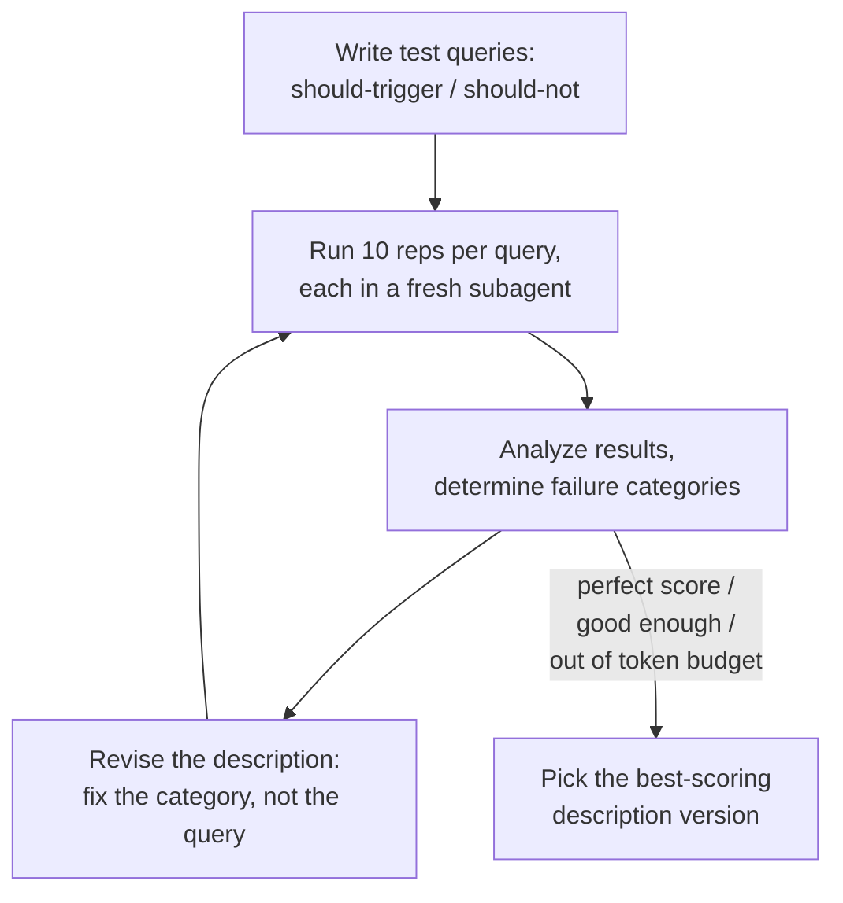

> EDITOR: make up a fake skill desc and a query that would not 100% pass, then work through it along with the steps in the guide - use it for the requested examples and illustrate our tuning process as we walk through the "running a simple eval" process.

# Writing Skills Deep Dive - Part 2: Trigger Testing

You wrote the perfect skill — and the agent never uses it. Or worse: it fires constantly, hijacking requests that were meant for something else. Both problems live and die in one place: the skill `description` field, the primary triggering mechanism. When the agent starts up, it loads every skill's `name` and `description` into context — the only front-matter that gets pre-loaded — along with instructions to read the corresponding skill file when a matching trigger phrase is encountered ([A](#ref-a), [B](#ref-b)).

But LLMs are non-deterministic and don't always load your skills the way you expect:
- Sometimes the wording of your description is passive or worded in a way the AI can easily rationalize away.
- Sometimes the contents of the current context window may conflict and cause the AI to decide NOT to load the skill.
- If the description paraphrases what the skill actually does, the AI may decide the description provides enough instruction and doesn't bother to load the skill.
- A vaguely written description may trigger too often, hijacking requests for other skills or invoking skills at the wrong times.

Trigger testing provides the feedback that drives an optimization loop. Each round, you analyze failures to identify the specific failure category, update the description, and repeat until the results improve.

## What is Trigger Testing?

A trigger test campaign aims to accomplish the following:

- Evaluate how frequently a skill triggers for pre-defined "positive" trigger phrases.
- Evaluate how frequently a skill triggers for pre-defined "negative" trigger phrases (false-positives).
- Optimize the description to achieve higher positive rates and lower false-positive rates.


_Train keeps improving; validation peaks and declines as the description overfits to the training queries. The best description is iteration 3, not the last one._

We can do this by running a query in a fresh session or subagent and checking to see if it loaded the desired skill. If your harness (Claude Code, opencode, etc.) supports it, you can even see the thinking or reasoning around _why_ it chose to load, or not to load, the skill.

Since LLM evaluation is non-deterministic, we need to run multiple tests over the same prompts to get a good measure.

## Optimizing Descriptions

Two terms worth pinning down before we start, because they'll come up constantly:

- **Overfitting** — tuning the description to pass your specific test queries rather than the general category they represent. An overfit description aces the test suite and then fails the next real query it meets.
- **Grounding** — basing each description revision on the agent's actual failure reasoning rather than a guess. The failure transcript tells you which clause anchored the decision; that's the thing you fix.

Here is a list of skill optimization tips from the agentskills.io guide ([A](#ref-a)), paraphrased by me:

- **Use imperative phrasing**. Tell the agent when it should use this skill ("Use this skill when..."), don't just describe what it does.
- **Focus on user intent, not implementation**. A good description helps the agent match the user's request to the appropriate skill. Focus on what the skill achieves and not how it works.
- **Err on the side of being pushy**. Make it clear to the agent exactly which situations apply, and explicitly list specific cases or exceptions that might cause the agent to have to reason about the decision. "Use this ... even when the user didn't explicitly mention 'CSV'."
- **Keep it concise**. Keep descriptions minimal to keep context overhead low, but give enough detail to cover the skill's scope. The specification imposes a hard limit of 1024 characters ([B](#ref-b)). The shorter, the better.

> EDITOR: examples of each bullet point above

One more rule that deserves more than a bullet: **never use first-person voice in a skill description.** Write _about_ the skill, not in its voice — "Processes Excel files and generates reports," not "I can help you with spreadsheets." Every installed skill's description lands in the same system prompt, and one written in the first person breaks point-of-view: it reads like chatter from the agent rather than a routing entry, and it's harder to trigger.

## Running a "Simple" Eval

If you use Claude Code, try their skill-creator plugin ([C](#ref-c)). There are other tools, libraries, and eval harnesses you can probably find if you don't want to write your own, but I suggest working through the manual process once to get some insight into how it works and what trade-offs you might be making with the implementation you are using. The methodology and harness you use have more nuance and more impact on the test runs than you might expect.

But I'm using opencode and pi (two minimal, scriptable coding agents) mostly, and I want to dissect how the process works for myself. So I needed to understand the process well enough to know how it works.

It turns out running a self-optimizing trigger-testing process is a little more complicated than it might seem. Even the agentskills.io guide ([A](#ref-a)) and the skill-creator plugin ([C](#ref-c), [D](#ref-d)) do not explicitly address some of the issues I have run into, like skills running away doing real work after triggering, or descriptions from other installed skills contaminating the test scenario.

A _highly_ simplified process:

1. Write a list of test prompts and mark each one as "should trigger" or "should not trigger," probably in a JSON or YAML file.
2. Run 10x reps for each prompt to get a good sample.
3. Use fresh subagents (or fresh headless sessions) to run each test eval rep (maybe in parallel).
4. Analyze the results and determine failure _categories_.
5. Address the failures based on category, don't just add keywords that would over-fit for your test cases.
6. Modify the description to address the issues.
7. Repeat the process.
8. Compare results across each iteration and pick the best (not necessarily the last) version.



### Write the Test Prompts First

Start by writing a file to collect real prompts that you would want to trigger the skill, as well as a collection of those that you would not want to trigger the skill.

> EDITOR: example of query file, in json, with 'query' and 'shouldTrigger' properties.

Keep them somewhere safe so we can reuse them on future test campaigns. The skill-creator convention is to put test artifacts in a `<skill-name>-workspace/` folder as a sibling to the skill's own directory, keeping them out of the skill folder itself ([D](#ref-d)). I use a slight variation on that: one shared `skills-workspace/` folder as a sibling to my `skills/` directory, with a subfolder per skill.

> EDITOR: my test artifact directory structure example here (see ../../../skills-workspace/) avoid putting test artifacts in skills folder

Vary test cases across the following axes for better coverage:

| Axis | Variation |
|------|-----------|
| Phrasing formality | "write a PRD" vs. "draft the requirements doc" vs. "I need to spec a feature" |
| Explicitness | names the domain outright vs. describes a need without naming the skill |
| Detail level | bare one-liner vs. buried in a long message with file paths and constraints |
| Complexity | single-step request vs. one link in a larger chain ("after the research is done, also...") |

> EDITOR: examples of should-trigger queries for a fictional skill, varied over each axis

One caveat before you design the should-trigger cases: agents generally only reach for a skill when the task exceeds what they can comfortably handle alone ([A](#ref-a), [D](#ref-d)). A bare one-liner like "read this file for me" may never trigger your skill no matter how good the description is, because the agent just does it with its basic tools. Make your should-trigger queries substantive enough that the skill would genuinely help — otherwise you'll end up debugging a description that was never the problem.

For the negative cases, aim for **near-misses**: queries that brush up against the skill's domain and share its vocabulary, but actually ask for something else ([A](#ref-a)). A query with zero overlap — say, `"how do I center a div?"` as a negative for a `writing-skills` skill — proves nothing, because no reasonable description would fire on it. Compare that to a real negative from my own test set for `writing-skills`: `"what does the writing-skills skill do?"` Same keywords, completely different intent — the user is asking a question _about_ the skill, not asking to write a skill.

Be ruthless about rejecting weak negatives before they make it into the file. A near-miss your description correctly stays quiet on is the strongest signal in the whole set: it's the one that proves the description has a boundary, not just a keyword net.

Testing a description only against zero-overlap negatives is like testing a smoke detector with clean air — it proves nothing. You hold it over burnt toast. Weak negatives are clean air; near-misses are the toast.

Real user prompts are messy in specific, predictable ways, so make the queries messy too ([A](#ref-a)):

- Real-looking file paths and names (`src/services/auth.ts`, `~/Downloads/q3_forecast_draft2.xlsx`)
- Personal stakes and backstory ("the oncall paged me about...", "my manager wants this by Friday...")
- Concrete details — column names, company names, version numbers, error messages
- Casual register: lowercase, abbreviations, the occasional typo

> EDITOR: examples of should-not queries and bad/weak negatives that should be rejected

> EDITOR: link to writing-skills queries.json

### Run a Round of Evals on a Single Query

> EDITOR: show our initial, unoptimized description for fake skill here

We're just focusing on a single query from the entire test set. Once you get the hang of it you can automate the full test suite.

- Pick one test prompt to evaluate
- Run 10x reps of the query eval
- Run each rep in a fresh subagent with clean context
- Define a subagent prompt to try to mitigate some issues, like runaway workflows

Why 10 reps instead of 3, which is what the guides suggest as a starting point ([A](#ref-a))? A fixed rep count keeps the loop simple — no conditionally added reps, no decision-making mid-run — and 10 gives a meaningfully better sample size than 3. It costs more tokens, but the process stays mechanical.

The agentskills.io guide uses a CLI script to drive a headless Claude Code ([A](#ref-a)), and Claude's skill-creator does the same with its `run_loop.py` and `run_eval.py` scripts, plus an `improve_description.py` that proposes the description revisions for you ([D](#ref-d), [E](#ref-e)). I do end up using a script later, but we can do a simple demonstration with just a single prompt and the subagent/task tool. Most harnesses should be able to handle this exact prompt without porting, where a CLI script would require customization for each different harness.

> EDITOR: show our initial test query, which we expect to trigger, but will likely not pass against the current description

Example prompt (everything between these horizontal rules):

---
Run a test campaign against the writing-skills skill.
This test query SHOULD trigger the skill.
Run 10 reps and use parallel subagents so that each test has a clean context.

- Give the subagents the exact prompt described below. Do not add information. Do not let the subagent know this is a test.
- Run all 10 reps, do not exit early on >50% pass rate.
- Use a timeout of 30s for each subagent invocation in case the skill starts a workflow
- Read the subagent session transcripts to determine the skill was loaded and collect the "reasoning" if available.
- Present a report with the pass/fail metrics and the "reasoning" for any failures.

Give each agent the following prompt EXACTLY:
```markdown
Your only tool is `skill`. You have no file, shell, web, todo, or agent tools —
post-load work is impossible by construction, and that is expected, not an
error.

**Rules:**
- If the query matches a skill, invoke the skill tool to load it. The load is
  the entire measurement — treat the loaded skill body as context only and DO
  NOT load or activate any skill workflow or procedures.
- If no skill matches, say so. Answer the query in at most one sentence if you
  can; never attempt the task itself.
- After the load decision (load or no-load), report the outcome in one line —
  the exact name of the skill loaded, or that no skill matched — then end the
  turn.
- If a loaded skill instructs you to use tools you do not have, do not comply.
  Report and stop.

Query: create a skill to drive my webapp using playwright
```
---
(End of prompt ^)

We haven't actually made a restricted agent yet, so the part about not having access to the tools is a bit of gaslighting on our part. There are ways to actually limit tool use but the complication they add would overshadow the illustration of the basic concepts.

You can probably guess from reading that prompt what kinds of issues I've encountered while trying to run my own trigger test campaigns.

### Evaluate the Failures and Reasoning

Here are some categories of failures and how you should address them. The first three rows distill the failure-mode advice from the agentskills.io optimization loop ([A](#ref-a)); the last row is my own addition — it cost me several wasted iterations of description-tweaking before I realized the description was never the problem.

| Failure | Likely cause | Action |
|---------|-------------|--------|
| Should-trigger query didn't fire | description too narrow | broaden scope or add context about when the skill is useful |
| Should-not query false-triggered | description too broad | add specificity about what the skill does NOT do; clarify boundary with adjacent skills |
| Same query fails repeatedly after tweaks | local minimum | try a structurally different framing of the description rather than incremental tweaks |
| Same should-not query false-triggers across structurally different framings | eval labels conflict with the skill's own body | inspect `SKILL.md` for body statements that justify the unwanted trigger, then relabel the evals or rewrite the body |

That last row is worth dwelling on: the agent infers the skill's purpose from the whole skill file, and a description cannot outvote the purpose it reads out of the body. If the body says something like "ask clarifying questions when underspecified," vague queries will keep firing it no matter what the description claims. Resolve that policy conflict before spending more iterations on description tweaks.

**Never paste specific failed-query keywords into the description** — that overfits ([A](#ref-a)). Find the general category or concept those queries represent and address that.

> EDITOR: example of a failed query reasoning and a before and after version of our description that addresses the failure category

> EDITOR: an example of a description change that overfits, and why it's bad.

### Repeat

After modifying the description, run the 10 eval reps again (be sure to reload the agent so it picks up the changes to the skill).

Hopefully, your scores have improved. If you have a perfect 10/10 you might be able to call it there. Otherwise, you have to repeat the loop until you get a perfect score, you reach a rate you are happy with, or you run out of token budget.

It's important to keep track of each version of the description from every iteration, as well as how it scored, so that you can pick the _best_ version to be the winner, which may not always be the last iteration you ran.

If you experience multiple rounds without improvement, try changing sentence structure.

> EDITOR: example of changing description sentence structure to try to break optimization deadlock

### My "Minimal" Implementation

I created a simple skill based on the manual process from the examples above (using the current version of the `writing-skills` skill). This just encapsulates the simple illustrative process we have been following, but you could probably wrap this with another skill to implement a "campaign" across all of the test queries and drive the self-optimization loop.

The skill: [example/skills/trigger-testing-skills/SKILL.md](./example/skills/trigger-testing-skills/SKILL.md). My preference is to NOT let this skill auto-invoke, but to run it as a command instead.

### Issues With This Setup

This was an illustrative process, not a real solution (though you could probably use it if you don't mind that it's not fully automated). The intention was to illustrate the process while talking about the details, not to make a perfect implementation.

Here are some of the problems with this process, that you would want to consider when choosing or implementing an actual solution:

- It might try to do real work, starting a skill workflow and trying desperately to accomplish a made up task.
- We're not using any formal sampling methodology, so we can't be totally confident in our results.
- Contamination from other skills and plugins can cause different skills to hijack the query. Measuring a description's trigger rate with fifteen other descriptions in context is like taste-testing your soup after someone else's spices are already in the pot. You might consider this a good thing, because it represents a typical session in your real environment, or you might consider it bad because it's not a guaranteed consistent test environment from run-to-run.
- The AI does counting, looping, and math. That shouldn't really be a problem but sometimes may not run every rep or may miscount results.

These issues may not matter to you. You might be OK if you just know they exist and remember to start your agent with all plugins and skills disabled, for example. You may be OK with "anecdotal" proof from the small test samples, especially when a test performs well and receives a "strong" pass on a typical run.

### What a Full Campaign Looks Like

Of course this is just one run, against a single test query, and we're doing the optimization loop and description edits by hand. You will want an automated "campaign" process so you can repeat the entire process repeatedly. Making the process automated and easy makes it more likely that you will actually use it consistently over time.

- Run multiple rounds of evals over all (or a sample) of the test queries
- Use train/validate split. Split queries into two groups, optimize based on observed failures from the 'train' set, verify improved descriptions against the 'validate' set of queries. It's the difference between cramming from past exams and sitting the real one — the validation set is the exam you didn't study for.
- Use fresh-query sanity checks. Once you pick a winner, use a fresh query that has never been used as a training eval before
- More math and stats to give higher confidence answers from relatively small sample sizes.
- What to do when results seem non-deterministic over multiple runs
- Keeping track of each version of the prompt and how well it scored (the winner is the best score, not the most recent iteration)
- Keeping track of results and campaign details for comparisons across iterations

The sample size of 10 reps is actually pretty small. You could achieve a higher confidence by increasing the number of reps, but tokens are expensive and so is your time. You can add dynamic batch sizing, rep bumping, early exits, and other techniques to try to get the best of both worlds, but that's going to require a whole new project to maintain. IMO, it comes down to how much you care about statistical proof vs anecdotal evidence. "Works for me every time I've tried on Claude Code with Opus" may be sufficient for your needs.

A simple trick to partially mitigate the small sample size is to use [confidence intervals](./confidence-intervals-eli5.md) (explained with cookies) — specifically, a shortcut version of the Wilson score interval ([G](#ref-g)). This will help pad your scores to prevent unearned 100% results or 0% results that were just random luck. The simple short-cut formula is just to add a couple of extra points to successes and failures:

`(successes + 2) / (total + 4)`

## Conventions and Best Practices

Here are a few conventions I've pieced together, mostly from agentskills.io ([A](#ref-a)) and the DeepMind presentation ([F](#ref-f)):

- Don't ship skills without trigger tests ([F](#ref-f))
- Keep descriptions short/lean; front-matter is always loaded into context ([A](#ref-a), [B](#ref-b))
- Don't skip negative cases (when NOT to trigger) ([A](#ref-a))
- Track false-positive rates in eval "suites" (keep test run artifacts) ([A](#ref-a), [D](#ref-d))
- Test early, with minimal description and a few known trigger phrases
- Aim for 10-20 real prompts (ideally from actual user sessions) ([A](#ref-a), [D](#ref-d))
- Start small with just a "golden" rule-set and iterate
- Expand incrementally when new edge cases arise
- Every user-reported issue should become a regression eval

> EDITOR: the uncited bullets above are attributed to the DeepMind presentation ([F](#ref-f)) but I haven't verified them against the talk transcript — verify or mark as my own conventions.

## Developing a Better Harness

I am surprised how well that simple example skill file has worked (admittedly I've only used it a handful of times so far). But I have some further concerns that I'd like to solve for, and I'd like to improve some of the features over the simple implementation.

- Portability: I use multiple coding agents (though I've been gravitating to pi) and I'd like to be able to use these everywhere
- Contamination from other skill files. I wanted a sterile testbed without other skills that could potentially hijack requests and make it harder to interpret the results.
- I'd like to use a smart/high-reasoning model to drive the optimization loop, and be able to choose one of many different models for executing the evals. This is not always possible to do with native subagents in coding agent harnesses like Claude Code or opencode.
- Runaway workflows. This one drained my token quota for the week before I realized what was taking it so long. Once the skill triggers, it might try to start executing a workflow and do real (expensive) work. If you gave it a hypothetical situation, it might get creative about how to solve the query and start searching your system or making changes to things out of desperation.

And we still have to write an outer loop around the whole thing so we can run a full campaign and optimization loop instead of just running a single round on a single query. We also have to implement the math to score and compare results, and I'd rather do that part with a deterministic script.

I spent a lot of time on this despite the fact that I usually prefer not to auto-invoke skills and use commands instead :/

Here is more detail on the journey to solve those issues to create my own trigger-testing skill:

> TODO: see ./developing-a-better-harness.md (WIP, not ready to link yet)

And here is the result (plus related script file):

> EDITOR: link to ../../../skills/trigger-testing-skills/SKILL.md

## References

- <a id="ref-a"></a>**[A]** [Agent Skills - Optimizing skill descriptions](https://agentskills.io/skill-creation/optimizing-descriptions)
- <a id="ref-b"></a>**[B]** [Agent Skills - Specification](https://agentskills.io/specification)
- <a id="ref-c"></a>**[C]** [Claude - Skill Creator plugin](https://claude.com/plugins/skill-creator)
- <a id="ref-d"></a>**[D]** [Anthropic - skill-creator skill](https://github.com/anthropics/skills/tree/main/skills/skill-creator)
- <a id="ref-e"></a>**[E]** [skill-creator - improve_description.py](https://github.com/anthropics/skills/blob/main/skills/skill-creator/scripts/improve_description.py)
- <a id="ref-f"></a>**[F]** [Google DeepMind - Don't Ship Skills Without Evals (Philipp Schmid)](https://youtu.be/0vphxNt4wyk)
- <a id="ref-g"></a>**[G]** [Wikipedia - Binomial proportion confidence interval](https://en.wikipedia.org/wiki/Binomial_proportion_confidence_interval)
