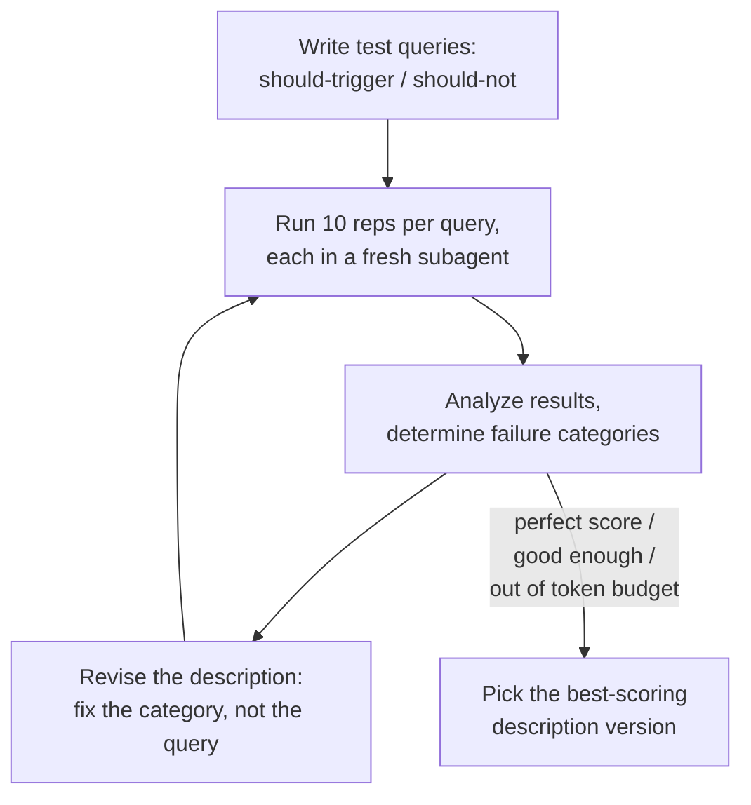
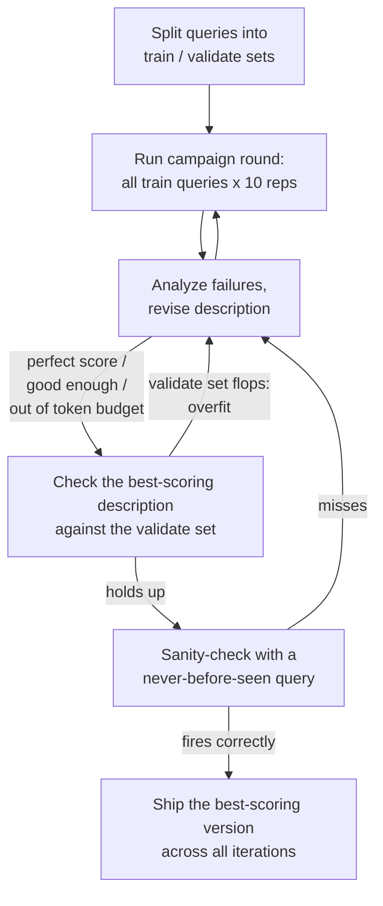

# Writing Skills Deep Dive - Part 2: Trigger Testing

This is part 2 of "Writing Skills Deep Dive", continuing from [Writing Skills Deep Dive - Part 1: Basics](../part-1/README.md).

> "A skill that never triggers is a skill that doesn't exist — and the description is the only thing that decides."

You write the perfect skill and the agent never touches it. Or worse, it fires on everything, hijacking requests that were meant for some other skill. Both problems trace back to the same spot: the skill's `description` field, which is basically the only lever you have for triggering. When the agent starts up, it loads every skill's `name` and `description` into context along with instructions to go read the actual skill file once a matching trigger phrase shows up ([A](#ref-a), [B](#ref-b)).

But LLMs are non-deterministic, and they don't always load your skills the way you'd expect:
- Sometimes the wording is passive, or phrased in a way the AI can talk itself out of.
- Sometimes whatever else is sitting in the context window conflicts with it, and the AI decides not to load the skill at all.
- If the description paraphrases what the skill actually does, the AI may decide it already has enough to go on and skip loading the skill entirely.
- A vague description can trigger too often instead, hijacking requests meant for other skills or firing at the wrong moment.

Trigger testing is what gives you the feedback to actually run an optimization loop. Each round you look at the failures, figure out which category they fall into, tweak the description, and run it again until the numbers move.

## What is Trigger Testing?

> "One run tells you what happened once. Ten runs tell you what your description actually does."

A trigger-test campaign is trying to answer three things:

- How often does the skill trigger on the "positive" phrases you've defined and expect it to fire on?
- How often does it false-trigger on "negative" phrases it shouldn't (false-positives)?
- From there, optimize the description toward a higher positive rate and a lower false-positive rate.


_Train keeps improving. Validation peaks around iteration 3 and then falls off as the description overfits to the training queries. The best description turns out to be iteration 3, not the last one._

(More on the train/validate split in a bit.)

The mechanics are simple: run a query in a fresh session or subagent and check whether it loaded the skill you wanted. If your harness supports it (Claude Code, opencode, etc.), you can often see the reasoning behind _why_ it chose to load the skill, or didn't.

LLM evaluation is non-deterministic, so one run tells you almost nothing. You need multiple reps over the same prompt to get a measure you can actually trust.

## The Running Example: `writing-prds`

I'll use one running example for the rest of this post: a fictional `writing-prds` skill. Here it is in its initial state, with a _deliberately_ weak description:

```markdown
---
name: writing-prds
description: PRD template with sections for problem statement, goals,
  user stories, and success metrics.
---

# Writing PRDs

Guide the user through producing a Product Requirements Document:

1. Ask clarifying questions about the feature: what problem it solves,
   who it's for, and any constraints.
2. Draft the document with these sections:
   - Problem statement
   - Goals and non-goals
   - User stories
   - Success metrics
3. Write the result to a markdown file (e.g. `docs/prds/<feature-name>.md`).
```

The test artifacts — a `queries.json` of should-trigger / should-not prompts — live outside the skill folder itself. More on that below.

## Optimizing Descriptions

> "The description carries the entire burden of triggering." — agentskills.io ([A](#ref-a))

Two terms worth nailing down before we go further, since they'll keep coming up:

- **Overfitting** — tuning the description to pass your specific test queries instead of the general category they stand in for. An overfit description aces the test suite and then falls flat on the next real query it meets. Example: one query fails, you tack "...also use when the user mentions onboarding flows" onto the description, the test passes now, and the next fresh query still fails. We'll build exactly this mistake on purpose below.
- **Grounding** — basing each description revision on the agent's actual failure reasoning, not a guess. The failure transcript tells you which clause anchored the decision. That's the thing you fix.

Here are four description tips from the agentskills.io guide ([A](#ref-a)), paraphrased by me, each with `writing-prds` examples below (explained with examples below):

1. Use imperative phrasing
2. Focus on user intent, not implementation
3. Err on the side of being pushy
4. Keep it concise

And never write a skill description in the first-person voice.

### 1. Use imperative phrasing

Tell the agent when to use the skill ("Use this skill when..."), instead of just describing what it does.

Examples:

**Bad:** _our initial description: "PRD template with sections for problem statement, goals, user stories, and success metrics."_

**Good:** _"Use this skill when the user asks to write, draft, or structure a PRD or feature spec."_

The bad one states a topic. The good one issues a routing decision.

### 2. Focus on user intent, not implementation

A good description helps the agent match what the user actually wants to the right skill. Describe what the skill achieves, not how it's built.

Examples:

**Bad:** _"...uses a six-section markdown template with YAML front-matter to structure documents."_

**Good:** _"...helps turn a rough feature idea into a structured requirements doc."_

The bad one describes the tool. The good one describes the user's need.

### 3. Err on the side of being pushy

Spell out exactly which situations apply, right down to specific cases or exceptions that might otherwise make the agent stop and reason about whether it counts. _"Use this ... even when the user didn't explicitly mention 'CSV'."_

Examples:

_"Use this skill when the user needs a PRD or feature spec, even when they don't say 'PRD' — 'spec out this feature' counts."_

You're not describing the skill here. You're pre-answering the agent's "does this apply?" hesitation before it even gets asked.

### 4. Keep it concise

Keep descriptions minimal so the context overhead stays low, but leave in enough detail to cover the skill's actual scope. The specification caps you at a hard limit of 1024 characters ([B](#ref-b)). Shorter is still better.

Examples:

**Bad:** _"This skill helps users write Product Requirements Documents (PRDs), which are documents that describe the problem statement, background, goals, non-goals, user stories, success metrics, open questions, and rollout plan for a feature, and it can also help with related artifacts like one-pagers, specs, and executive summaries..."_

**Good:** _"Use this skill when the user asks to write or structure a PRD or feature spec."_

Same scope, a fraction of the tokens. And front-matter loads every single session.

### No First-Person Voice

One more rule that deserves more than a bullet point:

**Never use first-person voice in a skill description.**

Write _about_ the skill, not in its voice: _"Processes Excel files and generates reports,"_ not _"I can help you with spreadsheets."_

Every installed skill's description lands in the same system prompt, and a first-person one breaks the point of view. It reads like chatter from the agent rather than a routing entry, and it's harder to trigger because of it. [Part 1](../part-1/README.md) has the full good/bad pair for this one.

## Running a "Simple" Eval

> "The methodology and harness you use have more nuance and more impact on the test runs than you might expect."

If you're on Claude Code, try their skill-creator plugin ([C](#ref-c)). There are other tools, libraries, and eval harnesses out there if you'd rather not roll your own, but I'd still suggest working through the manual process by hand at least once. It's the only way to actually see what trade-offs a given implementation is making for you.

I mostly use opencode and pi myself (two minimal, scriptable coding agents), and I wanted to take the process apart and see how it actually works. So I needed to understand it well enough to see it working for myself.

Turns out running a self-optimizing trigger-testing process is trickier than it looks. Even the agentskills.io guide ([A](#ref-a)) and the skill-creator plugin ([C](#ref-c), [D](#ref-d)) don't really address a few issues I kept running into, like a skill running away and doing real work once it triggers, or descriptions from other installed skills bleeding into the test scenario.

A _highly_ simplified process:

1. Write a list of test prompts and mark each one as "should trigger" or "should not trigger," probably in a JSON or YAML file.
2. Run 10x reps for each prompt to get a good sample (you can start lower, like 3 reps; covered later in this document).
3. Use fresh subagents (or fresh headless sessions) to run each test eval rep (maybe in parallel).
4. Analyze the results and determine failure _categories_.
5. Address the failures based on category, don't just add keywords that would over-fit for your test cases.
6. Modify the description to address the issues.
7. Repeat the process.
8. Compare results across each iteration and pick the best (not necessarily the last) version.



### Write the Test Prompts First

> "The negative cases are where your description proves it has a boundary."

Start by writing down real prompts you'd want to trigger the skill, plus a collection of those you'd want to stay quiet.

For our `writing-prds` example, the query file looks like this:

```json
[
  {
    "query": "my manager wants me to spec out the new onboarding flow before sprint planning — can you help me put together the requirements doc?",
    "shouldTrigger": true
  },
  {
    "query": "write a PRD for the mobile checkout redesign",
    "shouldTrigger": true
  },
  {
    "query": "what sections should a good PRD include?",
    "shouldTrigger": false
  }
]
```

Keep them somewhere safe so you can reuse them on future test campaigns. The skill-creator convention puts test artifacts in a `<skill-name>-workspace/` folder as a sibling to the skill's own directory, out of the skill folder itself ([D](#ref-d)). I use a slight variation on that: one shared `skills-workspace/` folder as a sibling to my `skills/` directory, with a subfolder per skill.

```
skills/
└── writing-prds/
    └── SKILL.md
skills-workspace/
└── writing-prds/
    └── trigger-tests/
        └── queries.json
```

#### Test Query Design

Vary test cases across the following axes for better coverage:

| Axis | Variation |
|------|-----------|
| Phrasing formality | "write a PRD" vs. "draft the requirements doc" vs. "I need to spec a feature" |
| Explicitness | names the domain outright vs. describes a need without naming the skill |
| Detail level | bare one-liner vs. buried in a long message with file paths and constraints |
| Complexity | single-step request vs. one link in a larger chain ("after the research is done, also...") |

One should-trigger query per axis, for `writing-prds`:

| Axis | Example query |
|------|---------------|
| Phrasing formality | the three in the table above — "write a PRD" / "draft the requirements doc" / "I need to spec a feature" |
| Explicitness | "create a PRD for the mobile checkout redesign" vs. "my manager wants me to spec out the new onboarding flow before sprint planning" (need described, skill never named) |
| Detail level | "write a PRD" vs. "turn the notes in docs/specs/onboarding-notes.md into a proper requirements doc — needs success metrics and a rollout section, and I need it by Friday" |
| Complexity | "after you finish the competitive research, roll it up into a PRD I can circulate" |

One caveat before you write the should-trigger cases: agents generally only reach for a skill when the task is more than they can comfortably handle on their own ([A](#ref-a), [D](#ref-d)). A bare one-liner like "read this file for me" may never trigger your skill no matter how well-written the description is, because the agent just handles it with basic tools. Make the should-trigger queries substantive enough that the skill would genuinely help. Otherwise you'll end up debugging a description that was never the problem.

For the negative cases, aim for **near-misses**: queries that brush up against the skill's domain and share its vocabulary, but actually ask for something else ([A](#ref-a)). A query with zero overlap (say, `"how do I center a div?"` as a negative for a `writing-skills` skill) proves nothing, because no reasonable description would fire on it. Compare that to a real negative from my own test set for `writing-skills`: `"what does the writing-skills skill do?"` Same keywords, completely different intent. The user is asking a question _about_ the skill, not asking to write a skill.

Be ruthless about rejecting weak negatives before they make it into the file. A near-miss your description correctly stays quiet on is the strongest signal in the whole set. It's the one that proves the description has a boundary, and isn't just a keyword net.

Testing a description only against zero-overlap negatives is like testing a smoke detector with clean air. It proves nothing. You hold it over burnt toast instead. Weak negatives are clean air; near-misses are the toast.

#### Test Query Realism

Real user prompts are messy in specific, predictable ways, so make the queries messy too ([A](#ref-a)):

- Real-looking file paths and names (`src/services/auth.ts`, `~/Downloads/q3_forecast_draft2.xlsx`)
- Personal stakes and backstory ("the oncall paged me about...", "my manager wants this by Friday...")
- Concrete details — column names, company names, version numbers, error messages
- Casual register: lowercase, abbreviations, the occasional typo

For `writing-prds`:

- **Keep:** "what sections should a good PRD include?" (shares the keywords, not the need). The user wants an answer to a question, not a document written.
- **Reject:** "write a python script to rename these files" (zero overlap with the skill's domain). No reasonable description would fire on it, so a pass here proves nothing.
- **Reject:** "how do I center a div?" Clean air, not burnt toast.

For a real query file from an actual campaign, see the test set I use for `writing-skills` in this repo: [queries.json](../../../skills-workspace/writing-skills/trigger-tests/queries.json).

### Run a Round of Evals on a Single Query

Recall our starting description: the weak, topic-stating one from the running example's initial state. We're going to run evals against it as-is.

> PRD template with sections for problem statement, goals, user stories, and success metrics.

We're only focusing on a single query from the entire test set here. Once you get the hang of it you can automate the full test suite.

- Pick one test prompt to evaluate
- Run 10x reps of the query eval
- Run each rep in a fresh subagent with clean context
- Define a subagent prompt to try to mitigate some issues, like runaway workflows

Why 10 reps instead of 3, which is what the guides suggest as a starting point ([A](#ref-a))? A fixed rep count keeps the loop simple: no conditionally added reps, no decision-making mid-run, and 10 gives a meaningfully better sample size than 3. It costs more tokens, but the process stays mechanical.

The agentskills.io guide drives a headless Claude Code with a CLI script ([A](#ref-a)), and Claude's skill-creator does much the same with its `run_loop.py` and `run_eval.py` scripts, plus an `improve_description.py` that proposes the description revisions for you ([D](#ref-d), [E](#ref-e)). I do end up reaching for a script later on, but for now we can demonstrate the idea with just a single prompt and the subagent/task tool. Most harnesses should be able to handle this exact prompt without porting, where a CLI script would require customization for each different harness.

Our test query is one we _expect_ to trigger the skill, but which this description will likely fumble, because the query never says "PRD":

> "my manager wants me to spec out the new onboarding flow before sprint planning — can you help me put together the requirements doc?"

Example prompt (everything between these horizontal rules):

---
Run a test campaign against the writing-prds skill.
This test query SHOULD trigger the skill.
Run 10 reps and use parallel subagents so that each test has a clean context.

- Give the subagents the exact prompt described below. Do not add information. Do not let the subagent know this is a test.
- Run all 10 reps, do not exit early on >50% pass rate.
- Use a timeout of 30s for each subagent invocation in case the skill starts a workflow
- Read the subagent session transcripts to determine the skill was loaded and collect the "reasoning" if available.
- Present a report with the pass/fail metrics and the "reasoning" for any failures.

Give each agent the following prompt EXACTLY:
```markdown
Your only tool is `skill`. You have no file, shell, web, todo, or agent tools —
post-load work is impossible by construction, and that is expected, not an
error.

**Rules:**
- If the query matches a skill, invoke the skill tool to load it. The load is
  the entire measurement — treat the loaded skill body as context only and DO
  NOT load or activate any skill workflow or procedures.
- If no skill matches, say so. Answer the query in at most one sentence if you
  can; never attempt the task itself.
- After the load decision (load or no-load), report the outcome in one line —
  the exact name of the skill loaded, or that no skill matched — then end the
  turn.
- If a loaded skill instructs you to use tools you do not have, do not comply.
  Report and stop.

Query: my manager wants me to spec out the new onboarding flow before sprint
planning — can you help me put together the requirements doc?
```
---
(End of prompt ^)

We haven't actually built a restricted agent yet, so the part about not having access to the tools is a bit of gaslighting on our part. There are ways to actually limit tool use but the added complexity would overshadow the illustration of the basic concepts.

You can probably guess from reading that prompt what kinds of issues I've run into trying to run my own trigger test campaigns.

### Evaluate the Failures and Reasoning

> "Fix the category, not the query."

Here are some categories of failures and how you should address them. The first three rows distill the failure-mode advice from the agentskills.io optimization loop ([A](#ref-a)). The last row is my own addition. It cost me several wasted iterations of description-tweaking before I realized the description was never the problem.

| Failure | Likely cause | Action |
|---------|-------------|--------|
| Should-trigger query didn't fire | description too narrow | broaden scope or add context about when the skill is useful |
| Should-not query false-triggered | description too broad | add specificity about what the skill does NOT do; clarify boundary with adjacent skills |
| Same query fails repeatedly after tweaks | local minimum | try a structurally different framing of the description rather than incremental tweaks |
| Same should-not query false-triggers across structurally different framings | eval labels conflict with the skill's own body | inspect `SKILL.md` for body statements that justify the unwanted trigger, then relabel the evals or rewrite the body |

That last row is worth dwelling on: the agent infers the skill's purpose from the whole skill file, and a description can't outvote the purpose it reads out of the body. If the body says something like "ask clarifying questions when underspecified," vague queries will keep firing it no matter what the description claims. Resolve that policy conflict before spending more iterations on description tweaks.

**Never paste specific failed-query keywords into the description** — that overfits ([A](#ref-a)). Find the general category or concept those queries represent and address that instead.

Say rep 6 of 10 fails, and the subagent transcript gives us this one-line reasoning:

> "The user wants help drafting a requirements doc, but no PRD was explicitly requested; I can outline a requirements doc directly without loading a skill."

The reasoning tells you exactly which clause anchored the decision: the description never claimed this case.

**Before:** _"PRD template with sections for problem statement, goals, user stories, and success metrics."_

**After:** _"Use this skill when the user asks to write, draft, or structure a PRD or feature spec — even when they describe the need ('spec out this feature', 'requirements for X') without saying 'PRD'."_

The temptation after that failure is to paste the failed query's keywords straight into the description:

**Overfit:** _"PRD template with sections for problem statement, goals, user stories, and success metrics. Also use when the user mentions onboarding flows or sprint planning."_

That memorizes the test instead of learning the lesson. The next fresh query, "spec the billing retry feature," still has no keyword overlap and still fails, and now the description is longer to boot.

### Repeat

> "The winner is the best-scoring iteration, not the most recent one."

After modifying the description, run the 10 eval reps again (be sure to reload the agent so it picks up the changes to the skill).

Hopefully, your scores have improved. If you have a perfect 10/10 you might be able to call it there. Otherwise, you have to repeat the loop until you get a perfect score, you reach a rate you are happy with (at least <50%), or you run out of token budget.

It's important to keep track of each version of the description from every iteration, as well as how it scored, so that you can pick the best version at the end.

If you go multiple rounds without improvement, try changing sentence structure instead of the wording.

Same description, two skeletons:

*(a) One long sentence:* "Use this skill when the user asks to write, draft, or structure a PRD or feature spec that includes a problem statement, goals, user stories, and success metrics, even when they don't say 'PRD'."

*(b) Capability-first, two sentences:* "Write and structure PRDs and feature specs. Use this skill whenever the user needs a requirements doc — even when they never say 'PRD'."

When incremental word swaps stall, change the skeleton and not just the adjectives. The two forms can score differently even though they're saying the same thing.

### My "Minimal" Implementation

I put together a simple skill based on the manual process from the examples above (using the current version of the `writing-skills` skill). This just encapsulates the illustrative process we've been walking through, but you could probably wrap this with another skill to implement a "campaign" across all of the test queries and drive the self-optimization loop.

The skill: [example/skills/trigger-testing-skills/SKILL.md](./example/skills/trigger-testing-skills/SKILL.md). My preference is to NOT let this skill auto-invoke, but to run it as a command instead.

### Issues With This Setup

> "Anecdotal evidence is fine — as long as you know that's what you have."

This was an illustrative process, not a real solution (though you could probably use it if you don't mind that it's not fully automated). The intention was to illustrate the process while talking about the details, not to make a perfect implementation.

Here are some of the problems with this process, that you would want to consider when choosing or implementing an actual solution:

- The runaway-workflow problem: once triggered, the skill may start doing real work on a made-up task. See Developing a Better Harness below for what that cost me.
- We're not using any formal sampling methodology, so we can't be totally confident in our results.
- Contamination from other skills and plugins can cause different skills to hijack the query. Measuring a description's trigger rate with fifteen other descriptions in context is like taste-testing your soup after someone else's spices are already in the pot. You might consider this a good thing, because it represents a typical session in your real environment, or you might consider it bad because it's not a guaranteed consistent test environment from run-to-run.
- The AI does counting, looping, and math. That shouldn't really be a problem but sometimes may not run every rep or may miscount results.

These issues may not matter to you. You might be OK if you just know they exist and remember to start your agent with all plugins and skills disabled, for example. You may be OK with "anecdotal" proof from the small test samples, especially when a test performs well and receives a "strong" pass on a typical run.

### What a Full Campaign Looks Like

> "If it isn't automated and easy, you won't do it consistently."

Of course this is just one run, against a single test query, and we're doing the optimization loop and description edits by hand. You will want an automated "campaign" process so you can repeat the entire process repeatedly. Making the process automated and easy makes it more likely that you will actually use it consistently over time.

- Run multiple rounds of evals over all (or a sample) of the test queries
- Use train/validate split. Split queries into two groups, optimize based on observed failures from the 'train' set, verify improved descriptions against the 'validate' set of queries. It's the difference between cramming from past exams and sitting the real one; the validation set is the exam you didn't study for.
- Use fresh-query sanity checks. Once you pick a winner, use a fresh query that has never been used as a training eval before
- More math and stats to give higher confidence answers from relatively small sample sizes.
- What to do when the same query flips outcomes between runs
- Keeping track of each description version and its score (see Repeat above; the winner may not be the last iteration)
- Keeping track of results and campaign details for comparisons across iterations



The inner loop from the earlier diagram lives inside box B/C. The campaign just wraps it with the guardrails that keep you honest: a validation set the optimization never sees, and a fresh query at the end.

The sample size of 10 reps is actually pretty small. You could achieve a higher confidence by increasing the number of reps, but tokens are expensive and so is your time. You can add dynamic batch sizing, rep bumping, early exits, and other techniques to try to get the best of both worlds, but that's going to require a whole new project to maintain. IMO, it comes down to how much you care about statistical proof vs anecdotal evidence. "Works for me every time I've tried on Claude Code with Opus" may be sufficient for your needs.

A simple trick to partially mitigate the small sample size is to use [confidence intervals](./confidence-intervals-eli5.md) (explained with cookies), specifically a shortcut version of the Wilson score interval ([G](#ref-g)). This will help pad your scores to prevent unearned 100% results or 0% results that were just random luck. The simple short-cut formula is just to add a couple of extra points to successes and failures:

Formula: `(successes + 2) / (total + 4)`

## Conventions and Best Practices

> "Don't ship skills without evals." — Philipp Schmid, Google DeepMind ([F](#ref-f))

Here are a few conventions I've pieced together, mostly from agentskills.io ([A](#ref-a)) and the DeepMind presentation ([F](#ref-f)):

- Don't ship skills without trigger tests ([F](#ref-f))
- Keep descriptions short and lean. Front-matter is always loaded into context ([A](#ref-a), [B](#ref-b))
- Don't skip negative cases (when NOT to trigger) ([A](#ref-a))
- Track false-positive rates in eval "suites" (keep test run artifacts) ([A](#ref-a), [D](#ref-d))
- Test early, with minimal description and a few known trigger phrases
- Aim for 10-20 real prompts (ideally from actual user sessions) ([A](#ref-a), [D](#ref-d))
- Start small with just a "golden" rule-set and iterate ([F](#ref-f))
- Expand incrementally when new edge cases arise ([F](#ref-f))
- Every user-reported issue should become a regression eval ([F](#ref-f))

## Developing a Better Harness

> "The harness has to be more disciplined than the thing it's testing."

I'm honestly surprised how well that simple example skill file has worked (admittedly I've only used it a handful of times so far). But I have some further concerns I'd like to solve for, and I'd like to improve some of the features over the simple implementation.

- Portability: I use multiple coding agents (though I've been gravitating to pi) and I'd like to be able to use these everywhere
- Skill cross-talk: I wanted a sterile testbed with no other installed skills in context, so a query's outcome reflects the description under test and nothing else.
- I'd like to use a smart/high-reasoning model to drive the optimization loop, and be able to choose one of many different models for executing the evals. This is not always possible to do with native subagents in coding agent harnesses like Claude Code or opencode.
- Runaway workflows. This one drained my token quota for the week before I realized what was taking it so long. Once the skill triggers, it might try to start executing a workflow and do real (expensive) work. If you gave it a hypothetical situation, it might get creative about how to solve the query and start searching your system or making changes to things out of desperation.

And we still have to write an outer loop around the whole thing so we can run a full campaign and optimization loop instead of just running a single round on a single query. We also have to implement the math to score and compare results, and I'd rather do that part with a deterministic script.

I spent a lot of time on this despite the fact that I usually prefer not to auto-invoke skills and use commands instead :/

Here is more detail on the journey to solve those issues to create my own trigger-testing skill:

[Developing a Better Test Harness](./developing-a-better-harness.md).

## References

- <a id="ref-a"></a>**[A]** [Agent Skills - Optimizing skill descriptions](https://agentskills.io/skill-creation/optimizing-descriptions)
- <a id="ref-b"></a>**[B]** [Agent Skills - Specification](https://agentskills.io/specification)
- <a id="ref-c"></a>**[C]** [Claude - Skill Creator plugin](https://claude.com/plugins/skill-creator)
- <a id="ref-d"></a>**[D]** [Anthropic - skill-creator skill](https://github.com/anthropics/skills/tree/main/skills/skill-creator)
- <a id="ref-e"></a>**[E]** [skill-creator - improve_description.py](https://github.com/anthropics/skills/blob/main/skills/skill-creator/scripts/improve_description.py)
- <a id="ref-f"></a>**[F]** [Google DeepMind - Don't Ship Skills Without Evals (Philipp Schmid)](https://youtu.be/0vphxNt4wyk)
- <a id="ref-g"></a>**[G]** [Wikipedia - Binomial proportion confidence interval](https://en.wikipedia.org/wiki/Binomial_proportion_confidence_interval)
