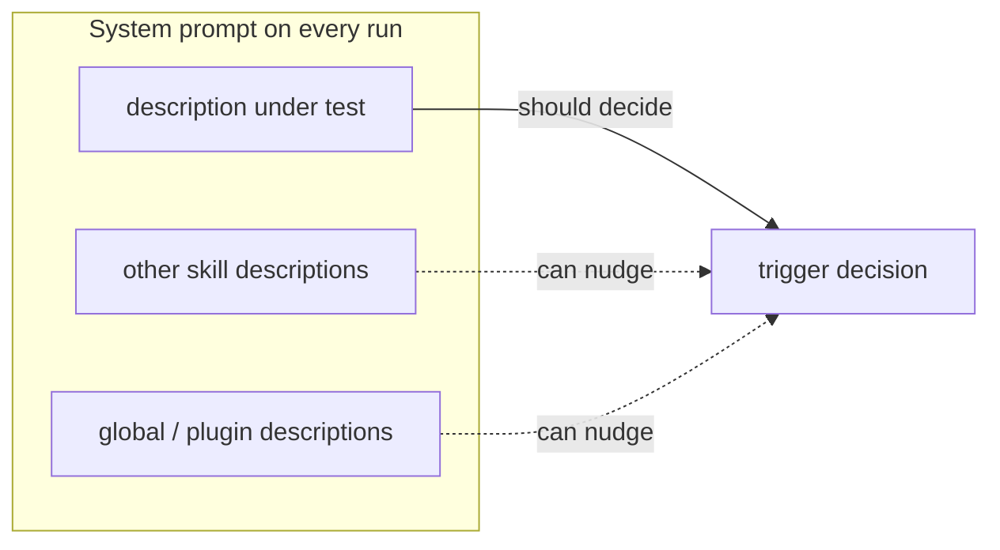
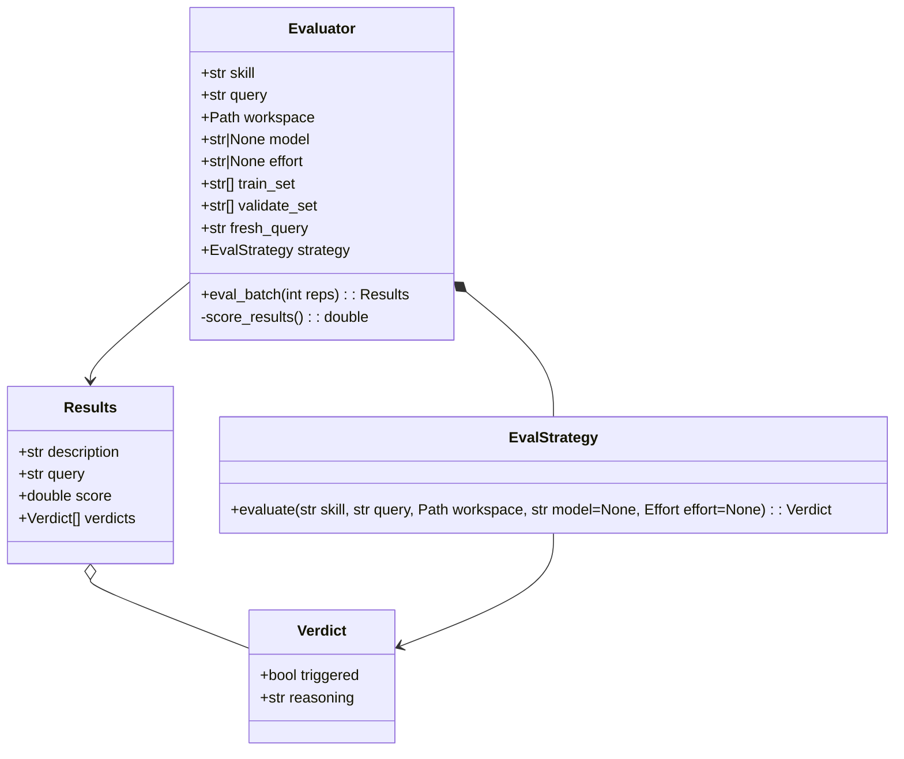

# Writing Skills Deep Dive - Part 2.5: Developing a Better Harness

I want to build a better test than what we made in [part 2](./README.md), and I have some very specific concerns from attempting this a few times before.

## Remaining Concerns

These are the issues that I'm most concerned with:

- Contamination from other skills
- Runaway workflows
- Agents "toiling" to find context for vague prompts and timing out before decision
- AI math and counting
- Portability
- Stats confidence and sample sizes
- Artifact management

### TLDR; Design Decisions to Address Concerns

- Run CLI with parameters to control model, effort, sources of contamination (mostly)
- Run from temp directory to isolate from actual project source
- Install "stub" files - just the skill front-matter part with no body - to prevent the skills from launching workflows.
- Use a custom agent definition to prevent timeouts due to agent toil trying to resolve ambiguous test queries.
- Use a script to drive the eval loop, score results, and do any other math or counting
- Use a strategy pattern to map an eval description to harness-specific CLI command
- Use a train/validate partition (if >10 cases)
- Apply [Wilson intervals](./confidence-intervals-eli5.md) ([Wikipedia][wilson]) to pad the small sample size
- Use a fresh query sanity check to make sure we haven't overfit our test queries
- Put a cap on the number of iterations the optimization loop can run
- Create per-skill directories to manage artifacts and campaign logs, and a manifest file to track test status of the skill

### Contamination from other skills

When we test software, it's important to test in a stable, consistent environment where conditions are exactly the same between runs. Otherwise you can't count on your results to be consistent or accurate. You can't know for sure if the change you made actually fixed the issue or if something in your test environment affected the behavior to make it pass, or was the reason it failed on the last run. Running a trigger test with your full skill load-out is like running a chemistry experiment in a dirty lab — you can't attribute the result to the variable you changed.

Other skills from your project, global settings, or plugins and extensions contain description text which is in your system prompt on every run. These descriptions can influence agent reasoning and affect decision making, possibly causing it to not load your skill or to load another skill.



You may not consider this a problem for testing skills, since you would probably intend to use your skill in your normal agent load-out, where it will live alongside other skills and extensions you use day to day. It's also somewhat difficult to solve this completely without writing a custom harness that ignores your global settings and skills (~/.agents, ~/.claude, etc).

My approach is to use the CLI to launch a headless agent session and use parameters to disable as many sources of contamination as possible. I also run the agent instance from a temporary directory so it doesn't automatically pick up any local repository-defined skills or settings and so it doesn't accidentally start making changes to my source.

When using opencode, I can't really prevent it from loading global configuration and skills at startup (you could mess with XDG environment variables to point to a fake ~/.config location, but that has other problems). But I can disable all plugins and extensions with a [`--pure` argument][opencode-cli].

### Runaway Workflows

Some skills just provide information to keep in context, that the AI can use when making its own decisions later. Other skills drive a workflow or procedure. What happens when your trigger test loads a skill that tries to run a workflow that does actual work?

In the best case scenario, it burns a bunch of extra tokens and makes each test eval take exponentially longer to run. In the worst case, it makes a bunch of changes you didn't want. If the test query you gave it makes no sense for its current state, and the state of the current working directory, the AI still has to try to "solve" your problem. It doesn't know this was a test, so it starts reasoning and rationalizing about what you wanted and digging through your host system for context. This leads to nonsense edits and changes to your project (or your host system if you don't have good guardrails in place).

My solution for solving this issue is to manage a "test workspace" in a temporary directory, and to copy out the skill under test to this workspace, but only the frontmatter part and not the body. When the test triggers the skill, the skill does nothing because it has no body content and no workflow to launch.

Another mitigation I use is to write a custom agent definition that limits tool calls to only "skill" and "read", and has a system prompt that tells the agent that it can't use any tools and should just load the skill and report. This is not 100% portable, as support for custom agents is harness-specific and they don't have standard frontmatter schemas from harness to harness.

I also cap the number of turns the agent can take at 3 and run the eval reps with a 30s timeout to handle anything that gets past those other layers.

### AI Math and Counting

On a good day, your agent would write stats to files on disk and/or write a program to drive the parts that require counting and math. On a bad day it will just rely on inference alone and produce inaccurate results.

We can take that decision away by writing a deterministic script to drive the campaign and do the math and looping. In fact, we should try to do as much of the deterministic stuff with scripting as we possibly can, and only use the AI for decision making and semantic evaluation.

### Portability

I'd like to support opencode, Claude Code, and pi, at minimum.

This has been a difficult problem so far. Even though "[agentskills][agentskills]" is a standard, the way you use tools, CLI commands, custom agents, and deal with contamination sources are all different. Some agents may not even support all of the options and concepts we want to include.

The other issue is translating a description of a test eval into a harness-specific CLI command. The solution I chose for this was to factor-out an "evaluator" object from the test harness and implement a strategy pattern. Each target harness has its own evaluator implementation with its own `evaluate` method. The evaluator turns a list of general eval parameters into a specific CLI command and parses the results to return a standard verdict response.

### Stats, Confidence, and Sample Size

This is another "how hard do you want to make it" question. For most of us, a simple campaign that shows a majority of passes over a set of X reps is enough. In the world of ML and training, you would want as many samples and repetitions as possible to refine your results into a number you can be confident about.

I'm pretty content with the 10x reps to give better confidence than the [recommended starting point of 3 reps][run-eval]. 10x reps are more likely to give a better sample than 3, but even that is probably a miniscule sample size compared to what we'd need to be confident when the results are not repeated perfect scores across multiple models.

Since this is sampling results across an infinite source set, running the entire trigger testing campaign repeatedly gets us closer and closer to a number that you could bet on. We don't plan to bet on these results, we just need a decent approximation.

But even a single campaign could require looping over the entire test suite multiple times, as it optimizes the description.

Testing against the exact same queries repeatedly ensures the description is well-tuned for those specific queries. But one technique from ML we can borrow to vary our tests is the "[train/validate split][train-validate]": Split queries into two groups, optimize the description based on observed failures from the 'train' set, verify improved descriptions against the 'validate' set of queries. You still end up testing all of the queries in your list, just some are tested for tuning the description and others are the final test of the improved description. We only bother with the split when there are more than 10 queries; below that, every query is used for both tuning and the final check.

```
queries.json
  ├─ train set     → optimize the description against observed failures
  └─ validate set  → the held-out final exam, run once on the winner
```

One more point here: you don't want the optimization loop to run forever if it gets stuck. Put a cap on the number of iterations the loop can make and pick the best result from the campaign.

### Artifact Management

You are going to want to save your set of test queries, so you can reuse them on future campaigns and so you can add more cases to them over time.

You also should keep some kind of record that the target skill has had a successful trigger-test run (don't ship without evals), along with the score it received. I don't know if it's necessary to keep a full history of every past campaign but you should at least keep the previous run for reference.

So you will need some place to store these artifacts and keep them organized. I chose the following:

1. A 'test workspace' in a separate directory to manage all artifacts. I have been using a 'skills-workspace' directory as a sibling directory to the main 'skills' directory, with subdirectories for each skill. Anthropic uses a [`<SKILL_NAME>-workspace` convention][skill-creator]. I'm not sure if it matters, and there isn't an industry standard.
2. Keep a top-level `manifest.json` that maps the version (checksum of the skill file) to the date and score of its last run. If the skill file changes, the checksum will change and we'll know it needs another test campaign.
3. I expect to run other types of tests later, so I'm using subdirectories for organizing the type of test: `skills-workspace/writing-skills/trigger-test/`. The manifest file should also support mapping multiple test types to the skill file version.
4. Keep the test queries in a file called `queries.json` under that `trigger-test` subdirectory.
5. Keep results from previous campaign runs under `trigger-test/campaigns`.

When we are running the optimization loop, we also have to keep track of the score from all previous iterations of the current campaign, along with the version of the description they changed, so we can compare and select the best one at the end. This can be done in memory or in a temporary folder.

### Actionable Queries

Some queries, like "turn this outline into a skill", WOULD trigger our target skill, but since no actual outline exists, they will instead timeout while trying to figure out what outline we're talking about, or else give up and never invoke the skill.

For a query to be 'actionable' it must reference something real so the agent doesn't get stuck, or else "inline" all of the relevant content into the query. In the case of the "outline" above, you could fabricate an outline of some process and write it to a file in the workspace, then reference it by name. In-lining works more reliably, but doesn't match how real user queries are typically written.

This is somewhat difficult to deal with reliably. The best I've come up with is to create a custom agent that limits tool calls, turns, and gives a custom system prompt to simply reply if it would trigger. The Claude Code skill-creator addresses this, kind of, by stopping the agent after the first message and fails if that message was not the expected skill load. I'm not sure which approach is better - my implementation gives the agent a hint to avoid timing out digging for context but skill-creator will just call it a fail.

### Custom Agent

A custom agent lets you set a system prompt and control various options like model, tools, and number of steps allowed (options available are harness-specific, and so is the format). We can use it to restrict the agent to prevent runaway workflows and ensure we have multiple lines of defense by capping the number of turns as well.

I thought I had come up with a plan that would make this harness-specific custom agent file obsolete. However, it turns out that it was actually critical to getting the campaign to work because some prompts don't contain enough context to be actionable - it won't trigger the skill until it has enough context to do so, even if it already realized that it _should_ invoke the skill.

The custom agent file does the following:
- Restrict ALL tools except for `skill`
- Limit maximum number of turns
- Provide a custom system prompt with instructions to decide if it would trigger a skill and just say so.

Since we've restricted all tool usage, we no longer need the dangerous `--auto` argument for opencode to work around permissions issues.

I did some research on how the Claude Code skill-creator skill handles the situations of runaway workflows and toil over non-actionable queries. It looks like they [run the evals with a process that streams the messages from the agent][run-eval] and kills the session after the very first tool call. If the tool call was a `Read` or `Skill` call targeting the skill, then it passes. I would say they actually don't solve the toil issue, because you can still send non-actionable queries that will fail even though the agent would have triggered them if it had all of the context.

Since the custom agent file I wrote is opencode-specific, each evaluator strategy implementation expects its own matching agent definition (only opencode exists so far).

[Opencode-specific custom agent](../../../skills/trigger-testing-skills/agents/trigger-evaluator.opencode.md).

## Flirting with Harness Engineering

Do we need a custom harness? Not really. Well, we don't need [langchain][langchain] or SDKs just yet. Coding agent harnesses have largely assimilated the best innovations from popular custom harnesses and provide enough utility that we can execute most coding-related tasks without writing our own harness. Custom agents, skills, headless agent sessions with command line arguments, hooks, and harness-specific extensions give you all the seams you need for most tasks.

My take on harness engineering is that we should apply it when we need the following:
1. You want to cleanly separate deterministic actions from actions that require inference. I think you should always try to do this as much as possible. This includes implementing complex workflows by taking away the chained-command execution responsibility from the executing agent.
2. You want to automate a task that requires some sort of action or interaction that the agent isn't good at. For most things you can just write a skill, but some things are hard to fix with prompting, like tightly integrated math and asking the AI to do something that requires strategy.

For number 1, you can usually do this with the options provided by your coding agent and by delegating deterministic actions to scripts. It only gets complicated when you have complex situations like an agent session calling a script that invokes a headless CLI client, that runs a script that invokes an agent, ...

```
agent session
  └─ runs script
      └─ launches headless CLI agent
          └─ runs script
              └─ launches agent ...
```

The only reason you would do something so convoluted is because you need to mix deterministic actions between/around points where you need inference. Then you need a custom agent implementation.

For number 2, you might be surprised how often you run into this (if you pay attention). One example I have encountered was an experiment to write a skill that plays connect-4 against a computer controlled opponent and self-optimized the skill until it could beat/tie a "[minimax][minimax]" implementation. The problem was that the AI had trouble reading the board, identifying the coordinates of opponent pieces and open spaces, and picking coordinates for its own moves. It seems that the coordinate detection process involves splitting the contents of the target row into a list of terms, then comparing them by index to the labels row to identify the cell. But due to issues with tokenizing text when the white-space IS content, the AI would frequently choose nonsense coordinates and accuse the game of changing the board.

```
labels:    1   2   3   4   5   6   7
row:     |   |   | X |   | O |   |   |
```

Given a row like the one above, the model would read the `X` at column 3 but report coordinate 5 — splitting the row string on whitespace and pipes, then matching by index against the labels row, goes wrong exactly where the whitespace is the content.

A custom harness using something like langchain would give you ultimate control. You can write a deterministic program and call the LLM directly whenever you need inference. You can write every deterministic step with python or typescript (don't worry, you can still use AI to write the deterministic code).

The drawback to using a custom harness is that it doesn't actually replicate your real harness' routing or system prompt. This is a test about the harness invoking a tool, which is heavily dependent on your system prompt and how your agent does tool calls. You can use harness-specific SDKs, but I'm aiming for something more portable while still matching the real harness environment as much as possible.

The only places we actually need inference are for analyzing failures, updating the description, and generating eval queries (and we can work around the latter). So really we can use a python script to drive the whole thing and only delegate to the agent harness CLI to run the eval reps. The skill can focus on only the parts that need decision making and all the things that can be done deterministically are done by the script.

Important steps in the process are listed below. `(M)` means it must be done by an LLM - involves reasoning or semantic understanding of something. Everything else is script-able and deterministic.

1. `(M)` Resolve campaign parameters from user query
2. `(M)` Generate/suggest initial test queries
3. Initialize and sync the eval workspace
4. Generate the train/validate split
5. Run the campaign rounds:
    a. Loop over every skill and drive reps for each run
    b. `(M)` But the actual eval happens in a headless agent
    c. Calculate pass rates and apply Wilson intervals
6. `(M)` Analyze failures and revise description
7. Detect flops and end conditions
8. Sanity check with fresh query (no LLM required if we keep a file of pre-canned queries we never use for eval training)
9. Pick best scoring version
10. Keep campaign records and organize artifacts

Only parts 1, 2, 5b, and 6 require an LLM at all. Using an LLM to control the looping and math is unreliable, and scripting the rest of the steps makes the process faster, more efficient, and _free_.

## Design

High-level Design:

- Skill:
    * Resolves campaign parameters
    * (Optionally) generates initial eval queries and/or fresh-check queries
    * Analyzes failures and revises the description
    * Calls a script to manage the campaign workspace
    * Calls a script to execute a run of evals and collect responses
    * Runs fresh-query sanity check from a file of canned queries
- Workspace Manager Script:
    * Initialize a temporary workspace directory and return its path
    * Sync the target skill (stub) and any configuration or custom agents to the workspace
    * Check the status of the workspace and determine if it is up-to-date or out-of-sync.
- Evaluator script and evaluator strategy:
    * Implements harness-specific CLI command and argument mapping
    * Generates the train/validate split from input file
    * Calculates results and applies confidence intervals
    * Provides a configurable way to run a single eval query (you can parameterize just about anything)
    * Runs from the temporary workspace to prevent leakage of project-specific skills
    * Compares scores across runs and picks winner
    * Writes the campaign log and other artifacts
    * (Ideally) runs the agent harness in a 'pure' mode, without any extensions or plugins.

We'll build and test the workspace manager, then build and test the evaluator script while manually managing the workspace. Then we tie it all together with the skill and implement the optimization loop.

### Workspace Manager Script

This seems like the logical place to start. It's the foundation and building block of our test setup and the "stubbing" stops my number one concern, runaway workflows.

Write a good "help" menu so the agent can work with the script accurately based on high-level instructions.

```
usage:
  trigger-test.sh init
  trigger-test.sh sync --skill NAME --source DIR --workspace DIR
  trigger-test.sh status --skill NAME --source DIR --workspace DIR
  trigger-test.sh cleanup --workspace DIR

init    creates one campaign workspace and prints its path on stdout.
sync    copies the source skill (front-matter only) to the target workspace,
        along with any other required resources for the campaign.
        run after every description change to sync the stub file.
status  provides an easy way to verify the workspace is in a valid state
        and that the skill stub file matches the current version of the real
        skill description.
cleanup removes the workspace (--workspace or $TRIGGER_TEST_WORKSPACE).
```

[Link to completed script](../../../skills/trigger-testing-skills/scripts/workspace-manager.sh)

Important note when writing scripts: validate and catch failures and show the exact error reason, so the agent can self-correct. An opaque "error happened" message is not helpful.

### Evaluator Script Implementation

The evaluator script has a few moving pieces and a couple of custom data structures. As always, I try to use as few dependencies as possible, outside of the python standard library.

> IMPORTANT NOTE: This was my design input for a minimal slice of this full script. This is not what the final product for this phase looks like. See [the actual script](../../../skills/trigger-testing-skills/scripts/evaluator.py) for the actual implementation. Use this section only as context for the desired approach and important design concerns.

Starting with the 'inner' workings of the evaluator, create a script that runs a series of eval reps over a single query in an existing and pre-synced workspace.

My initial sketch:



Classes without any functions can be simple `dataclasses` and the EvalStrategy can just be a function that matches a protocol/interface. We also need an enum to shape the possible input values for "effort":

For the target of an opencode-specific EvalStrategy, here are the relevant opencode cli command arguments:

```bash
opencode \
    # start from workspace directory
    --dir WORKSPACE \
    # disable all plugins and extensions
    --pure \
    # select model and reasoning/effort (optional)
    --model MODEL \
    --variant EFFORT \
    # use json structured output where possible
    --format json \
    # verbose output so we can see reasoning and other info
    --print-logs \
    --log-level INFO \
    # auto-approve - this is dangerous, we'll fix it a bit later
    --auto \
    QUERY
```

If 'effort' and/or 'model' are not used, they are not included in the command.

I fed my agent this document as an input and had it design the first version. We had a few rounds of refinement and the agent validated (or invalidated) some of my assumptions. Notably, we made some changes to the arguments for the opencode command and we added parallel reps and a smoke test rep. Another big change is that the AI decided to implement a more complicated form of the confidence interval calculation, which I chose to allow.

Here's the implementation plan for this phase: [phase-1-evaluator-script-plan](./phase-1-evaluator-script-plan.md)

And here is an example of a manual run using the script on an existing workspace:
```bash
python3 skills/trigger-testing-skills/scripts/evaluator.py run \
    --skill writing-skills --workspace /tmp/trigger-test.Zp8Q9DCdzj \
    --query "turn this outline into a skill" --expect trigger \
    --model kimi-for-coding/k3 --variant minimal --reps 3; \
    echo "exit=$?"
# trigger test: writing-skills
# workspace: /tmp/trigger-test.Zp8Q9DCdzj
# model: kimi-for-coding/k3  variant: minimal  reps: 3  timeout: 30s
# [rep   1] started
# [rep   1] completed: triggered
# [rep   2] started
# [rep   3] started
# [rep   2] completed: triggered
# [rep   3] completed: not-triggered
# 
# query: "turn this outline into a skill"   expected: trigger
#   run   1: triggered      pass
#   run   2: triggered      pass
#   run   3: not-triggered  fail
#   summary: 2 pass / 1 fail / 0 void (3 runs)  wilson95: [0.208, 0.939]  score: 0.208
# exit=0
```

### Implementing the Campaign and Skill

High-level outline of how the skill works:

- Resolve required parameters from the user prompt
- Create and sync a new workspace
- Offer to create queries.json and some initial queries, if not exists
- Split queries.json into "train" and "validate" sets

Then start the outer campaign loop (max 3 iterations, early exit on a perfect train round):

- For each 'train' query:
    * Call the evaluator script to run X (default 10) reps of the eval
    * Collect the results
    * Write a log with the query, current description, and train score
- If there are no train failures, exit the loop early
- Analyze failures and refine the description
- Repeat this outer loop until you reach max iterations

After the evaluation loop is done:

- Select a winner (highest train score across iterations)
- Check the winning description against the 'validate' set (once — the held-out exam)
- Run a fresh query sanity check (generate one on-demand for now)
- Log the result
- If the sanity check failed, stop. Do not start the entire loop again. Never use a fresh query for training.

### Trigger-Testing my `writing-skills` Skill

As part of the verification procedure for the final phase of this implementation, I ran a test campaign against the writing-skills skill. It chose to use the free ['Big Pickle' model][zen] from opencode to control costs.

After validating that the campaign actually works from end-to-end, I started a new campaign using kimi k3 (minimal), and then again against my heavily quantized Qwen3.8 27B local model with medium effort.

Below is a quick example of how the writing-skills description evolved during one campaign. The common problem with this description was that it was firing too often for should-not queries, so the description needed more detail about what it actually does and _when to use it_ (or when not to use it).

Initial description:
```
Use when creating a new skill, editing or updating an existing one, or
reviewing a skill before deployment. Covers frontmatter conventions and body
structure for skill files.
```

Iteration 2:
```
Use when creating a new skill, editing or updating an existing skill, or
reviewing a skill before deployment. Covers frontmatter conventions and body
structure for skill files. This skill authors and edits skill definitions
themselves; it is not for discovering which skills exist, picking a skill for a
task, or answering questions about what a skill does.
```

Iteration 3:
```
Use when authoring or maintaining agent skill definitions — creating a new
skill, editing or updating an existing skill, or reviewing a skill before
deployment. Covers frontmatter conventions and body structure for skill files.
This skill writes skill definitions themselves; never use it to discover which
skills exist, pick a skill for a task, or explain what a skill does.
```

One thing that surprised me is that the smarter models don't always get better scores with the same inputs. It seems Kimi K3 was more likely to invoke the skill for should-not queries until we tuned it to be more specific. You really do need to train against a smaller, low-reasoning model AND a frontier model with high reasoning to cover everything.

## Conclusion

This came out a bit more complicated than I planned (evaluator.py seems a bit "sloppy") but seems to match my design and constraints. I don't plan on modifying it very often or increasing the scope, so I'm not concerned with making this perfect.

We didn't write a custom harness with langchain or anything, but we did write a program that launches CLI agents and uses deterministic code everywhere that LLM inference isn't required. I think that counts as harness-engineering. Writing this with langchain might have actually been easier, but it wouldn't match harness-specific routing and environment details, so it's not the best test of what your actual system would do in practice.

In the next post, on pressure testing skills, we'll face a similar problem: context leaks in and influences the agent's decision making. In this case it's much worse though, because you are testing how likely the agent is to stick to the rules in your skill. Conflicting instructions from context leaks will give the AI more room to rationalize and discard your discipline rules. Context leaks from your global AGENTS.md/CLAUDE.md are a challenge because it's hard to exclude those while still using the actual client, where you could avoid that with langchain but then you don't have the right system prompt (and it's important here).

## References

1. [opencode-cli]: [opencode CLI documentation](https://opencode.ai/docs/cli/) — `run` command flags (`--dir`, `--model`, `--variant`, `--format`, `--auto`) and global flags (`--pure`, `--print-logs`, `--log-level`)
2. [agentskills]: [Agent Skills open standard](https://agentskills.io) — the cross-harness skill format originally developed by Anthropic
3. [skill-creator]: [anthropics/skills — skill-creator SKILL.md](https://github.com/anthropics/skills/blob/main/skills/skill-creator/SKILL.md) — `<skill-name>-workspace/` sibling directory convention and the 3-runs-per-query default for trigger evals
4. [run-eval]: [anthropics/skills — skill-creator `scripts/run_eval.py`](https://github.com/anthropics/skills/blob/main/skills/skill-creator/scripts/run_eval.py) — streams `claude -p` output and decides pass/fail at the first tool call (`Skill`/`Read` targeting the skill), default 3 runs per query
5. [wilson]: [Wikipedia — Binomial proportion confidence interval (Wilson score interval)](https://en.wikipedia.org/wiki/Binomial_proportion_confidence_interval#Wilson_score_interval)
6. [train-validate]: [Wikipedia — Training, validation, and test data sets](https://en.wikipedia.org/wiki/Training,_validation,_and_test_data_sets)
7. [minimax]: [Wikipedia — Minimax](https://en.wikipedia.org/wiki/Minimax)
8. [langchain]: [LangChain](https://www.langchain.com/)
9. [zen]: [opencode Zen documentation](https://opencode.ai/docs/zen/) — model list and pricing, including the free Big Pickle stealth model and Kimi K3
