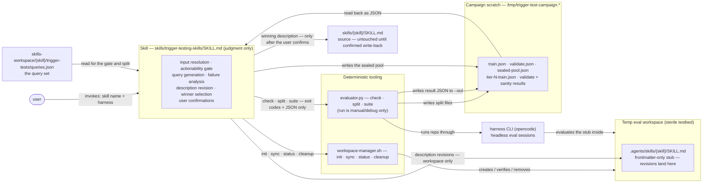
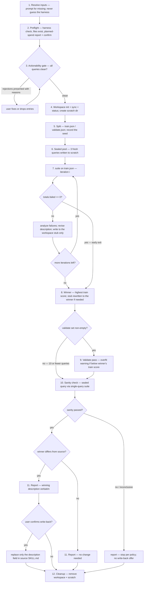

# Phase 2: Campaign and Skill — Implementation Plan

Companion to `developing-a-better-harness.md`, section "Implementing the Campaign and Skill".
This plan is decision-complete: every choice below is either a locked decision from the
design review or an explicitly registered assumption (see "Assumptions register"). The
implementing agent should not introduce new decisions; anything ambiguous is called out
here with the chosen behavior.

**Scope: the campaign loop and the skill that drives it.** This phase ties the existing
pieces (`workspace-manager.sh`, `evaluator.py` inner core) into a full trigger-test
campaign: actionability gate, train/validate split, description-optimization loop,
validate pass, fresh-query sanity check, winner report, and confirmed write-back.
NOT in scope: the custom restricted agent, artifact management (manifest.json, campaign
history — next phase per the notes), pi/claude harness strategy implementations, retries
or token-budget enforcement.

## How the pieces fit together

The skill contributes judgment only; every deterministic step (looping, counting,
splitting, scoring) lives in the scripts. Queries, labels, and results stay in campaign
scratch so the eval workspace remains a sterile testbed.



## Locked decisions (from design review with the user)

1. **README validation model.** Optimize on the train set only (train → analyze →
   revise → re-train). The validate set runs **once at the end** against the winning
   (best-train) description, as a held-out check. The notes' loop (validate every
   iteration, winner by validate score) is discarded and the notes have been corrected.
2. **Deterministic suite-runner.** The campaign loop does not live in the skill.
   `evaluator.py` gains new subcommands (`check`, `split`, `suite`) that do all looping,
   counting, splitting, aggregation, and scoring. The skill performs only judgment steps
   (parameter resolution, query generation/review, actionability judgment, failure
   analysis, description revision, user confirmations) and consumes only machine-readable
   output (exit codes and JSON files). The skill never parses prose stdout.
3. **Workspace-only revisions + confirm.** Description revisions are written only to the
   temp-workspace stub (`<workspace>/.agents/skills/<skill>/SKILL.md`, frontmatter-only)
   during the campaign. The source `skills/<skill>/SKILL.md` is untouched until the end,
   when the winning description is presented verbatim and written back only after the
   user confirms.
4. **Perfect-train early exit.** A train round with zero failures ends the loop
   immediately (nothing to analyze). Hard cap of 3 iterations regardless.
5. **Sealed pre-campaign pool.** Fresh sanity-check queries are generated *before* the
   optimization loop starts, stored in campaign scratch, and one is drawn at the end.
   The optimizing model never generates the sanity query after seeing its own work.
6. **Reject-and-surface actionability, before any spend.** Every query in the query set
   is judged for actionability before workspace init, before the split, before a single
   eval rep runs. All rejections (with reasons) are presented at once; the user fixes or
   drops entries; the campaign does not proceed until the set is clean. No fabrication
   of files or query rewriting by the campaign.
7. **Harness is a required, user-specified parameter.** The skill resolves a `harness`
   value (e.g. `opencode`, `pi`, `claude`) from the user prompt and asks for it if
   missing. It never tries to detect which harnesses are installed. Preflight verifies
   the specified harness (supported + CLI on PATH). Nothing in the skill is hard-coded
   to opencode; harness specifics live only in the evaluator's strategy registry.
8. **`trigger-tests/` (plural)** is the query-set directory convention
   (`skills-workspace/<skill>/trigger-tests/queries.json`), matching the repo and README.
9. **Sanity-check failure stops the campaign.** No restart of the loop (deliberate
   override of the README flowchart), no write-back offer, fresh queries are never used
   for training. The failure is reported; the user decides what to do next.

## Deliverables

- **Modified:** `skills/trigger-testing-skills/scripts/evaluator.py` — harness strategy
  registry, `--harness` added to `run`, new `check` / `split` / `suite` subcommands.
- **Modified:** `skills/trigger-testing-skills/SKILL.md` — rewritten campaign-centric
  (see "Skill design").
- **Unchanged:** `skills/trigger-testing-skills/scripts/workspace-manager.sh`.
- **Unchanged:** `agents/trigger-evaluator.md` (the subagent-dispatch workflow is
  retired from the skill; the agent file is left in place, out of scope).

Python >= 3.10, standard library only (adds `random`, `shutil` to the existing imports).

## Harness strategy layer

The existing `OpencodeStrategy` becomes one entry in a registry. Only opencode is
implemented this phase; the registry is the seam for pi/claude later.

```python
class EvalStrategy(Protocol):
    binary: str          # CLI binary name, used by the preflight check
    def evaluate(self, skill: str, query: str, workspace: Path,
                 model: str | None = None, effort: str | None = None) -> Verdict: ...

STRATEGIES: dict[str, type[EvalStrategy]] = {"opencode": OpencodeStrategy}
```

- `resolve_strategy(name)` → strategy class, or print
  `error: unsupported harness '<name>' (supported: opencode)` to stderr, exit 1.
- `check_harness(strategy_cls)` → `shutil.which(strategy_cls.binary)`; if None, print
  `error: harness '<name>' CLI not found on PATH (looked for '<binary>')` to stderr,
  exit 1. This verifies the binary exists, not that it is configured (provider keys
  etc.) — the smoke rep covers configuration.
- Defense in depth: `subprocess.run` raising `FileNotFoundError` inside `evaluate()`
  is caught and re-raised as `HarnessExecutionError("harness CLI '<binary>' not found
  on PATH")` so a missing binary mid-campaign aborts cleanly instead of tracebacking.
- `eval_batch` / `run_rep` signatures are generalized from `OpencodeStrategy` to the
  protocol. No other changes to the phase-1 inner core (signal detection, verdict
  precedence, Wilson scoring, report format for `run`).

## CLI contracts

All harness-taking subcommands require `--harness`. Exit codes everywhere:
`0` = success; `1` = operational/validation error or harness execution failure;
`2` = argparse usage errors.

### `check` (new)

```
usage: evaluator.py check --harness NAME
```

Validates the harness is supported and its CLI binary is on PATH. Success:
`ok: harness '<name>' available (<binary>: <resolved path>)` on stdout, exit 0.
Failures: the two stderr messages under "Harness strategy layer", exit 1.
The skill calls this in preflight before anything else that could spend tokens.

### `run` (changed)

```
usage: evaluator.py run --harness NAME --skill NAME --workspace DIR
                        --query TEXT --expect trigger|not-trigger
                        [--model MODEL] [--variant EFFORT] [--reps N]
                        [--timeout SECONDS]
```

Breaking change from phase 1: `--harness` is now required. Everything else about `run`
is unchanged (human-readable report to stdout, no machine-readable output). `run`
remains a manual/debug tool; **the skill never invokes `run`** — sanity checks use
`suite` with a single-query file so all skill-consumed output is JSON (see below).

### `split` (new)

```
usage: evaluator.py split --queries FILE --out-dir DIR
                          [--train-frac 0.6] [--seed N]
```

Deterministic stratified split. Pure function: no harness, no evals.

- Reads and strictly validates the query file: a JSON list of objects, each with
  `query` (non-empty string) and `shouldTrigger` (boolean). Any violation:
  `error: <exact reason>` (file missing, invalid JSON, entry N missing 'query', ...)
  to stderr, exit 1.
- **No-split path (<= 10 queries):** `train.json` = the full set, `validate.json` =
  `[]`; prints `note: <=10 queries, no validate split (train=<n>, validate=0)`.
- **Split path (> 10 queries):** per class (`shouldTrigger` true/false separately):
  shuffle with `random.Random(seed)`, `n_validate = int(len * (1 - train_frac) + 0.5)`
  clamped to `[0, len-1]` when `len >= 2` (a class of 1 keeps its item in train),
  first `n_validate` go to validate, rest to train. Then shuffle train and validate
  (same RNG). `--train-frac` must be in (0, 1).
- If `--seed` is omitted, one is drawn from `random.SystemRandom` and **printed** so
  the campaign record keeps it.
- Writes `<out-dir>/train.json` and `<out-dir>/validate.json` in the same schema as
  the input (`[{"query": ..., "shouldTrigger": ...}]`); creates `--out-dir` if needed.
- Stdout summary: `split: <n> queries -> train <a> / validate <b> (seed <s>)`
  plus per-class counts.

### `suite` (new)

```
usage: evaluator.py suite --harness NAME --skill NAME --workspace DIR
                          --queries FILE --out FILE
                          [--model MODEL] [--variant EFFORT]
                          [--reps 10] [--timeout 30]
```

Runs one full query set and emits structured results. This is the campaign's unit of
work (one invocation = one train round, or the validate pass, or the sanity check).

- Validates exactly like `run` (stub present, reps/timeout >= 1) plus: harness
  supported + binary present (same messages as `check`), query file valid (same rules
  as `split`), `--out` parent writable. Each failure: exact reason to stderr, exit 1.
- Empty query file (`[]`): writes a result JSON with empty `queries` and null-totals,
  prints a note, exit 0. (The validate pass is simply skipped by the skill instead;
  this path exists so a stray invocation is not an error.)
- Execution: queries are processed **sequentially** in file order; each query runs
  through the phase-1 `eval_batch` unchanged (smoke rep alone, then parallel batches
  of <= 10). Parallelism stays within a query to bound provider load.
- Progress on stdout, reusing the phase-1 log formats, plus a per-query line after
  each batch: `[query i/n] "<query>" -> <p> pass / <f> fail / <v> void  score: <s>`.
- **Harness failure policy (unchanged from phase 1):** any `HarnessExecutionError`
  aborts the suite immediately — error to stderr, exit 1, **no JSON file written**.
  A partial result file is never produced.
- After all queries: pooled totals over all non-void runs of all queries, one Wilson
  interval on the pool, `score = wilson_low` (nulls when the pool has 0 scored runs),
  and the JSON written to `--out`.

`suite --out` JSON schema:

```json
{
  "skill": "writing-skills",
  "harness": "opencode",
  "model": "...", "variant": null,
  "reps": 10, "timeout": 30,
  "queries": [
    {
      "query": "...", "should_trigger": true,
      "passed": 8, "failed": 1, "void": 1,
      "wilson_low": 0.462, "wilson_high": 0.974, "score": 0.462,
      "failures": [
        {"run": 3, "outcome": "not-triggered", "detail": "...",
         "reasoning": "..."}
      ]
    }
  ],
  "totals": {"passed": 74, "failed": 20, "void": 6,
             "wilson_low": 0.613, "wilson_high": 0.812, "score": 0.613}
}
```

- `failures` contains only non-void runs whose outcome mismatched the expectation,
  with that run's captured reasoning — exactly what the analysis step needs. Void runs
  appear only in the counts.
- Per-query `wilson_*`/`score` are computed as in phase 1 (nulls when a query is all
  void). Totals pool raw counts first, then compute one interval (not an average of
  intervals).

## Skill design

Rewrite of `skills/trigger-testing-skills/SKILL.md`, keeping the existing file's
structure (frontmatter / Overview / Inputs / Workflow / Report format / Gotchas /
Checklist) and the writing-skills conventions for prose. Command-invoked only, as
today.

### Frontmatter

Keep `name`, `disable-model-invocation: true`, and the opencode slash/autoinvoke
metadata. Update `description` to cover campaigns and optimization, e.g.:

> Use when the user asks to run a trigger test or trigger-testing campaign, tune a
> skill description that fires too often or not often enough, or check whether a skill
> triggers reliably. Runs train/validate eval campaigns over a query set in headless
> harness sessions and iteratively revises the skill's description.

(Final wording follows the writing-skills conventions; under 1024 chars, imperative,
no first person.)

### Inputs

- **Skill** (required) — the skill under test, given as a name or a path. A name is
  resolved via the driving session's skill-registry metadata (opencode exposes each
  registered skill's file location), falling back to `./skills/<name>/SKILL.md`;
  a path points at the skill dir (or its `SKILL.md`) directly. Skills registered
  as built-in have no filesystem location and cannot be tested — surface that and
  stop. The **source root** is derived from the resolved location: the directory
  containing that `skills/` directory (for `<root>/.opencode/skills/<name>`
  layouts, the parent of `.opencode`).
- **Harness** (required) — e.g. `opencode`. The user MUST specify it; if missing, ask.
  Never auto-detect installed harnesses (locked decision 7).
- **model / variant** (optional) — passed to eval executions only. The campaign-
  driving model is the session's current model.
- **reps** (default 10), **timeout** (default 30s), **max-iterations** (default 3),
  **train-frac** (default 0.6), **seed** (optional).
- **queries path** (default `skills-workspace/<skill>/trigger-tests/queries.json`
  under the source root; `skills-workspace/` is created there if missing).

### Campaign scratch

The skill creates a scratch dir outside the eval workspace
(`mktemp -d /tmp/trigger-test-campaign.XXXXXXXXXX`) to hold the split files, per-round
result JSON, and the sealed pool. Keeping these out of the temp workspace preserves
the sterile testbed — a wandering `--auto` run must not discover the query file with
its labels or the sealed pool. The skill removes the scratch dir at cleanup (with the
same path-prefix paranoia as workspace-manager's cleanup).

### Workflow

The numbered steps below are the authoritative spec; this is the same flow at a glance:



1. **Resolve inputs.** Prompt for missing required ones. Never guess the harness.
2. **Preflight** (no spend):
   a. Resolve the Python interpreter (`python3`, else `python`, on PATH; must be
      >= 3.10) and use it for every script invocation. Then
      `evaluator.py check --harness <harness>`; on failure, stop and surface.
   b. Resolve the target skill (registry-metadata location for names, else explicit
      path); its `SKILL.md` must exist, else stop. Derive the source root from its
      location and create `<source-root>/skills-workspace/<skill>/trigger-tests/`
      if missing.
   c. Queries file exists; else **offer to generate** an initial set per the README
      query-design conventions (coverage axes, realism, near-miss negatives, no weak
      negatives) — the user reviews and approves before anything is saved.
   d. Report planned maximum spend
      (`train_size × reps × max-iterations + validate_size × reps + reps` sanity)
      and ask the user to proceed.
3. **Actionability gate** (no spend; locked decision 6). Judge every query:
   - *processable request?* — reject statements/ruminations that ask for nothing
     (questions asking for information are processable and fine).
   - *self-contained in a bare workspace?* — reject queries referencing files,
     outlines, tickets, or skills that will not exist in the temp workspace.
   Present all rejections at once, with the reason per query. The user fixes or drops
   entries; re-run the gate after edits. The campaign proceeds only when the set is
   clean. **Suggested fix for artifact references: inline the referenced content
   into the query text** ("turn this outline into a skill: 1. ... 2. ..."). Pasting
   content is what real users do, it keeps the workspace sterile, and it makes
   near-miss negatives non-vacuous — the agent has the content in front of it, so
   "didn't trigger" is a meaningful result. The skill may propose inlined rewrites;
   the user approves every edit. Never scaffold files into the eval workspace
   instead — a triggered run could then mutate shared workspace state mid-suite.
   References to conversation context ("make it pushier") or to other skills cannot
   be inlined; rewrite them as self-contained queries or drop them. (Expected: the
   current `writing-skills` queries.json fails this gate on its
   first encounter — "turn this outline into a skill", the
   `docs/agent-notes/release-checklist.md` reference, dangling skill references —
   that is the gate working, not a bug.)
4. **Workspace.** `workspace-manager.sh init` → `sync --skill <skill> --source
   <source-root> --workspace <ws>` → `status` (must pass before any eval). Create
   scratch dir.
5. **Split.** `evaluator.py split --queries <queries> --out-dir <scratch>
   [--train-frac f] [--seed s]`. Record the printed seed.
6. **Sealed pool** (locked decision 5). Generate 3 fresh should-trigger queries per
   the README realism conventions; they must be self-contained (actionable by
   construction). Write to `<scratch>/sealed-pool.json`. They are never shown to the
   optimization loop.
7. **Iteration loop** (`i = 1..max-iterations`):
   a. `evaluator.py suite --harness <h> --skill <s> --workspace <ws>
      --queries <scratch>/train.json --out <scratch>/iter-<i>-train.json
      [--model m] [--variant v] --reps r --timeout t`.
      On exit 1: abort the campaign (see "Error handling").
   b. Read the result JSON. If `totals.failed == 0`: **early exit** (locked
      decision 4).
   c. Otherwise analyze failures (below), revise the description (guardrails below),
      and write the revision **to the workspace stub only** (locked decision 3).
      Record `{iteration, description, train score}` in context.
8. **Winner selection.** Highest `totals.score` across iterations; ties go to the
   earlier iteration (assumption 4). If the winner is not the current stub contents,
   rewrite the stub to the winner's description before continuing.
9. **Validate pass** (skipped when `validate.json` is empty — the <= 10 case):
   `suite --queries <scratch>/validate.json --out <scratch>/validate.json`.
   If the validate score is below the winner's train score, flag an **overfit
   warning** in the report (informational only; no restart, no automatic action).
10. **Sanity check.** Take the first entry of the sealed pool, write it as a
    single-query file `<scratch>/sanity.json`
    (`[{"query": ..., "shouldTrigger": true}]`), run
    `suite --queries <scratch>/sanity.json --out <scratch>/sanity.json`.
    Pass = `triggered` observed in >= 60% of non-void runs; all-void = inconclusive
    (reported as such, not failed). On failure: stop per locked decision 9.
11. **Report and write-back.** Present the report (below), including the winning
    description verbatim. If the winner differs from the source description and the
    sanity check passed, ask the user to confirm applying it; on confirmation, replace
    only the `description` field in the source `skills/<skill>/SKILL.md` frontmatter,
    preserving every other field and the body byte-for-byte. If the winner IS the
    original description, report that no change is needed (no write-back offer).
12. **Cleanup.** On completion (pass or fail): `workspace-manager.sh cleanup
    --workspace <ws>` and remove the scratch dir. On abort/error: keep both and print
    their paths for debugging.

### Failure analysis (skill guidance, embedded in SKILL.md)

Categories from the README, applied to the reasoning captured in the suite JSON:

| Failure | Likely cause | Action |
|---------|-------------|--------|
| Should-trigger query didn't fire | description too narrow | broaden scope or add context about when the skill is useful |
| Should-not query false-triggered | description too broad | add specificity about what the skill does NOT do; clarify boundary with adjacent skills |
| Same query fails repeatedly after tweaks | local minimum | structurally reframe the description (change the skeleton, not the adjectives) |

Note for the skill text: the README's fourth row (eval labels conflicting with the
skill *body*) cannot occur under this harness — eval agents see frontmatter-only
stubs, never the body. If a should-not query false-triggers across structurally
different framings, suspect the setup (wrong skill stubbed, contaminated workspace),
not the body, and surface it to the user instead of iterating.

Revision guardrails (from the README, embedded in SKILL.md): fix the category, not
the query; never paste failed-query keywords into the description; imperative
phrasing; user intent over implementation; err pushy; keep it concise (1024-char hard
cap); never first person; change the sentence skeleton when word swaps stall.

### Description revision mechanics

The stub is tiny, so revisions rewrite the whole stub file: frontmatter with the same
`name` (and any other pre-existing fields) and the revised `description`, no body.
The skill never edits the source file during the loop (locked decision 3), so
`workspace-manager.sh status` would correctly report "out of date" mid-campaign —
`status` is only run once, right after the initial `sync`.

### Report format

```
campaign: writing-skills   harness: opencode   model: <m>   variant: <v>
train: 9 queries   validate: 7 queries   reps: 10   seed: 42   iterations run: 2 of 3

iter 1: train score 0.613  (74 pass / 20 fail / 6 void)
        failure categories: 2x too-narrow (implicit asks), 1x local minimum
iter 2: train score 0.917  (91 pass / 3 fail / 6 void)
winner: iteration 2
  description: "Use this skill when ..."
validate: score 0.857  (54 pass / 3 fail / 3 void)   [overfit warning if below train]
sanity: "<sealed query>" -> triggered 9/10 -> pass

The winning description differs from the source. Apply it to
skills/writing-skills/SKILL.md? [awaiting confirmation]
```

On sanity failure the report ends at the sanity line plus
"stopping per campaign policy; no changes applied" and no write-back offer.

### Gotchas (SKILL.md)

- The harness is always user-specified; never infer it from the environment.
- Revisions touch the workspace stub only; the source file changes only on confirmed
  write-back at the end.
- Never restart the loop after a sanity failure; never train on sealed-pool queries.
- Never fabricate workspace files or silently rewrite queries to make them
  actionable — reject and surface instead. Proposed fixes (inlining the referenced
  content into the query text) go through user review at the gate like any other
  edit.
- The validate set runs once, at the end, against the winner; it is not part of the
  optimization loop.
- Keep queries verbatim across the whole campaign; editing mid-campaign invalidates
  comparisons.
- Early exit only on a perfect train round; never on a "good enough" majority.

### Checklist (SKILL.md)

- [ ] Harness explicitly specified by the user; `check` passed before any spend
- [ ] Actionability gate passed on the full query set before any spend
- [ ] Planned-spend report confirmed by the user
- [ ] Workspace synced and `status` clean before the first suite run
- [ ] Split seed recorded; sealed pool written before iteration 1
- [ ] Every suite run's JSON read from `--out`; no prose parsing
- [ ] Early exit only on zero train failures; max 3 iterations
- [ ] Winner = highest train score; stub matches winner before validate/sanity
- [ ] Validate once; overfit warning if below winner's train score
- [ ] Sanity via single-query suite; failure stops with no write-back offer
- [ ] Write-back only after explicit user confirmation
- [ ] Workspace + scratch removed on completion; kept and reported on abort

## Error handling policies

- `check` failure → stop in preflight, surface the exact message.
- `split` / query-file validation failure → stop before spend, surface the message.
- `suite` exit 1 (harness execution failure, e.g. provider 429) → abort the campaign:
  surface the stderr error, keep workspace and scratch, print their paths, apply
  nothing. No retries this phase.
- Suite totals with 0 scored runs (all void) → treat as broken conditions: abort as
  above (a campaign of timeouts measures nothing).
- Sanity inconclusive (all void) → reported as inconclusive; not a pass, not a
  restart; user decides.

## Exact validation commands

Run from the repo root. Use a cheap model and small reps; total validation cost
should stay well below one real campaign.

```bash
EV=python3\ skills/trigger-testing-skills/scripts/evaluator.py   # shorthand

# 1. check: supported harness, unsupported harness, missing binary
python3 skills/trigger-testing-skills/scripts/evaluator.py check --harness opencode
# expected: exit 0, "ok: harness 'opencode' available (...)"
python3 skills/trigger-testing-skills/scripts/evaluator.py check --harness pi
# expected: exit 1, "error: unsupported harness 'pi' (supported: opencode)"
PATH=/usr/bin:/bin python3 skills/.../evaluator.py check --harness opencode
# expected if opencode is not on that PATH (python3 itself must still resolve
# there): exit 1, "CLI not found on PATH"

# 2. split: real file, stratification, seed print, reproducibility
python3 skills/.../evaluator.py split \
  --queries skills-workspace/writing-skills/trigger-tests/queries.json \
  --out-dir /tmp/tt-split --seed 42
# expected: "split: 16 queries -> train ... / validate ... (seed 42)"; both files
# valid; rerun with --seed 42 produces identical files; different seed differs.
# Also: a 4-query file -> no-split note, validate.json == [].

# 3. run regression with required --harness
WS="$(skills/trigger-testing-skills/scripts/workspace-manager.sh init)"
skills/trigger-testing-skills/scripts/workspace-manager.sh sync \
  --skill writing-skills --source . --workspace "$WS"
python3 skills/.../evaluator.py run --harness opencode \
  --skill writing-skills --workspace "$WS" \
  --query "create a skill to drive my webapp using playwright" --expect trigger \
  --model opencode/gpt-5.4-nano --reps 3 --timeout 60
# expected: phase-1 behavior, exit 0.

# 4. suite: two-query file, verify JSON structure and pooled math by hand
python3 skills/.../evaluator.py suite --harness opencode \
  --skill writing-skills --workspace "$WS" \
  --queries /tmp/tt-two-queries.json --out /tmp/tt-suite.json \
  --model opencode/gpt-5.4-nano --reps 3 --timeout 60
# expected: exit 0; progress lines per rep and per query; /tmp/tt-suite.json matches
# the schema; totals.passed+failed+void == 6; score == pooled wilson_low.

# 5. suite abort path: unreachable provider -> exit 1, NO JSON file
python3 skills/.../evaluator.py suite --harness opencode \
  --skill writing-skills --workspace "$WS" \
  --queries /tmp/tt-two-queries.json --out /tmp/tt-should-not-exist.json \
  --model ollama/nonexistent --reps 3
# expected: exit 1; stderr names the failure; /tmp/tt-should-not-exist.json absent.

skills/trigger-testing-skills/scripts/workspace-manager.sh cleanup --workspace "$WS"
```

Skill-level manual validation (in a live session, after the script checks pass):

6. **Gate validation:** invoke the skill against `writing-skills` with the current
   queries.json and an explicit harness. Expected: the actionability gate rejects
   several known-non-actionable queries and the campaign stops before any spend.
7. **End-to-end mini-campaign:** point the skill at a small cleaned query file
   (<= 10 queries -> exercises the no-split path), `--reps 3`, cheap model. Expected:
   full loop with at least one revision, winner selection, sanity check, report;
   `git diff skills/writing-skills/SKILL.md` (or a scratch target skill) is empty
   until the write-back prompt; answer "no" and confirm the source is untouched.
8. **Write-back path:** rerun (or use a scratch target skill), answer "yes"; confirm
   only the `description` frontmatter field changed and the body is byte-identical.
9. **Early exit:** craft a tiny set the current description already aces; confirm the
   loop stops after iteration 1 and the winner is the original description (no
   write-back offer).
10. **Sanity failure:** harder to force on demand; acceptable to validate by code
    reading plus a forced-failure unit-style run of the suite JSON handling, rather
    than a live campaign.

## Assumptions register (flag any you want reversed before implementation)

1. Set-level score = pooled Wilson lower bound over all non-void runs in the set;
   per-query breakdown always present in the JSON for analysis.
2. Split: stratified by `shouldTrigger`, default train-frac 0.6, per-class validate
   count `int(n*(1-frac)+0.5)` clamped so a class of >= 2 keeps >= 1 in train; a
   class of 1 stays in train. Seeded; seed printed; re-drawn each campaign.
3. <= 10 queries -> no split; validate pass skipped; winner by train score alone.
4. Winner ties -> earlier iteration.
5. Winner selection is the skill comparing <= 3 machine-computed scores from JSON —
   no AI arithmetic. Full artifact persistence (manifest, campaign history) is next
   phase per the notes.
6. Sanity check: first entry of a 3-query sealed pool, should-trigger, `reps` reps
   via a single-query `suite`; pass = triggered in >= 60% of non-void runs; all-void
   = inconclusive (reported, neither pass nor restart).
7. Overfit warning = validate score below the winner's train score; informational
   only, no threshold math, surfaced for the user's judgment.
8. Actionability gate is all-or-nothing per attempt: all rejections presented at
   once; the user fixes or drops (the suggested fix for artifact references is
   inlining the referenced content into the query text); the gate re-runs after
   edits; the campaign proceeds only on a clean set.
9. Sealed pool is generated after the split and before iteration 1; stored in scratch;
   queries are self-contained by construction.
10. Evaluator/suite exit 1 mid-campaign -> abort, keep workspace + scratch, surface
    the error, no retry.
11. Cleanup on completion (pass or fail); workspace + scratch kept only on abort.
12. SKILL.md becomes campaign-centric; single-query testing remains via the
    documented `evaluator.py run` invocation; the subagent-dispatch workflow is
    removed from the skill; `agents/trigger-evaluator.md` is left in place untouched.
13. Driving model = the session's current model; `--model`/`--variant` apply to eval
    executions only.
14. Sequential across queries; parallelism only within a query's reps.
15. Planned-spend report + explicit proceed confirmation before the first eval.
16. Only the opencode strategy is implemented; unsupported harness names get the
    clean registry error; pi/claude strategies are future work plugged into the same
    seam.
17. The source root is resolved from the target skill's location: names are looked
    up in the driving session's skill-registry metadata (which exposes each
    registered skill's file path), with `./skills/<name>/SKILL.md` as fallback and
    explicit paths for skills not registered in the session. The source root is
    the directory containing that `skills/` directory (the project root for
    `.opencode/skills` layouts). `--source` for workspace-manager is the source
    root; `skills-workspace/<skill>/trigger-tests/` is assumed or created under
    it. The scripts are invoked by their path inside the trigger-testing-skills
    skill directory, independent of the current working directory.
18. Stub rewrites preserve all frontmatter fields except `description`; the body is
    never written to the stub.
19. `suite --out` is required; the skill consumes only exit codes and JSON files,
    never prose stdout.
20. Scripts are stdlib-only and run under any Python >= 3.10. The skill resolves
    the interpreter from PATH at preflight (`python3`, falling back to `python`),
    verifies the version, and uses it for all invocations; no repo-specific
    `.venv` path is baked in.
21. The WIP notes doc was corrected in exactly two spots (loop description -> README
    model; "revise the description" -> "revise the query"). Other now-superseded note
    fragments (fabricate-and-rewrite actionability, on-demand fresh query,
    winner-by-validate) are intentionally left as-is in the raw notes; this plan is
    the source of truth.

## Known limitations / accepted risks

- `--auto` risk stands unchanged from phase 1 (locked decision 2 there): a triggered
  run can execute arbitrary tools inside the disposable workspace. Mitigations are
  unchanged: temp workspace, frontmatter-only stubs, per-run timeout. The restricted
  custom agent remains the documented future fix.
- `check` verifies the harness binary exists, not that it is configured; provider
  misconfiguration surfaces via the smoke rep as a harness failure (abort).
- Global agent configuration (`~/.config/opencode`, etc.) still loads in eval
  sessions; full contamination-proofing (XDG redirection) remains out of scope per
  the notes.
- Session-context-dependent queries ("make it pushier", "update that skill we made
  yesterday") and queries referencing other skills are untestable under this
  harness; the gate rejects them and the user rewrites or drops them. If live
  testing ever shows inlined queries triggering differently than file-on-disk
  references, the deferred answer is skill-generated scaffolding with per-query
  workspace reset in the tooling — not this phase.
- No retries/backoff: provider rate limits abort the campaign (workspace kept for
  debugging).
- No budget enforcement beyond the planned-spend report and confirmation.
- Cross-project campaigns resolve the source root from the target skill
  (assumption 17), but the trigger-testing-skills skill itself — including its
  scripts — must be installed in the driving session.
