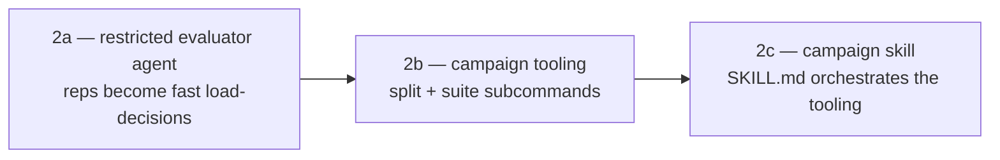

# Phase 2: Campaign and Skill — Overview and Plan Index

Companion to `developing-a-better-harness.md`, section "Implementing the Campaign and
Skill". The phase-2 work — tying `workspace-manager.sh` and the phase-1 `evaluator.py`
into a full trigger-test campaign (train/validate split, description-optimization loop,
validate pass, fresh-query sanity check, winner report, confirmed write-back) — is
implemented in three sequential sub-plans:

Each plan is decision-complete on its own: locked decisions and assumptions keep their
original design-review numbers, and each document notes which ones it owns. Later
plans reference earlier decisions by those numbers.

## [Phase 2a: Restricted Evaluator Agent](./phase-2a-restricted-evaluator-agent-plan.md)

The harness-specific setup that makes testing viable. Installs the restricted
`trigger-evaluator` agent (skill tool only, steps capped, `mode: primary`) into every
eval workspace, drops `--auto`, reworks signal detection (completed load vs.
interrupted-run intent, with the `timeout` verdict flag), and adds the `check`
preflight subcommand plus the harness strategy registry. Reps drop from up-to-timeout
arbitrary-tool runs to ~2–4 s load decisions at ~2k tokens.
*Deliverables: the opencode agent asset, fixture-based unit tests, and the evaluator
changes behind `check` and the reworked `run`.*

## [Phase 2b: Campaign Tooling](./phase-2b-campaign-tooling-plan.md)

The deterministic machinery the campaign runs on. `evaluator.py` gains `split`
(stratified, seeded train/validate split with a machine-readable `split.json`) and
`suite` (one full query set → structured result JSON with per-query and pooled Wilson
scores, `timeouts` counts, and failure reasoning). No skill changes; both subcommands
are validated standalone with live and abort-path runs.
*Deliverables: the two new evaluator subcommands and the `--out` JSON schema.*

## [Phase 2c: Campaign Skill](./phase-2c-campaign-skill-plan.md)

The judgment layer. Rewrites `skills/trigger-testing-skills/SKILL.md` into the
campaign driver: input resolution, preflight, planned-spend confirmation, sealed
sanity pool, the 3-iteration train loop with workspace-only revisions, winner
selection, the once-at-the-end validate pass, sanity check, suspect-query flagging,
and confirmed write-back to the source SKILL.md.
*Deliverables: the rewritten SKILL.md only — all scripts and agent files are
unchanged from phases 2a–2b.*

## Still out of scope (next phase)

Artifact management (manifest.json, campaign history), pi/claude harness strategy
implementations (the 2a registry is their seam), retries/backoff, and token-budget
enforcement.
