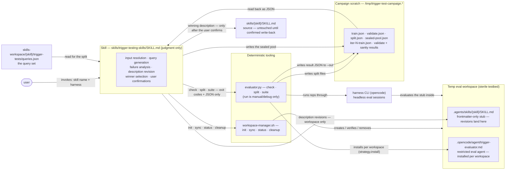
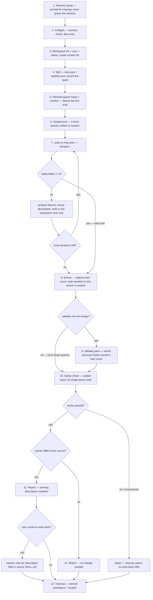

# Phase 2: Campaign and Skill — Implementation Plan

Companion to `developing-a-better-harness.md`, section "Implementing the Campaign and Skill".
This plan is decision-complete: every choice below is either a locked decision from the
design review or an explicitly registered assumption (see "Assumptions register"). The
implementing agent should not introduce new decisions; anything ambiguous is called out
here with the chosen behavior.

**Scope: the campaign loop and the skill that drives it.** This phase ties the existing
pieces (`workspace-manager.sh`, `evaluator.py` inner core) into a full trigger-test
campaign: train/validate split, description-optimization loop, validate pass,
fresh-query sanity check, winner report, and confirmed write-back.
IN scope (pulled forward from the next phase): the restricted evaluator agent and its
per-workspace installation (locked decisions 10–11). NOT in scope: artifact management
(manifest.json, campaign history — next phase per the notes), pi/claude harness
strategy implementations, retries or token-budget enforcement.

## How the pieces fit together

The skill contributes judgment only; every deterministic step (looping, counting,
splitting, scoring) lives in the scripts. Queries, labels, and results stay in campaign
scratch so the eval workspace remains a sterile testbed.



## Locked decisions (from design review with the user)

1. **README validation model.** Optimize on the train set only (train → analyze →
   revise → re-train). The validate set runs **once at the end** against the winning
   (best-train) description, as a held-out check. The notes' loop (validate every
   iteration, winner by validate score) is discarded and the notes have been corrected.
2. **Deterministic suite-runner.** The campaign loop does not live in the skill.
   `evaluator.py` gains new subcommands (`check`, `split`, `suite`) that do all looping,
   counting, splitting, aggregation, and scoring. The skill performs only judgment steps
   (parameter resolution, query generation/review, failure
   analysis, description revision, user confirmations) and consumes only machine-readable
   output (exit codes and JSON files). The skill never parses prose stdout.
3. **Workspace-only revisions + confirm.** Description revisions are written only to the
   temp-workspace stub (`<workspace>/.agents/skills/<skill>/SKILL.md`, frontmatter-only)
   during the campaign. The source `skills/<skill>/SKILL.md` is untouched until the end,
   when the winning description is presented verbatim and written back only after the
   user confirms.
4. **Perfect-train early exit.** A train round with zero failures ends the loop
   immediately (nothing to analyze). Hard cap of 3 iterations regardless.
5. **Sealed pre-campaign pool.** Fresh sanity-check queries are generated *before* the
   optimization loop starts, stored in campaign scratch, and one is drawn at the end.
   The optimizing model never generates the sanity query after seeing its own work.
6. **No actionability gate** (supersedes the earlier reject-and-surface gate decision).
   The gate existed because non-self-contained queries caused toil and wasted spend
   under `--auto` full-tool reps; under the restricted evaluator agent (decisions
   10–11) the load decision is the entire measurement, so such queries are measurable
   at the same ~2k-token cost as any other, and the gate's concretize/inline rewrites
   would skew the corpus away from realistic terse, context-dependent phrasing. Query
   quality is instead policed by evidence: failure analysis flags a should-trigger
   query that fails under every candidate description across every iteration as a
   suspect query (probable query-side problem — bad label, non-processable statement,
   or missing-context dependence), surfaced in the report with its `timeouts` count as
   corroboration. The campaign never blocks on, rewrites, or fabricates files for a
   query. Self-contained-by-construction remains the convention for *generated*
   queries (sealed pool, query-set authoring), not a requirement for the eval corpus.
7. **Harness is a required, user-specified parameter.** The skill resolves a `harness`
   value (e.g. `opencode`, `pi`, `claude`) from the user prompt and asks for it if
   missing. It never tries to detect which harnesses are installed. Preflight verifies
   the specified harness (supported + CLI on PATH). Nothing in the skill is hard-coded
   to opencode; harness specifics live only in the evaluator's strategy registry.
8. **`trigger-tests/` (plural)** is the query-set directory convention
   (`skills-workspace/<skill>/trigger-tests/queries.json`), matching the repo and README.
9. **Sanity-check failure stops the campaign.** No restart of the loop (deliberate
   override of the README flowchart), no write-back offer, fresh queries are never used
   for training. The failure is reported; the user decides what to do next.
10. **Restricted evaluator agent, installed per workspace.** Every eval rep runs under
    the `trigger-evaluator` agent (skill tool only, steps capped, all other tools
    denied), so the load decision is the entire measurement and post-load execution —
    including toil over non-self-contained queries — is structurally impossible. Agent
    definitions and discovery locations are harness-specific: per-harness copies live
    at `skills/trigger-testing-skills/agents/trigger-evaluator.<harness>.md`, and the
    harness strategy installs its copy into the workspace before any rep
    (`strategy.install()`; opencode dest `.opencode/agent/trigger-evaluator.md`,
    `mode: primary` — subagent mode is rejected for headless `--agent` use) and passes
    `--agent trigger-evaluator`. `--auto` is dropped: the agent's own permissions allow
    the skill tool headless and deny every other tool. A missing agent source file, or
    an opencode "agent not found / falling back to default agent" warning on stderr,
    is a harness execution failure (abort), never a silent fallback run.
11. **Interrupted-run intent counts as a pass.** On timeout (or step-cap cutoff), the
    partial event stream is parsed before classifying: a completed target-skill load
    is `triggered` (signal wins, as before); clear intent evidence without a completed
    load is `triggered` with `timeout: true` on the Verdict (counted in Wilson
    scoring; surfaced via per-query and totals `timeouts` counts); otherwise `void`.
    A step-cap cutoff is recognized by the absence of the mandated final report in
    an otherwise clean, normally-exited stream (see "Signal detection", rule 3);
    `timeout: true` marks both interruption forms.
    Intent evidence is restricted to the agent's mandated report naming the target, an
    attempted skill call on the target, or a strict intent phrase in reasoning —
    never a bare mention of the skill name. (User decision: count as pass, flagged.)

## Probe evidence this plan relies on

Validated against the installed opencode CLI (1.18.21) with a scratch workspace,
kimi-for-coding/k3 at minimal effort, `--pure`, and no `--auto`:

- `.opencode/agent/<name>.md` inside the workspace is discovered with `--pure` +
  `--dir <workspace>`; plugins are off under `--pure`, so the agent must be
  physically installed into the workspace (the repo's plugin-registered `agents/`
  copy is not visible to eval sessions).
- `mode: subagent` agents are rejected for headless `--agent` use: stderr warning
  `agent "trigger-evaluator" is a subagent, not a primary agent. Falling back to
  default agent` — hence `mode: primary` in the opencode copy.
- The agent's own `permission: {skill: allow}` permits the skill tool headless
  without `--auto` (`state.status: "completed"`); all other tools are denied.
- An unknown `--agent` name is a silent fallback: exit 0, the eval runs under the
  default agent, and the only evidence is a stderr warning (`agent "..." not found.
  Falling back to default agent`) — hence the stderr scan in the strategy layer.
- A rejected skill call appears as `tool_use` with `state.status: "error"` — the
  phase-1 rule (any status counts) would score it `triggered`; only
  `status == "completed"` is a load.
- The agent's mandated report arrives as a `text` event, model-formatted (observed:
  `Loaded skill: **writing-skills** — ...`; no-match: `No skill matched — Paris.`).
- `steps: 3` sufficed for reasoning + load + report (2 steps used); reps completed in
  ~2–4 s at ~2k tokens, versus up to the 30 s timeout plus arbitrary tool use under
  the phase-1 configuration.
- Built-in skills (customize-opencode) are present even with `--pure` in a sterile
  workspace; a should-not-trigger query loaded it (correctly attributed as
  not-triggered w.r.t. the target).

## Deliverables

- **New:** `skills/trigger-testing-skills/agents/trigger-evaluator.opencode.md` — the
  restricted evaluator agent for opencode (`mode: primary`, skill-only permissions,
  capped steps; locked decision 10). Contents: a copy of
  `agents/trigger-evaluator.md` with exactly one change — `mode: subagent` →
  `mode: primary`; the permission block, `steps: 3`, and the body (including the
  mandated report line the signal detection parses) carry over verbatim.
- **New:** `skills/trigger-testing-skills/scripts/test_evaluator.py` — stdlib
  `unittest` module driving the verdict logic with canned NDJSON streams
  (`subprocess.run` stubbed; no live model): timeout-with-intent partial stream →
  `triggered` + `timeout: true`; rejected skill call (`status="error"`) in a
  completed run → `not-triggered`; missing-report clean exit → the rule-3 step-cap
  intent path; stderr agent-fallback warning → `HarnessExecutionError`.
- **Modified:** `skills/trigger-testing-skills/scripts/evaluator.py` — harness strategy
  registry with `install()`, `--harness` added to `run`, new `check` / `split` /
  `suite` subcommands, signal-detection rework (see "Signal detection"), `timeout`
  flag on `Verdict`.
- **Modified:** `skills/trigger-testing-skills/SKILL.md` — rewritten campaign-centric
  (see "Skill design").
- **Unchanged:** `skills/trigger-testing-skills/scripts/workspace-manager.sh` (agent
  install lives in the evaluator strategy, not the workspace manager).
- **Unchanged:** `agents/trigger-evaluator.md` (the subagent-dispatch workflow is
  retired from the skill; the repo file remains for interactive sessions and now
  intentionally diverges from the skill-local opencode copy, which uses
  `mode: primary`).

Python >= 3.10, standard library only (adds `random`, `shutil` to the existing
imports; the test module adds `unittest` — runtime imports unchanged).

## Harness strategy layer

The existing `OpencodeStrategy` becomes one entry in a registry. Only opencode is
implemented this phase; the registry is the seam for pi/claude later.

```python
class EvalStrategy(Protocol):
    binary: str          # CLI binary name, used by the preflight check
    agent_name: str      # "trigger-evaluator"; passed to the harness per rep
    agent_source: Path   # .../trigger-testing-skills/agents/trigger-evaluator.<harness>.md
    agent_dest: str      # workspace-relative install path; opencode:
                         # ".opencode/agent/trigger-evaluator.md"
    def install(self, workspace: Path) -> None: ...
    def evaluate(self, skill: str, query: str, workspace: Path,
                 model: str | None = None, effort: str | None = None) -> Verdict: ...

STRATEGIES: dict[str, type[EvalStrategy]] = {"opencode": OpencodeStrategy}
```

- `resolve_strategy(name)` → strategy class, or print
  `error: unsupported harness '<name>' (supported: opencode)` to stderr, exit 1.
- `check_harness(strategy_cls)` → `shutil.which(strategy_cls.binary)`; if None, print
  `error: harness '<name>' CLI not found on PATH (looked for '<binary>')` to stderr,
  exit 1; also verifies `agent_source` exists (`error: evaluator agent file missing:
  <path>`, exit 1). This verifies the binary exists, not that it is configured
  (provider keys etc.) — the smoke rep covers configuration.
- `install(workspace)` copies `agent_source` to `workspace / agent_dest` (creating
  parents) and verifies the file landed; a missing source is the operational error
  above, raised before any spend. `cmd_run` and `cmd_suite` call it after
  instantiating the strategy and validating the workspace stub, always before any
  rep. Idempotent: every invocation re-copies, so a stale or edited workspace agent
  file is always refreshed.
- Defense in depth: `subprocess.run` raising `FileNotFoundError` inside `evaluate()`
  is caught and re-raised as `HarnessExecutionError("harness CLI '<binary>' not found
  on PATH")` so a missing binary mid-campaign aborts cleanly instead of tracebacking.
  Likewise, opencode silently falls back to the default agent when `--agent` names an
  unknown agent (exit 0, stderr warning only — see probe evidence): any
  `agent ... not found` / `Falling back to default agent` warning on stderr is
  re-raised as `HarnessExecutionError` so a suite can never run under the wrong
  agent.
- `eval_batch` / `run_rep` signatures are generalized from `OpencodeStrategy` to the
  protocol. Batch mechanics (smoke rep, parallel batches, Wilson scoring) are
  unchanged; signal detection and `Verdict` are reworked per "Signal detection".

## Signal detection (reworked for the restricted agent)

The phase-1 rule (any skill `tool_use` event naming the target = triggered) is
replaced by a precedence that distinguishes a completed load from intent, because the
restricted agent makes both the mandated text report and permission/step failures
observable:

1. **Completed load wins.** A `tool_use` event for the `skill` tool with
   `input.name == <target>` and `state.status == "completed"` → `triggered`
   (including when found in the partial stream of an interrupted run). Any other
   status (`error`, `pending`) is recorded as an attempted load, never a completed
   one — phase 1 counted `status="error"` as triggered, a false positive once
   permission rejections are possible.
2. **Completed run, no completed load, report present** → `not-triggered`. The detail
   notes any other skill loaded (as before), an attempted-but-failed load of the
   target, or the agent's no-match report.
3. **Interrupted run** — two forms, both parsed before classifying:
   (a) subprocess timeout — the partial stdout carried by `subprocess.TimeoutExpired`
   (phase 1 discarded it); (b) step-cap cutoff — detected when a normally-exited,
   error-free run with parseable events has neither a completed load nor the
   mandated final report (the report is the completeness marker: with `steps: 3`
   every normal run ends with it — probe: 2 steps used); the full stream is treated
   as the partial stream. Completed load → `triggered`; else intent evidence →
   `triggered` with `timeout: true` (locked decision 11); else → `void` with
   `timeout: true`.
4. The agent's mandated final report (`Loaded skill: <name>` / `No skill matched`,
   observed as a `text` event) is parsed conservatively (tolerate markdown emphasis)
   and used only as intent evidence under rule 3 and as corroborating detail under
   rules 1–2. A report claiming a load that no completed `tool_use` corroborates is
   intent, not a load — the mechanical signal always beats narration on conflict.
5. Reasoning (`--thinking`) is captured as before and consulted under rule 3 only via
   strict intent patterns (e.g. "I should load the `<skill>` skill", "loading
   `<skill>`"), never a bare name mention — not-trigger reasoning names the target
   while rejecting it.

`Verdict` gains `timeout: bool = False`; `timeout: true` marks any interrupted run
(subprocess timeout or step-cap cutoff). `detail` always records which signal path
produced the verdict. Scoring is unchanged (Wilson over non-void runs);
timeout-intent passes are included in scoring (locked decision 11) and surfaced via
`timeouts` counts so the analysis step can see how much of a score rests on the
weaker signal.

## CLI contracts

All harness-taking subcommands require `--harness`. Exit codes everywhere:
`0` = success; `1` = operational/validation error or harness execution failure;
`2` = argparse usage errors.

### `check` (new)

```
usage: evaluator.py check --harness NAME
```

Validates the harness is supported, its CLI binary is on PATH, and the strategy's
evaluator-agent source file exists. Success:
`ok: harness '<name>' available (<binary>: <resolved path>)` on stdout, exit 0.
Failures: the two stderr messages under "Harness strategy layer", exit 1.
The skill calls this in preflight before anything else that could spend tokens.

### `run` (changed)

```
usage: evaluator.py run --harness NAME --skill NAME --workspace DIR
                        --query TEXT --expect trigger|not-trigger
                        [--model MODEL] [--variant EFFORT] [--reps 10]
                        [--timeout 30]
```

Breaking change from phase 1: `--harness` is now required. Reps now execute under the
restricted evaluator agent: `cmd_run` installs it via `strategy.install(workspace)`
before any rep, and the opencode command is
`opencode run --pure --thinking --format json --dir <ws> --agent trigger-evaluator
[--model m] [--variant v] <query>` — `--auto` is dropped (locked decision 10). The
per-run report line appends a `(timeout)` marker for verdicts with `timeout: true`.
Everything else about `run` is unchanged (human-readable report to stdout, no
machine-readable output). `run` remains a manual/debug tool; **the skill never
invokes `run`** — sanity checks use `suite` with a single-query file so all
skill-consumed output is JSON (see below).

### `split` (new)

```
usage: evaluator.py split --queries FILE --out-dir DIR
                          [--train-frac 0.6] [--seed N]
```

Deterministic stratified split. Pure function: no harness, no evals.

- Reads and strictly validates the query file: a JSON list of objects, each with
  `query` (non-empty string) and `shouldTrigger` (boolean). Any violation:
  `error: <exact reason>` (file missing, invalid JSON, entry N missing 'query', ...)
  to stderr, exit 1.
- **No-split path (<= 10 queries):** `train.json` = the full set, `validate.json` =
  `[]`; prints `note: <=10 queries, no validate split (train=<n>, validate=0)`.
- **Split path (> 10 queries):** per class (`shouldTrigger` true/false separately):
  shuffle with `random.Random(seed)`, `n_validate = int(len * (1 - train_frac) + 0.5)`
  clamped to `[0, len-1]` for every class size (for a class of 1 the clamp range is
  `[0, 0]`, so its item always stays in train), first `n_validate` go to validate,
  rest to train. Then shuffle train and validate (same RNG). `--train-frac` must be
  in (0, 1); otherwise `error: --train-frac must be in (0, 1)` to stderr, exit 1.
- If `--seed` is omitted, one is drawn from `random.SystemRandom`, recorded in
  `split.json`, and **printed** so the campaign record keeps it.
- Writes `<out-dir>/train.json` and `<out-dir>/validate.json` in the same schema as
  the input (`[{"query": ..., "shouldTrigger": ...}]`); creates `--out-dir` if needed.
- Also writes `<out-dir>/split.json` on every path (split and no-split):
  `{"seed": <s>, "train": <a>, "validate": <b>}` — the machine-readable channel the
  skill reads for the seed and the planned-spend sizes (locked decision 2).
- Stdout summary: `split: <n> queries -> train <a> / validate <b> (seed <s>)`
  plus per-class counts.

### `suite` (new)

```
usage: evaluator.py suite --harness NAME --skill NAME --workspace DIR
                          --queries FILE --out FILE
                          [--model MODEL] [--variant EFFORT]
                          [--reps 10] [--timeout 30]
```

Runs one full query set and emits structured results. This is the campaign's unit of
work (one invocation = one train round, or the validate pass, or the sanity check).

- Validates exactly like `run` (stub present, reps/timeout >= 1, evaluator agent
  installed via `strategy.install`) plus: harness supported + binary present + agent
  source asset present (same messages as `check`), query file valid (same rules
  as `split`), `--out` parent writable. Each failure: exact reason to stderr, exit 1.
- Empty query file (`[]`): writes a result JSON with empty `queries` and totals of
  zero counts with null `wilson_*`/`score`, prints a note, exit 0. (The validate
  pass is simply skipped by the skill instead; this path exists so a stray
  invocation is not an error.)
- Execution: queries are processed **sequentially** in file order; each query runs
  through the phase-1 `eval_batch` unchanged (smoke rep alone, then parallel batches
  of <= 10). Parallelism stays within a query to bound provider load.
- Progress on stdout, reusing the phase-1 log formats, plus a per-query line after
  each query completes: `[query i/n] "<query>" -> <p> pass / <f> fail / <v> void
  score: <s>` (`score: n/a` when the query is all-void).
- **Harness failure policy (unchanged from phase 1):** any `HarnessExecutionError`
  aborts the suite immediately — error to stderr, exit 1, **no JSON file written**.
  A partial result file is never produced.
- After all queries: pooled totals over all non-void runs of all queries, one Wilson
  interval on the pool, `score = wilson_low` (nulls when the pool has 0 scored runs),
  and the JSON written to `--out`.

`suite --out` JSON schema:

```json
{
  "skill": "writing-skills",
  "harness": "opencode",
  "model": "...", "variant": null,
  "reps": 10, "timeout": 30,
  "queries": [
    {
      "query": "...", "should_trigger": true,
      "passed": 8, "failed": 1, "void": 1, "timeouts": 1,
      "wilson_low": 0.462, "wilson_high": 0.974, "score": 0.462,
      "failures": [
        {"run": 3, "outcome": "not-triggered", "detail": "...",
         "reasoning": "...", "timeout": false}
      ]
    }
  ],
  "totals": {"passed": 74, "failed": 20, "void": 6, "timeouts": 3,
             "wilson_low": 0.613, "wilson_high": 0.812, "score": 0.613}
}
```

- `failures` contains only non-void runs whose outcome mismatched the expectation,
  with that run's captured reasoning — exactly what the analysis step needs. Void runs
  appear only in the counts. `timeout` on a failure entry marks a mismatch that rests
  on interrupted-run intent evidence (locked decision 11).
- `timeouts` counts verdicts with `timeout: true` (any outcome), per query and
  pooled — the analysis step uses it to see how much of a score rests on
  interrupted-run intent.
- Per-query `wilson_*`/`score` are computed as in phase 1 (nulls when a query is all
  void). Totals pool raw counts first, then compute one interval (not an average of
  intervals).

## Skill design

Rewrite of `skills/trigger-testing-skills/SKILL.md`, keeping the existing file's
structure (frontmatter / Overview / Inputs / Workflow / Report format / Gotchas /
Checklist) and the writing-skills conventions for prose. Command-invoked only, as
today.

### Frontmatter

Keep `name`, `disable-model-invocation: true`, and the opencode slash/autoinvoke
metadata. Update `description` to cover campaigns and optimization, e.g.:

> Use when the user asks to run a trigger test or trigger-testing campaign, tune a
> skill description that fires too often or not often enough, or check whether a skill
> triggers reliably. Runs train/validate eval campaigns over a query set in headless
> harness sessions and iteratively revises the skill's description.

(Final wording follows the writing-skills conventions; under 1024 chars, imperative,
no first person.)

### Inputs

- **Skill** (required) — the skill under test, given as a name or a path. A name is
  resolved via the driving session's skill-registry metadata (opencode exposes each
  registered skill's file location), falling back to `./skills/<name>/SKILL.md`;
  a path points at the skill dir (or its `SKILL.md`) directly. Skills registered
  as built-in have no filesystem location and cannot be tested — surface that and
  stop. The **source root** is derived from the resolved location: the directory
  containing that `skills/` directory, for every layout (for
  `<root>/.opencode/skills/<name>`, the source root is `<root>/.opencode`, so
  artifacts live at `<root>/.opencode/skills-workspace/` — the README's "sibling
  of skills/" convention). If the resolved skill is not under a directory named
  `skills/`, no source root can be derived — stop and surface that.
- **Harness** (required) — e.g. `opencode`. The user MUST specify it; if missing, ask.
  Never auto-detect installed harnesses (locked decision 7).
- **model / variant** (optional) — passed to eval executions only. The campaign-
  driving model is the session's current model.
- **reps** (default 10), **timeout** (default 30s), **max-iterations** (default 3;
  hard cap 3 per locked decision 4 — a higher requested value is clamped to 3 and
  the user is told), **train-frac** (default 0.6), **seed** (optional).
- **queries path** (default `skills-workspace/<skill>/trigger-tests/queries.json`
  under the source root; `skills-workspace/` is created there if missing).

### Campaign scratch

The skill creates a scratch dir outside the eval workspace
(`mktemp -d /tmp/trigger-test-campaign.XXXXXXXXXX`) to hold the split files, per-round
result JSON, and the sealed pool. Keeping these out of the temp workspace preserves
the sterile testbed — a wandering eval run must not discover the query file with
its labels or the sealed pool. The skill removes the scratch dir at cleanup (with the
same path-prefix paranoia as workspace-manager's cleanup).

### Workflow

The numbered steps below are the authoritative spec; this is the same flow at a glance:



1. **Resolve inputs.** Prompt for missing required ones. Never guess the harness.
2. **Preflight** (no spend):
   a. Resolve the Python interpreter (`python3`, else `python`, on PATH; must be
      >= 3.10) and use it for every script invocation. Then
      `evaluator.py check --harness <harness>`; on failure, stop and surface.
   b. Resolve the target skill (registry-metadata location for names, else explicit
      path); its `SKILL.md` must exist, else stop. Derive the source root from its
      location and create `<source-root>/skills-workspace/<skill>/trigger-tests/`
      if missing.
   c. Queries file exists; else **offer to generate** an initial set per the README
      query-design conventions (coverage axes, realism, near-miss negatives, no weak
      negatives) — the user reviews and approves before anything is saved.
3. **Workspace.** `workspace-manager.sh init` → `sync --skill <skill> --source
   <source-root> --workspace <ws>` → `status` (must pass before any eval). Create
   scratch dir.
4. **Split.** `evaluator.py split --queries <queries> --out-dir <scratch>
   [--train-frac f] [--seed s]`. Record the seed from `<scratch>/split.json`.
5. **Planned spend.** Report planned maximum spend
   (`train_size × reps × max-iterations + validate_size × reps + reps` sanity),
   with the train/validate sizes read from `<scratch>/split.json`, and ask the user
   to proceed. This is the last confirmation before the first eval; everything before
   it is token-free local scripting.
6. **Sealed pool** (locked decision 5). Generate 3 fresh should-trigger queries per
   the README realism conventions; they must be self-contained by construction
   (locked decision 6). Write to `<scratch>/sealed-pool.json`. They are never shown
   to the optimization loop.
7. **Iteration loop** (`i = 1..max-iterations`):
   a. `evaluator.py suite --harness <h> --skill <s> --workspace <ws>
      --queries <scratch>/train.json --out <scratch>/iter-<i>-train.json
      [--model m] [--variant v] --reps r --timeout t`.
      On exit 1: abort the campaign (see "Error handling").
   b. Read the result JSON. Record `{iteration, description, train score}` in
      context, where `description` is the one this iteration's suite evaluated —
      the source description for iteration 1, otherwise the revision written at
      the end of the previous iteration. If the pool has 0 scored runs (all void —
      `totals.score` is null): abort as broken conditions (see "Error handling").
      Otherwise, if `totals.failed == 0`: **early exit** (locked decision 4).
   c. Otherwise analyze failures (below), revise the description (guardrails below),
      and write the revision **to the workspace stub only** (locked decision 3).
8. **Winner selection.** Highest `totals.score` across iterations; ties go to the
   earlier iteration (assumption 4). If the winner is not the current stub contents,
   rewrite the stub to the winner's description before continuing.
9. **Validate pass** (skipped when `validate.json` is empty — the <= 10 case):
   `suite --queries <scratch>/validate.json --out <scratch>/validate-results.json`.
   If the validate score is below the winner's train score, flag an **overfit
   warning** in the report (informational only; no restart, no automatic action).
   An all-void validate pass aborts the campaign like a train round (see "Error
   handling").
10. **Sanity check.** Take the first entry of the sealed pool, write it as a
    single-query file `<scratch>/sanity.json`
    (`[{"query": ..., "shouldTrigger": true}]`), run
    `suite --queries <scratch>/sanity.json --out <scratch>/sanity-results.json`.
    Pass = `triggered` observed in >= 60% of non-void runs; all-void = inconclusive
    (reported as such, not failed). On failure: stop per locked decision 9.
11. **Report and write-back.** Present the report (below), including the winning
    description verbatim. If the winner differs from the source description and the
    sanity check passed, ask the user to confirm applying it; on confirmation, replace
    only the `description` field in the source SKILL.md (at its resolved location)
    frontmatter, preserving every other field and the body byte-for-byte. If the
    winner IS the original description, report that no change is needed (no
    write-back offer).
12. **Cleanup.** On completion (pass or fail): `workspace-manager.sh cleanup
    --workspace <ws>` and remove the scratch dir. On abort/error: keep both and print
    their paths for debugging.

### Failure analysis (skill guidance, embedded in SKILL.md)

Categories from the README, applied to the reasoning captured in the suite JSON:

| Failure | Likely cause | Action |
|---------|-------------|--------|
| Should-trigger query didn't fire | description too narrow | broaden scope or add context about when the skill is useful |
| Should-not query false-triggered | description too broad | add specificity about what the skill does NOT do; clarify boundary with adjacent skills |
| Same query fails repeatedly after tweaks | local minimum | structurally reframe the description (change the skeleton, not the adjectives) |

Note for the skill text: the README's fourth row (eval labels conflicting with the
skill *body*) cannot occur under this harness — eval agents see frontmatter-only
stubs, never the body. If a should-not query false-triggers across structurally
different framings, suspect the setup (wrong skill stubbed, contaminated workspace),
not the body, and surface it to the user instead of iterating.

Timeout note for the skill text: under the restricted evaluator agent, toil-driven
timeouts are structurally impossible, so a cluster of `timeouts` (passes resting on
interrupted-run intent, or voids) points at infrastructure — slow provider, step cap
— not the description. Check `timeouts` before analyzing failures; investigate
conditions (or raise `--timeout`) instead of revising the description on that
evidence.

Suspect-query flag (locked decision 6): a should-trigger query that fails under
*every* candidate description across *every* iteration is probably a query-side
problem — bad label, a statement that asks for nothing, or dependence on context the
bare workspace lacks — not a description problem. Flag such queries in the report
(with the per-query `timeouts` count as corroboration) and recommend the user prune
or rewrite them in queries.json. Never contort the description to chase a query with
this signature; that is exactly the failure the revision guardrails exist to prevent,
and a contortion that does help would have to survive the validation set anyway.

Revision guardrails (from the README, embedded in SKILL.md): fix the category, not
the query; never paste failed-query keywords into the description; imperative
phrasing; user intent over implementation; err pushy; keep it concise (1024-char hard
cap); never first person; change the sentence skeleton when word swaps stall.

### Description revision mechanics

The stub is tiny, so revisions rewrite the whole stub file: frontmatter with the same
`name` (and any other pre-existing fields) and the revised `description`, no body.
The skill never edits the source file during the loop (locked decision 3), so
`workspace-manager.sh status` would correctly report "out of date" mid-campaign —
`status` is only run once, right after the initial `sync`.

### Report format

```
campaign: writing-skills   harness: opencode   model: <m>   variant: <v>
train: 9 queries   validate: 7 queries   reps: 10   seed: 42   iterations run: 2 of 3

iter 1: train score 0.548  (55 pass / 29 fail / 6 void)
        failure categories: mostly too-narrow (implicit asks); one local minimum
iter 2: train score 0.903  (84 pass / 3 fail / 3 void)
winner: iteration 2
  description: "Use this skill when ..."
validate: score 0.810  (58 pass / 6 fail / 6 void)   [overfit warning if below train]
sanity: "<sealed query>" -> triggered 9/10 -> pass
suspect queries: "turn this outline into a skill" — failed under all candidates in
  all iterations (timeouts: 2); likely query-side, consider pruning or rewriting

The winning description differs from the source. Apply it to
skills/writing-skills/SKILL.md? [awaiting confirmation]
```

The `suspect queries` block appears only when failure analysis flagged any (locked
decision 6). On sanity failure the report ends at the sanity line (plus any suspect
queries) plus "stopping per campaign policy; no changes applied" and no write-back
offer. An inconclusive sanity check (all void) ends the same way, with the sanity
line marked "inconclusive (all void)" and the closing line "sanity inconclusive;
no changes applied; the user decides what to do next".

### Gotchas (SKILL.md)

- The harness is always user-specified; never infer it from the environment.
- Eval reps run under the restricted `trigger-evaluator` agent, installed into each
  workspace by the evaluator itself; never run reps as the default agent and never
  re-add `--auto`.
- A `triggered` verdict resting on interrupted-run intent (`timeout: true`) is a pass
  but weaker evidence; check the `timeouts` counts before trusting a score.
- Revisions touch the workspace stub only; the source file changes only on confirmed
  write-back at the end.
- Never restart the loop after a sanity failure; never train on sealed-pool queries.
- Never fabricate workspace files for a query, and never rewrite a query to make it
  pass — a query that fails under every candidate is flagged as suspect in the
  report, not fixed mid-campaign.
- The validate set runs once, at the end, against the winner; it is not part of the
  optimization loop.
- Keep queries verbatim across the whole campaign; editing mid-campaign invalidates
  comparisons.
- Early exit only on a perfect train round; never on a "good enough" majority.

### Checklist (SKILL.md)

- [ ] Harness explicitly specified by the user; `check` passed before any spend
- [ ] Evaluator agent installed per workspace by `run`/`suite` (strategy.install); an
  agent-fallback warning aborts, never runs under the default agent
- [ ] Planned-spend report confirmed by the user
- [ ] Workspace synced and `status` clean before the first suite run
- [ ] Split seed recorded; sealed pool written before iteration 1
- [ ] Every suite run's JSON read from `--out`; no prose parsing
- [ ] Early exit only on zero train failures; max 3 iterations
- [ ] Winner = highest train score; stub matches winner before validate/sanity
- [ ] Validate once; overfit warning if below winner's train score
- [ ] Sanity via single-query suite; failure stops with no write-back offer
- [ ] Suspect queries (failed under every candidate in every iteration) flagged in
  the report
- [ ] Write-back only after explicit user confirmation
- [ ] Workspace + scratch removed on completion; kept and reported on abort

## Error handling policies

- `check` failure → stop in preflight, surface the exact message.
- Evaluator agent install failure (missing source asset, workspace not writable) →
  operational error, exit 1, before any spend.
- An opencode "agent not found / falling back to default agent" warning on stderr →
  treated as `HarnessExecutionError`: the suite aborts, no JSON written (a run under
  the wrong agent is contamination, not data).
- `split` / query-file validation failure → stop before spend, surface the message.
- `suite` exit 1 (harness execution failure, e.g. provider 429) → abort the campaign:
  surface the stderr error, keep workspace and scratch, print their paths, apply
  nothing. No retries this phase.
- Suite totals with 0 scored runs (all void) → treat as broken conditions: abort as
  above (a campaign of timeouts measures nothing). Applies to train rounds and the
  validate pass alike, and is checked before the zero-failures early exit; the
  sanity check is the only exception (all-void = inconclusive, below).
- Sanity inconclusive (all void) → reported as inconclusive; not a pass, not a
  restart; user decides.

## Exact validation commands

Run from the repo root. Use a cheap model and small reps; total validation cost
should stay well below one real campaign.

```bash
# 1. check: supported harness, unsupported harness, missing binary
python3 skills/trigger-testing-skills/scripts/evaluator.py check --harness opencode
# expected: exit 0, "ok: harness 'opencode' available (...)"
python3 skills/trigger-testing-skills/scripts/evaluator.py check --harness pi
# expected: exit 1, "error: unsupported harness 'pi' (supported: opencode)"
PATH=/usr/bin:/bin python3 skills/.../evaluator.py check --harness opencode
# expected if opencode is not on that PATH (python3 itself must still resolve
# there): exit 1, "CLI not found on PATH"
mv skills/trigger-testing-skills/agents/trigger-evaluator.opencode.md{,.bak} && \
  python3 skills/.../evaluator.py check --harness opencode; \
  mv skills/trigger-testing-skills/agents/trigger-evaluator.opencode.md{.bak,}
# expected: exit 1, "error: evaluator agent file missing: ..."

# 2. split: real file, stratification, seed print, reproducibility
python3 skills/.../evaluator.py split \
  --queries skills-workspace/writing-skills/trigger-tests/queries.json \
  --out-dir /tmp/tt-split --seed 42
# expected: "split: 16 queries -> train ... / validate ... (seed 42)"; both files
# valid; split.json records {"seed": 42, "train": 9, "validate": 7}; rerun with
# --seed 42 produces identical files; different seed differs.
# Also: a 4-query file -> no-split note, validate.json == [],
# split.json {"seed": <s>, "train": 4, "validate": 0}.

# 3. run regression with required --harness (also exercises agent install)
WS="$(skills/trigger-testing-skills/scripts/workspace-manager.sh init)"
skills/trigger-testing-skills/scripts/workspace-manager.sh sync \
  --skill writing-skills --source . --workspace "$WS"
python3 skills/.../evaluator.py run --harness opencode \
  --skill writing-skills --workspace "$WS" \
  --query "create a skill to drive my webapp using playwright" --expect trigger \
  --model kimi-for-coding/k3 --variant minimal --reps 3 --timeout 60
# expected: exit 0; "$WS/.opencode/agent/trigger-evaluator.md" now exists; reps run
# under the restricted agent (seconds each, no --auto, no permission rejections).

# 4. suite: two-query file, verify JSON structure and pooled math by hand
# fixture for 4-5 (labels don't affect the structural checks):
cat > /tmp/tt-two-queries.json <<'EOF'
[
  {"query": "create a skill to drive my webapp using playwright", "shouldTrigger": true},
  {"query": "what does the writing-skills skill do?", "shouldTrigger": false}
]
EOF
python3 skills/.../evaluator.py suite --harness opencode \
  --skill writing-skills --workspace "$WS" \
  --queries /tmp/tt-two-queries.json --out /tmp/tt-suite.json \
  --model kimi-for-coding/k3 --variant minimal --reps 3 --timeout 60
# expected: exit 0; progress lines per rep and per query; /tmp/tt-suite.json matches
# the schema (including per-query and totals "timeouts");
# totals.passed+failed+void == 6; score == pooled wilson_low.

# 5. suite abort path: unreachable provider -> exit 1, NO JSON file
python3 skills/.../evaluator.py suite --harness opencode \
  --skill writing-skills --workspace "$WS" \
  --queries /tmp/tt-two-queries.json --out /tmp/tt-should-not-exist.json \
  --model ollama/nonexistent --reps 3
# expected: exit 1; stderr names the failure; /tmp/tt-should-not-exist.json absent.

# 6. signal edge paths (fixture-based, no live model; subprocess.run stubbed)
python3 -m unittest discover -s skills/trigger-testing-skills/scripts -p 'test_*.py' -v
# expected: all pass — timeout with intent in the partial stream -> triggered +
# timeout:true; rejected skill call (status="error") in a completed run ->
# not-triggered; missing-report clean exit -> rule-3 step-cap intent path; stderr
# "Falling back to default agent" -> HarnessExecutionError.

skills/trigger-testing-skills/scripts/workspace-manager.sh cleanup --workspace "$WS"
```

Skill-level manual validation (in a live session, after the script checks pass):

7. **No-gate + suspect-query flag:** invoke the skill against `writing-skills` with
   the current queries.json (which contains known non-self-contained queries) and an
   explicit harness. Expected: the campaign proceeds straight past preflight with no
   gate stop; the known-bad queries are measured like any other; any should-trigger
   query that fails under every candidate in every iteration appears under
   `suspect queries` in the report.
8. **End-to-end mini-campaign:** point the skill at a small query file
   (<= 10 queries -> exercises the no-split path), `--reps 3`, cheap model. Expected:
   full loop with at least one revision, winner selection, sanity check, report;
   `git diff skills/writing-skills/SKILL.md` (or a scratch target skill) is empty
   until the write-back prompt; answer "no" and confirm the source is untouched.
9. **Write-back path:** rerun (or use a scratch target skill), answer "yes"; confirm
   only the `description` frontmatter field changed and the body is byte-identical.
10. **Early exit:** craft a tiny set the current description already aces; confirm the
    loop stops after iteration 1 and the winner is the original description (no
    write-back offer).
11. **Sanity failure:** harder to force on demand; acceptable to validate by code
    reading plus a forced-failure unit-style run of the suite JSON handling, rather
    than a live campaign.

## Assumptions register (flag any you want reversed before implementation)

1. Set-level score = pooled Wilson lower bound over all non-void runs in the set;
   per-query breakdown always present in the JSON for analysis.
2. Split: stratified by `shouldTrigger`, default train-frac 0.6, per-class validate
   count `int(n*(1-frac)+0.5)` clamped to `[0, n-1]` for every class size, so a
   class of >= 2 keeps >= 1 in train and a class of 1 always stays in train.
   Seeded; seed printed and written to `split.json`
   (with the train/validate sizes); re-drawn each campaign.
3. <= 10 queries -> no split; validate pass skipped; winner by train score alone.
4. Winner ties -> earlier iteration.
5. Winner selection is the skill comparing <= 3 machine-computed scores from JSON —
   no AI arithmetic. Each iteration's score is credited to the description that
   iteration's suite evaluated (iteration 1 = the source description). Full artifact
   persistence (manifest, campaign history) is next phase per the notes.
6. Sanity check: first entry of a 3-query sealed pool, should-trigger, `reps` reps
   via a single-query `suite`; pass = triggered in >= 60% of non-void runs; all-void
   = inconclusive (reported, neither pass nor restart).
7. Overfit warning = validate score below the winner's train score; informational
   only, no threshold math, surfaced for the user's judgment.
8. Suspect-query flag: a should-trigger query is flagged when it fails under every
   candidate description in every iteration of a campaign; the flag is report-only
   (with the query's `timeouts` count as corroboration) and never blocks the
   campaign, rewrites the query, or fabricates workspace files.
9. Sealed pool is generated after the split and before iteration 1; stored in scratch;
   queries are self-contained by construction.
10. Evaluator/suite exit 1 mid-campaign -> abort, keep workspace + scratch, surface
    the error, no retry.
11. Cleanup on completion (pass or fail); workspace + scratch kept only on abort.
12. SKILL.md becomes campaign-centric; single-query testing remains via the
    documented `evaluator.py run` invocation; the subagent-dispatch workflow is
    removed from the skill; `agents/trigger-evaluator.md` is left in place untouched.
13. Driving model = the session's current model; `--model`/`--variant` apply to eval
    executions only.
14. Sequential across queries; parallelism only within a query's reps.
15. Planned-spend report + explicit proceed confirmation after the split, before the
    first eval.
16. Only the opencode strategy is implemented; unsupported harness names get the
    clean registry error; pi/claude strategies are future work plugged into the same
    seam.
17. The source root is resolved from the target skill's location: names are looked
    up in the driving session's skill-registry metadata (which exposes each
    registered skill's file path), with `./skills/<name>/SKILL.md` as fallback and
    explicit paths for skills not registered in the session. The source root is
    the directory containing that `skills/` directory, for every layout (for
    `.opencode/skills` layouts that is the `.opencode` directory itself, so
    `skills-workspace/` sits beside the skills there); a resolved skill not under
    a `skills/` directory yields no source root — stop and surface it.
    `--source` for workspace-manager is the source root;
    `skills-workspace/<skill>/trigger-tests/` is assumed or created under
    it. The scripts are invoked by their path inside the trigger-testing-skills
    skill directory, independent of the current working directory.
18. Stub rewrites preserve all frontmatter fields except `description`; the body is
    never written to the stub.
19. `suite --out` is required; the skill consumes only exit codes and JSON files,
    never prose stdout.
20. Scripts are stdlib-only and run under any Python >= 3.10. The skill resolves
    the interpreter from PATH at preflight (`python3`, falling back to `python`),
    verifies the version, and uses it for all invocations; no repo-specific
    `.venv` path is baked in.
21. The WIP notes doc was corrected in exactly two spots (loop description -> README
    model; "revise the description" -> "revise the query"). Other now-superseded note
    fragments (fabricate-and-rewrite actionability, on-demand fresh query,
    winner-by-validate) are intentionally left as-is in the raw notes; this plan is
    the source of truth.
22. Per-harness evaluator agent files live at
    `skills/trigger-testing-skills/agents/trigger-evaluator.<harness>.md`; the
    opencode copy is `agents/trigger-evaluator.md` with only `mode: subagent`
    flipped to `mode: primary` — permissions, `steps: 3`, and body verbatim
    (subagent mode is rejected for headless `--agent` use — probe-verified). The
    repo `agents/trigger-evaluator.md` remains for interactive sessions and is
    allowed to diverge.
23. Intent-on-timeout counts as a pass (user decision): interrupted runs with clear
    intent evidence -> `triggered` with `timeout: true`, included in Wilson scoring;
    `timeouts` counts surfaced per query and in totals. "Interrupted" means a
    subprocess timeout or a step-cap cutoff; the cutoff is recognized by the missing
    mandated report in a clean, normally-exited stream (Signal detection, rule 3).
    Intent evidence is restricted to the agent's report naming the target, an
    attempted skill call on the target, or a strict intent phrase in reasoning —
    never a bare name mention.
24. `--auto` is dropped under the restricted agent (probe: the agent's own
    `permission.skill: allow` permits the skill tool headless); all other tools are
    denied by the agent definition.
25. A missing agent source file, failed install, or an opencode agent-fallback
    warning on stderr -> harness execution failure (abort), never a silent run under
    the default agent.

## Known limitations / accepted risks

- The restricted evaluator agent closes phase 1's `--auto` risk: reps run with only
  the skill tool allowed and steps capped, so post-load execution — and toil over
  non-self-contained queries — is structurally impossible. Residual risks: `steps: 3`
  is tight (probe: 2 steps used for load+report), so a wasted step can cut a run
  before the report — detected by the missing report and absorbed by the intent
  policy (locked decision 11); and the report text is model-generated formatting
  (markdown emphasis observed), so it only ever serves as intent/corroboration,
  never the primary signal.
- Built-in harness skills (e.g. opencode's customize-opencode) are present in eval
  sessions even with `--pure` in a sterile workspace and cannot be disabled.
  Other-skill loads are already attributed correctly (`not-triggered` w.r.t. the
  target), but a built-in can legitimately win over the stub on a should-trigger
  query — that mirrors real usage; treat it as data, not contamination.
- `check` verifies the harness binary exists, not that it is configured; provider
  misconfiguration surfaces via the smoke rep as a harness failure (abort).
- Global agent configuration (`~/.config/opencode`, etc.) still loads in eval
  sessions; full contamination-proofing (XDG redirection) remains out of scope per
  the notes.
- Session-context-dependent queries ("make it pushier", "update that skill we made
  yesterday") and queries referencing other skills remain weak test cases: they are
  measurable now (the restricted agent can only make a load decision) but their
  labels are dubious, so if they fail persistently they surface via the
  suspect-query flag rather than blocking the campaign. If live testing ever shows
  content-inlined queries triggering differently than file-on-disk references, the
  deferred answer is skill-generated scaffolding with per-query workspace reset in
  the tooling — not this phase.
- No retries/backoff: provider rate limits abort the campaign (workspace kept for
  debugging).
- No budget enforcement beyond the planned-spend report and confirmation.
- Cross-project campaigns resolve the source root from the target skill
  (assumption 17), but the trigger-testing-skills skill itself — including its
  scripts — must be installed in the driving session.
