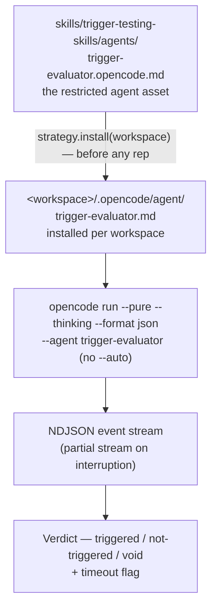

# Phase 2a: Restricted Evaluator Agent — Implementation Plan

Companion to `developing-a-better-harness.md`, section "Implementing the Campaign and Skill".
This plan is decision-complete: every choice below is either a locked decision from the
design review or an explicitly registered assumption (see "Assumptions register"). The
implementing agent should not introduce new decisions; anything ambiguous is called out
here with the chosen behavior.

**Scope: the harness-specific setup that makes reps fast, cheap, and correctly
measured.** The phase-1 evaluator runs reps under the default agent with `--auto`, so a
triggered run can execute arbitrary tools and burn the full timeout. This phase installs
the restricted `trigger-evaluator` agent into every eval workspace, routes all reps
through it, reworks signal detection for the richer event stream, and adds the `check`
preflight subcommand. After this phase a rep is a load decision only — seconds per rep,
~2k tokens, no post-load execution, so testing no longer stalls on timeouts.
IN scope: the harness strategy registry, per-workspace agent installation, the `check`
subcommand, the signal-detection rework (including the interrupted-run intent policy),
and the `run` subcommand changes.
NOT in scope: the `split` / `suite` subcommands (phase 2b,
`phase-2b-campaign-tooling-plan.md`), the SKILL.md campaign rewrite (phase 2c,
`phase-2c-campaign-skill-plan.md`), pi/claude harness strategy implementations, retries
or token-budget enforcement.

The pieces that land here, at a glance:



## Locked decisions (from design review with the user)

Numbering follows the original phase-2 design-review list; decisions owned by the later
phases (`split`/`suite` tooling, the skill workflow) live in their own plans.

7. **Harness is a required, user-specified parameter.** The skill resolves a `harness`
   value (e.g. `opencode`, `pi`, `claude`) from the user prompt and asks for it if
   missing. It never tries to detect which harnesses are installed. Preflight verifies
   the specified harness (supported + CLI on PATH). Nothing in the skill is hard-coded
   to opencode; harness specifics live only in the evaluator's strategy registry. (The
   skill-side application of this decision is specced in phase 2c; this phase implements
   the registry and the required `--harness` argument.)
10. **Restricted evaluator agent, installed per workspace.** Every eval rep runs under
    the `trigger-evaluator` agent (skill tool only, steps capped, all other tools
    denied), so the load decision is the entire measurement and post-load execution —
    including toil over non-self-contained queries — is structurally impossible. Agent
    definitions and discovery locations are harness-specific: per-harness copies live
    at `skills/trigger-testing-skills/agents/trigger-evaluator.<harness>.md`, and the
    harness strategy installs its copy into the workspace before any rep
    (`strategy.install()`; opencode dest `.opencode/agent/trigger-evaluator.md`,
    `mode: primary` — subagent mode is rejected for headless `--agent` use) and passes
    `--agent trigger-evaluator`. `--auto` is dropped: the agent's own permissions allow
    the skill tool headless and deny every other tool. A missing agent source file, or
    an opencode "agent not found / falling back to default agent" warning on stderr,
    is a harness execution failure (abort), never a silent fallback run.
11. **Interrupted-run intent counts as a pass.** On timeout (or step-cap cutoff), the
    partial event stream is parsed before classifying: a completed target-skill load
    is `triggered` (signal wins, as before); clear intent evidence without a completed
    load is `triggered` with `timeout: true` on the Verdict (counted in Wilson
    scoring; surfaced via per-query and totals `timeouts` counts); otherwise `void`.
    A step-cap cutoff is recognized by the absence of the mandated final report in
    an otherwise clean, normally-exited stream (see "Signal detection", rule 3);
    `timeout: true` marks both interruption forms.
    Intent evidence is restricted to the agent's mandated report naming the target, an
    attempted skill call on the target, or a strict intent phrase in reasoning —
    never a bare mention of the skill name. (User decision: count as pass, flagged.)

## Probe evidence this plan relies on

Validated against the installed opencode CLI (1.18.21) with a scratch workspace,
kimi-for-coding/k3 at minimal effort, `--pure`, and no `--auto`:

- `.opencode/agent/<name>.md` inside the workspace is discovered with `--pure` +
  `--dir <workspace>`; plugins are off under `--pure`, so the agent must be
  physically installed into the workspace (the repo's plugin-registered `agents/`
  copy is not visible to eval sessions).
- `mode: subagent` agents are rejected for headless `--agent` use: stderr warning
  `agent "trigger-evaluator" is a subagent, not a primary agent. Falling back to
  default agent` — hence `mode: primary` in the opencode copy.
- The agent's own `permission: {skill: allow}` permits the skill tool headless
  without `--auto` (`state.status: "completed"`); all other tools are denied.
- An unknown `--agent` name is a silent fallback: exit 0, the eval runs under the
  default agent, and the only evidence is a stderr warning (`agent "..." not found.
  Falling back to default agent`) — hence the stderr scan in the strategy layer.
- A rejected skill call appears as `tool_use` with `state.status: "error"` — the
  phase-1 rule (any status counts) would score it `triggered`; only
  `status == "completed"` is a load.
- The agent's mandated report arrives as a `text` event, model-formatted (observed:
  `Loaded skill: **writing-skills** — ...`; no-match: `No skill matched — Paris.`).
- `steps: 3` sufficed for reasoning + load + report (2 steps used); the plan ships
  `steps: 5` in the installed agent for headroom. Reps completed in
  ~2–4 s at ~2k tokens, versus up to the 30 s timeout plus arbitrary tool use under
  the phase-1 configuration.
- Built-in skills (customize-opencode) are present even with `--pure` in a sterile
  workspace; a should-not-trigger query loaded it (correctly attributed as
  not-triggered w.r.t. the target).

## Deliverables

- **New:** `skills/trigger-testing-skills/agents/trigger-evaluator.opencode.md` — the
   restricted evaluator agent for opencode (`mode: primary`, skill-only permissions,
   capped steps; locked decision 10). Contents: a copy of
   `agents/trigger-evaluator.md` with exactly two changes — `mode: subagent` →
   `mode: primary` and `steps: 3` → `steps: 5`; the permission block and the body
   (including the mandated report line the signal detection parses) carry over
   verbatim.
- **New:** `skills/trigger-testing-skills/scripts/test_evaluator.py` — stdlib
  `unittest` module driving the verdict logic with canned NDJSON streams
  (`subprocess.run` stubbed; no live model): timeout-with-intent partial stream →
  `triggered` + `timeout: true`; rejected skill call (`status="error"`) in a
  completed run → `not-triggered`; missing-report clean exit → the rule-3 step-cap
  intent path; stderr agent-fallback warning → `HarnessExecutionError`.
- **Modified:** `skills/trigger-testing-skills/scripts/evaluator.py` — harness strategy
  registry with `install()`, `--harness` added to `run`, new `check` subcommand,
  signal-detection rework (see "Signal detection"), `timeout` flag on `Verdict`.
  (The `split` and `suite` subcommands are phase 2b and are NOT built here.)
- **Unchanged:** `skills/trigger-testing-skills/scripts/workspace-manager.sh` (agent
  install lives in the evaluator strategy, not the workspace manager).
- **Unchanged:** `agents/trigger-evaluator.md` (the repo file remains for interactive
  sessions and now intentionally diverges from the skill-local opencode copy, which
  uses `mode: primary`).

Python >= 3.10, standard library only (adds `shutil` to the existing imports; the test
module adds `unittest` — runtime imports unchanged).

## Harness strategy layer

The existing `OpencodeStrategy` becomes one entry in a registry. Only opencode is
implemented this phase; the registry is the seam for pi/claude later.

```python
class EvalStrategy(Protocol):
    binary: str          # CLI binary name, used by the preflight check
    agent_name: str      # "trigger-evaluator"; passed to the harness per rep
    agent_source: Path   # .../trigger-testing-skills/agents/trigger-evaluator.<harness>.md
    agent_dest: str      # workspace-relative install path; opencode:
                         # ".opencode/agent/trigger-evaluator.md"
    def install(self, workspace: Path) -> None: ...
    def evaluate(self, skill: str, query: str, workspace: Path,
                 model: str | None = None, effort: str | None = None) -> Verdict: ...

STRATEGIES: dict[str, type[EvalStrategy]] = {"opencode": OpencodeStrategy}
```

- `resolve_strategy(name)` → strategy class, or print
  `error: unsupported harness '<name>' (supported: opencode)` to stderr, exit 1.
- `check_harness(strategy_cls)` → `shutil.which(strategy_cls.binary)`; if None, print
  `error: harness '<name>' CLI not found on PATH (looked for '<binary>')` to stderr,
  exit 1; also verifies `agent_source` exists (`error: evaluator agent file missing:
  <path>`, exit 1). This verifies the binary exists, not that it is configured
  (provider keys etc.) — the smoke rep covers configuration.
- `install(workspace)` copies `agent_source` to `workspace / agent_dest` (creating
  parents) and verifies the file landed; a missing source is the operational error
  above, raised before any spend. `cmd_run` calls it after instantiating the strategy
  and validating the workspace stub, always before any rep. (`cmd_suite`, added in
  phase 2b, does the same.) Idempotent: every invocation re-copies, so a stale or
  edited workspace agent file is always refreshed.
- Defense in depth: `subprocess.run` raising `FileNotFoundError` inside `evaluate()`
  is caught and re-raised as `HarnessExecutionError("harness CLI '<binary>' not found
  on PATH")` so a missing binary mid-campaign aborts cleanly instead of tracebacking.
  Likewise, opencode silently falls back to the default agent when `--agent` names an
  unknown agent (exit 0, stderr warning only — see probe evidence): any
  `agent ... not found` / `Falling back to default agent` warning on stderr is
  re-raised as `HarnessExecutionError` so a suite can never run under the wrong
  agent.
- `eval_batch` / `run_rep` signatures are generalized from `OpencodeStrategy` to the
  protocol. Batch mechanics (smoke rep, parallel batches, Wilson scoring) are
  unchanged; signal detection and `Verdict` are reworked per "Signal detection".

## Signal detection (reworked for the restricted agent)

The phase-1 rule (any skill `tool_use` event naming the target = triggered) is
replaced by a precedence that distinguishes a completed load from intent, because the
restricted agent makes both the mandated text report and permission/step failures
observable:

1. **Completed load wins.** A `tool_use` event for the `skill` tool with
   `input.name == <target>` and `state.status == "completed"` → `triggered`
   (including when found in the partial stream of an interrupted run). Any other
   status (`error`, `pending`) is recorded as an attempted load, never a completed
   one — phase 1 counted `status="error"` as triggered, a false positive once
   permission rejections are possible.
2. **Completed run, no completed load, report present** → `not-triggered`. The detail
   notes any other skill loaded (as before), an attempted-but-failed load of the
   target, or the agent's no-match report.
3. **Interrupted run** — two forms, both parsed before classifying:
   (a) subprocess timeout — the partial stdout carried by `subprocess.TimeoutExpired`
   (phase 1 discarded it); (b) step-cap cutoff — detected when a normally-exited,
   error-free run with parseable events has neither a completed load nor the
    mandated final report (the report is the completeness marker: with `steps: 5`
    every normal run ends with it — probe: 2 steps used under `steps: 3`, so 5
    leaves headroom); the full stream is treated
   as the partial stream. Completed load → `triggered`; else intent evidence →
   `triggered` with `timeout: true` (locked decision 11); else → `void` with
   `timeout: true`.
4. The agent's mandated final report (`Loaded skill: <name>` / `No skill matched`,
   observed as a `text` event) is parsed conservatively (tolerate markdown emphasis)
   and used only as intent evidence under rule 3 and as corroborating detail under
   rules 1–2. A report claiming a load that no completed `tool_use` corroborates is
   intent, not a load — the mechanical signal always beats narration on conflict.
5. Reasoning (`--thinking`) is captured as before and consulted under rule 3 only via
   strict intent patterns (e.g. "I should load the `<skill>` skill", "loading
   `<skill>`"), never a bare name mention — not-trigger reasoning names the target
   while rejecting it.

`Verdict` gains `timeout: bool = False`; `timeout: true` marks any interrupted run
(subprocess timeout or step-cap cutoff). `detail` always records which signal path
produced the verdict. Scoring is unchanged (Wilson over non-void runs);
timeout-intent passes are included in scoring (locked decision 11) and surfaced via
`timeouts` counts so the analysis step can see how much of a score rests on the
weaker signal. (The per-query and totals `timeouts` fields are emitted by the `suite`
JSON in phase 2b; `run` shows the per-run `(timeout)` marker.)

## CLI contracts

All harness-taking subcommands require `--harness`. Exit codes everywhere:
`0` = success; `1` = operational/validation error or harness execution failure;
`2` = argparse usage errors.

### `check` (new)

```
usage: evaluator.py check --harness NAME
```

Validates the harness is supported, its CLI binary is on PATH, and the strategy's
evaluator-agent source file exists. Success:
`ok: harness '<name>' available (<binary>: <resolved path>)` on stdout, exit 0.
Failures: the two stderr messages under "Harness strategy layer", exit 1.
The skill calls this in preflight before anything else that could spend tokens
(phase 2c).

### `run` (changed)

```
usage: evaluator.py run --harness NAME --skill NAME --workspace DIR
                        --query TEXT --expect trigger|not-trigger
                        [--model MODEL] [--variant EFFORT] [--reps 10]
                        [--timeout 30]
```

Breaking change from phase 1: `--harness` is now required. Reps now execute under the
restricted evaluator agent: `cmd_run` installs it via `strategy.install(workspace)`
before any rep, and the opencode command is
`opencode run --pure --thinking --format json --dir <ws> --agent trigger-evaluator
[--model m] [--variant v] <query>` — `--auto` is dropped (locked decision 10). The
per-run report line appends a `(timeout)` marker for verdicts with `timeout: true`.
Everything else about `run` is unchanged (human-readable report to stdout, no
machine-readable output). `run` remains a manual/debug tool; **the skill never
invokes `run`** — sanity checks use `suite` (phase 2b) with a single-query file so
all skill-consumed output is JSON.

## Error handling policies

- `check` failure → operational error before any spend: exact message to stderr,
  exit 1. The skill (phase 2c) calls `check` in preflight and stops on failure,
  surfacing the message.
- Evaluator agent install failure (missing source asset, workspace not writable) →
  operational error, exit 1, before any spend.
- An opencode "agent not found / falling back to default agent" warning on stderr →
  treated as `HarnessExecutionError`: abort, never a silent run under the default
  agent (a run under the wrong agent is contamination, not data). Under `suite`
  (phase 2b) this aborts the suite with no JSON written.

## Exact validation commands

Run from the repo root. Use a cheap model and small reps.

```bash
# 1. check: supported harness, unsupported harness, missing binary
python3 skills/trigger-testing-skills/scripts/evaluator.py check --harness opencode
# expected: exit 0, "ok: harness 'opencode' available (...)"
python3 skills/trigger-testing-skills/scripts/evaluator.py check --harness pi
# expected: exit 1, "error: unsupported harness 'pi' (supported: opencode)"
PATH=/usr/bin:/bin python3 skills/.../evaluator.py check --harness opencode
# expected if opencode is not on that PATH (python3 itself must still resolve
# there): exit 1, "CLI not found on PATH"
mv skills/trigger-testing-skills/agents/trigger-evaluator.opencode.md{,.bak} && \
  python3 skills/.../evaluator.py check --harness opencode; \
  mv skills/trigger-testing-skills/agents/trigger-evaluator.opencode.md{.bak,}
# expected: exit 1, "error: evaluator agent file missing: ..."

# 2. run regression with required --harness (also exercises agent install)
WS="$(skills/trigger-testing-skills/scripts/workspace-manager.sh init)"
skills/trigger-testing-skills/scripts/workspace-manager.sh sync \
  --skill writing-skills --source . --workspace "$WS"
python3 skills/.../evaluator.py run --harness opencode \
  --skill writing-skills --workspace "$WS" \
  --query "create a skill to drive my webapp using playwright" --expect trigger \
  --model kimi-for-coding/k3 --variant minimal --reps 3 --timeout 60
# expected: exit 0; "$WS/.opencode/agent/trigger-evaluator.md" now exists; reps run
# under the restricted agent (seconds each, no --auto, no permission rejections).

# 3. signal edge paths (fixture-based, no live model; subprocess.run stubbed)
python3 -m unittest discover -s skills/trigger-testing-skills/scripts -p 'test_*.py' -v
# expected: all pass — timeout with intent in the partial stream -> triggered +
# timeout:true; rejected skill call (status="error") in a completed run ->
# not-triggered; missing-report clean exit -> rule-3 step-cap intent path; stderr
# "Falling back to default agent" -> HarnessExecutionError.

skills/trigger-testing-skills/scripts/workspace-manager.sh cleanup --workspace "$WS"
```

## Assumptions register (flag any you want reversed before implementation)

Numbering follows the original phase-2 register; assumptions owned by the later phases
are in their own plans.

16. Only the opencode strategy is implemented; unsupported harness names get the
    clean registry error; pi/claude strategies are future work plugged into the same
    seam.
20. Scripts are stdlib-only and run under any Python >= 3.10. (The skill resolves the
    interpreter from PATH at preflight — phase 2c; no repo-specific `.venv` path is
    baked in.)
22. Per-harness evaluator agent files live at
    `skills/trigger-testing-skills/agents/trigger-evaluator.<harness>.md`; the
    opencode copy is `agents/trigger-evaluator.md` with only two changes —
    `mode: subagent` flipped to `mode: primary` and `steps: 3` bumped to
    `steps: 5` — permissions and body verbatim
    (subagent mode is rejected for headless `--agent` use — probe-verified). The
    repo `agents/trigger-evaluator.md` remains for interactive sessions and is
    allowed to diverge.
23. Intent-on-timeout counts as a pass (user decision): interrupted runs with clear
    intent evidence -> `triggered` with `timeout: true`, included in Wilson scoring;
    `timeouts` counts surfaced per query and in totals. "Interrupted" means a
    subprocess timeout or a step-cap cutoff; the cutoff is recognized by the missing
    mandated report in a clean, normally-exited stream (Signal detection, rule 3).
    Intent evidence is restricted to the agent's report naming the target, an
    attempted skill call on the target, or a strict intent phrase in reasoning —
    never a bare name mention.
24. `--auto` is dropped under the restricted agent (probe: the agent's own
    `permission.skill: allow` permits the skill tool headless); all other tools are
    denied by the agent definition.
25. A missing agent source file, failed install, or an opencode agent-fallback
    warning on stderr -> harness execution failure (abort), never a silent run under
    the default agent.

## Known limitations / accepted risks

- The restricted evaluator agent closes phase 1's `--auto` risk: reps run with only
  the skill tool allowed and steps capped, so post-load execution — and toil over
  non-self-contained queries — is structurally impossible. Residual risks: a
  step-cap cutoff can still cut a run before the report (probe: 2 steps used for
  load+report under `steps: 3`; the shipped `steps: 5` leaves headroom but does not
  eliminate the risk) — detected by the missing report and absorbed by the intent
  policy (locked decision 11); and the report text is model-generated formatting
  (markdown emphasis observed), so it only ever serves as intent/corroboration,
  never the primary signal.
- Built-in harness skills (e.g. opencode's customize-opencode) are present in eval
  sessions even with `--pure` in a sterile workspace and cannot be disabled.
  Other-skill loads are already attributed correctly (`not-triggered` w.r.t. the
  target), but a built-in can legitimately win over the stub on a should-trigger
  query — that mirrors real usage; treat it as data, not contamination.
- `check` verifies the harness binary exists, not that it is configured; provider
  misconfiguration surfaces via the smoke rep as a harness failure (abort).
- Global agent configuration (`~/.config/opencode`, etc.) still loads in eval
  sessions; full contamination-proofing (XDG redirection) remains out of scope per
  the notes.
