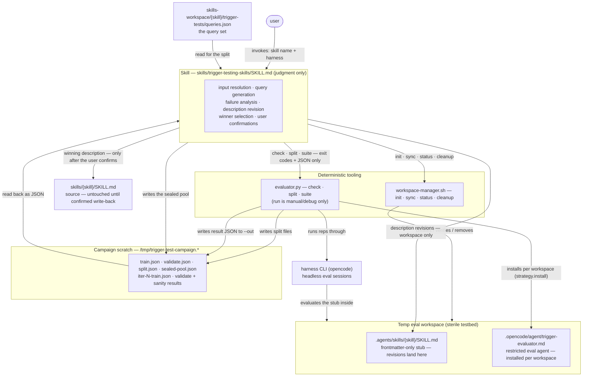
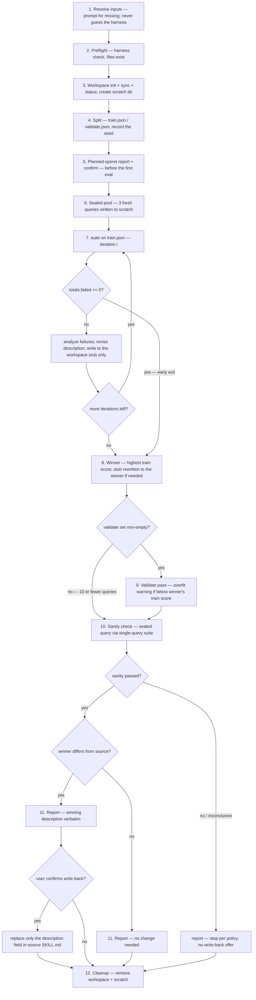

# Phase 2c: Campaign Skill — Implementation Plan

Companion to `developing-a-better-harness.md`, section "Implementing the Campaign and Skill".
This plan is decision-complete: every choice below is either a locked decision from the
design review or an explicitly registered assumption (see "Assumptions register"). The
implementing agent should not introduce new decisions; anything ambiguous is called out
here with the chosen behavior.

**Scope: the skill that drives the campaign.** This phase rewrites
`skills/trigger-testing-skills/SKILL.md` to tie the existing pieces
(`workspace-manager.sh`, `evaluator.py`) into a full trigger-test campaign:
train/validate split, description-optimization loop, validate pass, fresh-query sanity
check, winner report, and confirmed write-back. The skill contributes judgment only;
every deterministic step (looping, counting, splitting, scoring) already lives in the
scripts.
Requires phases 2a (`phase-2a-restricted-evaluator-agent-plan.md`) and 2b
(`phase-2b-campaign-tooling-plan.md`) complete: `check` / `split` / `suite` exist, reps
run under the restricted `trigger-evaluator` agent, and `Verdict` carries the
`timeout` flag.
NOT in scope: artifact management (manifest.json, campaign history — next phase per
the notes), pi/claude harness strategy implementations, retries or token-budget
enforcement.

## How the pieces fit together

The skill contributes judgment only; every deterministic step (looping, counting,
splitting, scoring) lives in the scripts. Queries, labels, and results stay in campaign
scratch so the eval workspace remains a sterile testbed.



## Locked decisions (from design review with the user)

Numbering follows the original phase-2 design-review list; decisions owned by the
earlier phases (harness/agent setup, split/suite tooling) live in their own plans.

1. **README validation model.** Optimize on the train set only (train → analyze →
   revise → re-train). The validate set runs **once at the end** against the winning
   (best-train) description, as a held-out check. The notes' loop (validate every
   iteration, winner by validate score) is discarded and the notes have been corrected.
2. **Deterministic suite-runner** (phase 2b owns the tooling). Skill-side: the skill
   performs only judgment steps (parameter resolution, query generation/review,
   failure analysis, description revision, user confirmations) and consumes only
   machine-readable output (exit codes and JSON files). The skill never parses prose
   stdout.
3. **Workspace-only revisions + confirm.** Description revisions are written only to
   the temp-workspace stub (`<workspace>/.agents/skills/<skill>/SKILL.md`,
   frontmatter-only) during the campaign. The source `skills/<skill>/SKILL.md` is
   untouched until the end, when the winning description is presented verbatim and
   written back only after the user confirms.
4. **Perfect-train early exit.** A train round with zero failures ends the loop
   immediately (nothing to analyze). Hard cap of 3 iterations regardless.
5. **Sealed pre-campaign pool.** Fresh sanity-check queries are generated *before* the
   optimization loop starts, stored in campaign scratch, and one is drawn at the end.
   The optimizing model never generates the sanity query after seeing its own work.
6. **No actionability gate** (supersedes the earlier reject-and-surface gate
   decision). The gate existed because non-self-contained queries caused toil and
   wasted spend under `--auto` full-tool reps; under the restricted evaluator agent
   (phase-2a decisions 10–11) the load decision is the entire measurement, so such
   queries are measurable at the same ~2k-token cost as any other, and the gate's
   concretize/inline rewrites would skew the corpus away from realistic terse,
   context-dependent phrasing. Query quality is instead policed by evidence: failure
   analysis flags a should-trigger query that fails under every candidate description
   across every iteration as a suspect query (probable query-side problem — bad
   label, non-processable statement, or missing-context dependence), surfaced in the
   report with its `timeouts` count as corroboration. The campaign never blocks on,
   rewrites, or fabricates files for a query. Self-contained-by-construction remains
   the convention for *generated* queries (sealed pool, query-set authoring), not a
   requirement for the eval corpus.
7. **Harness is a required, user-specified parameter** (implemented in the tooling in
   phase 2a). Skill-side application: resolve the `harness` value from the user
   prompt, ask for it if missing, never auto-detect installed harnesses; preflight
   verifies it via `evaluator.py check`.
8. **`trigger-tests/` (plural)** is the query-set directory convention
   (`skills-workspace/<skill>/trigger-tests/queries.json`), matching the repo and
   README.
9. **Sanity-check failure stops the campaign.** No restart of the loop (deliberate
   override of the README flowchart), no write-back offer, fresh queries are never
   used for training. The failure is reported; the user decides what to do next.

## Deliverables

- **Modified:** `skills/trigger-testing-skills/SKILL.md` — rewritten campaign-centric
  (see "Skill design").
- **Unchanged:** `skills/trigger-testing-skills/scripts/evaluator.py` and
  `skills/trigger-testing-skills/scripts/workspace-manager.sh` (phases 2a–2b),
  `skills/trigger-testing-skills/agents/trigger-evaluator.opencode.md` (phase 2a).
- **Unchanged:** `agents/trigger-evaluator.md` (the subagent-dispatch workflow is
  retired from the skill; the repo file remains for interactive sessions and
  intentionally diverges from the skill-local opencode copy, which uses
  `mode: primary`).

## Skill design

Rewrite of `skills/trigger-testing-skills/SKILL.md`, keeping the existing file's
structure (frontmatter / Overview / Inputs / Workflow / Report format / Gotchas /
Checklist) and the writing-skills conventions for prose. Command-invoked only, as
today.

### Frontmatter

Keep `name`, `disable-model-invocation: true`, and the opencode slash/autoinvoke
metadata. Update `description` to cover campaigns and optimization, e.g.:

> Use when the user asks to run a trigger test or trigger-testing campaign, tune a
> skill description that fires too often or not often enough, or check whether a skill
> triggers reliably. Runs train/validate eval campaigns over a query set in headless
> harness sessions and iteratively revises the skill's description.

(Final wording follows the writing-skills conventions; under 1024 chars, imperative,
no first person.)

### Inputs

- **Skill** (required) — the skill under test, given as a name or a path. A name is
  resolved via the driving session's skill-registry metadata (opencode exposes each
  registered skill's file location), falling back to `./skills/<name>/SKILL.md`;
  a path points at the skill dir (or its `SKILL.md`) directly. Skills registered
  as built-in have no filesystem location and cannot be tested — surface that and
  stop. The **source root** is derived from the resolved location: the directory
  containing that `skills/` directory, for every layout (for
  `<root>/.opencode/skills/<name>`, the source root is `<root>/.opencode`, so
  artifacts live at `<root>/.opencode/skills-workspace/` — the README's "sibling
  of skills/" convention). If the resolved skill is not under a directory named
  `skills/`, no source root can be derived — stop and surface that.
- **Harness** (required) — e.g. `opencode`. The user MUST specify it; if missing, ask.
  Never auto-detect installed harnesses (locked decision 7).
- **model / variant** (optional) — passed to eval executions only. The campaign-
  driving model is the session's current model.
- **reps** (default 10), **timeout** (default 30s), **max-iterations** (default 3;
  hard cap 3 per locked decision 4 — a higher requested value is clamped to 3 and
  the user is told), **train-frac** (default 0.6), **seed** (optional).
- **queries path** (default `skills-workspace/<skill>/trigger-tests/queries.json`
  under the source root; `skills-workspace/` is created there if missing).

### Campaign scratch

The skill creates a scratch dir outside the eval workspace
(`mktemp -d /tmp/trigger-test-campaign.XXXXXXXXXX`) to hold the split files, per-round
result JSON, and the sealed pool. Keeping these out of the temp workspace preserves
the sterile testbed — a wandering eval run must not discover the query file with
its labels or the sealed pool. The skill removes the scratch dir at cleanup (with the
same path-prefix paranoia as workspace-manager's cleanup).

### Workflow

The numbered steps below are the authoritative spec; this is the same flow at a glance:



1. **Resolve inputs.** Prompt for missing required ones. Never guess the harness.
2. **Preflight** (no spend):
   a. Resolve the Python interpreter (`python3`, else `python`, on PATH; must be
      >= 3.10) and use it for every script invocation. Then
      `evaluator.py check --harness <harness>`; on failure, stop and surface.
   b. Resolve the target skill (registry-metadata location for names, else explicit
      path); its `SKILL.md` must exist, else stop. Derive the source root from its
      location and create `<source-root>/skills-workspace/<skill>/trigger-tests/`
      if missing.
   c. Queries file exists; else **offer to generate** an initial set per the README
      query-design conventions (coverage axes, realism, near-miss negatives, no weak
      negatives) — the user reviews and approves before anything is saved.
3. **Workspace.** `workspace-manager.sh init` → `sync --skill <skill> --source
   <source-root> --workspace <ws>` → `status` (must pass before any eval). Create
   scratch dir.
4. **Split.** `evaluator.py split --queries <queries> --out-dir <scratch>
   [--train-frac f] [--seed s]`. Record the seed from `<scratch>/split.json`.
5. **Planned spend.** Report planned maximum spend
   (`train_size × reps × max-iterations + validate_size × reps + reps` sanity),
   with the train/validate sizes read from `<scratch>/split.json`, and ask the user
   to proceed. This is the last confirmation before the first eval; everything before
   it is token-free local scripting.
6. **Sealed pool** (locked decision 5). Generate 3 fresh should-trigger queries per
   the README realism conventions; they must be self-contained by construction
   (locked decision 6). Write to `<scratch>/sealed-pool.json`. They are never shown
   to the optimization loop.
7. **Iteration loop** (`i = 1..max-iterations`):
   a. `evaluator.py suite --harness <h> --skill <s> --workspace <ws>
      --queries <scratch>/train.json --out <scratch>/iter-<i>-train.json
      [--model m] [--variant v] --reps r --timeout t`.
      On exit 1: abort the campaign (see "Error handling").
   b. Read the result JSON. Record `{iteration, description, train score}` in
      context, where `description` is the one this iteration's suite evaluated —
      the source description for iteration 1, otherwise the revision written at
      the end of the previous iteration. If the pool has 0 scored runs (all void —
      `totals.score` is null): abort as broken conditions (see "Error handling").
      Otherwise, if `totals.failed == 0`: **early exit** (locked decision 4).
   c. Otherwise analyze failures (below), revise the description (guardrails below),
      and write the revision **to the workspace stub only** (locked decision 3).
8. **Winner selection.** Highest `totals.score` across iterations; ties go to the
   earlier iteration (assumption 4). If the winner is not the current stub contents,
   rewrite the stub to the winner's description before continuing.
9. **Validate pass** (skipped when `validate.json` is empty — the <= 10 case):
   `suite --queries <scratch>/validate.json --out <scratch>/validate-results.json`.
   If the validate score is below the winner's train score, flag an **overfit
   warning** in the report (informational only; no restart, no automatic action).
   An all-void validate pass aborts the campaign like a train round (see "Error
   handling").
10. **Sanity check.** Take the first entry of the sealed pool, write it as a
    single-query file `<scratch>/sanity.json`
    (`[{"query": ..., "shouldTrigger": true}]`), run
    `suite --queries <scratch>/sanity.json --out <scratch>/sanity-results.json`.
    Pass = `triggered` observed in >= 60% of non-void runs; all-void = inconclusive
    (reported as such, not failed). On failure: stop per locked decision 9.
11. **Report and write-back.** Present the report (below), including the winning
    description verbatim. If the winner differs from the source description and the
    sanity check passed, ask the user to confirm applying it; on confirmation, replace
    only the `description` field in the source SKILL.md (at its resolved location)
    frontmatter, preserving every other field and the body byte-for-byte. If the
    winner IS the original description, report that no change is needed (no
    write-back offer).
12. **Cleanup.** On completion (pass or fail): `workspace-manager.sh cleanup
    --workspace <ws>` and remove the scratch dir. On abort/error: keep both and print
    their paths for debugging.

### Failure analysis (skill guidance, embedded in SKILL.md)

Categories from the README, applied to the reasoning captured in the suite JSON:

| Failure | Likely cause | Action |
|---------|-------------|--------|
| Should-trigger query didn't fire | description too narrow | broaden scope or add context about when the skill is useful |
| Should-not query false-triggered | description too broad | add specificity about what the skill does NOT do; clarify boundary with adjacent skills |
| Same query fails repeatedly after tweaks | local minimum | structurally reframe the description (change the skeleton, not the adjectives) |

Note for the skill text: the README's fourth row (eval labels conflicting with the
skill *body*) cannot occur under this harness — eval agents see frontmatter-only
stubs, never the body. If a should-not query false-triggers across structurally
different framings, suspect the setup (wrong skill stubbed, contaminated workspace),
not the body, and surface it to the user instead of iterating.

Timeout note for the skill text: under the restricted evaluator agent, toil-driven
timeouts are structurally impossible, so a cluster of `timeouts` (passes resting on
interrupted-run intent, or voids) points at infrastructure — slow provider, step cap
— not the description. Check `timeouts` before analyzing failures; investigate
conditions (or raise `--timeout`) instead of revising the description on that
evidence.

Suspect-query flag (locked decision 6): a should-trigger query that fails under
*every* candidate description across *every* iteration is probably a query-side
problem — bad label, a statement that asks for nothing, or dependence on context the
bare workspace lacks — not a description problem. Flag such queries in the report
(with the per-query `timeouts` count as corroboration) and recommend the user prune
or rewrite them in queries.json. Never contort the description to chase a query with
this signature; that is exactly the failure the revision guardrails exist to prevent,
and a contortion that does help would have to survive the validation set anyway.

Revision guardrails (from the README, embedded in SKILL.md): fix the category, not
the query; never paste failed-query keywords into the description; imperative
phrasing; user intent over implementation; err pushy; keep it concise (1024-char hard
cap); never first person; change the sentence skeleton when word swaps stall.

### Description revision mechanics

The stub is tiny, so revisions rewrite the whole stub file: frontmatter with the same
`name` (and any other pre-existing fields) and the revised `description`, no body.
The skill never edits the source file during the loop (locked decision 3), so
`workspace-manager.sh status` would correctly report "out of date" mid-campaign —
`status` is only run once, right after the initial `sync`.

### Report format

```
campaign: writing-skills   harness: opencode   model: <m>   variant: <v>
train: 9 queries   validate: 7 queries   reps: 10   seed: 42   iterations run: 2 of 3

iter 1: train score 0.548  (55 pass / 29 fail / 6 void)
        failure categories: mostly too-narrow (implicit asks); one local minimum
iter 2: train score 0.903  (84 pass / 3 fail / 3 void)
winner: iteration 2
  description: "Use this skill when ..."
validate: score 0.810  (58 pass / 6 fail / 6 void)   [overfit warning if below train]
sanity: "<sealed query>" -> triggered 9/10 -> pass
suspect queries: "turn this outline into a skill" — failed under all candidates in
  all iterations (timeouts: 2); likely query-side, consider pruning or rewriting

The winning description differs from the source. Apply it to
skills/writing-skills/SKILL.md? [awaiting confirmation]
```

The `suspect queries` block appears only when failure analysis flagged any (locked
decision 6). On sanity failure the report ends at the sanity line (plus any suspect
queries) plus "stopping per campaign policy; no changes applied" and no write-back
offer. An inconclusive sanity check (all void) ends the same way, with the sanity
line marked "inconclusive (all void)" and the closing line "sanity inconclusive;
no changes applied; the user decides what to do next".

### Gotchas (SKILL.md)

- The harness is always user-specified; never infer it from the environment.
- Eval reps run under the restricted `trigger-evaluator` agent, installed into each
  workspace by the evaluator itself; never run reps as the default agent and never
  re-add `--auto`.
- A `triggered` verdict resting on interrupted-run intent (`timeout: true`) is a pass
  but weaker evidence; check the `timeouts` counts before trusting a score.
- Revisions touch the workspace stub only; the source file changes only on confirmed
  write-back at the end.
- Never restart the loop after a sanity failure; never train on sealed-pool queries.
- Never fabricate workspace files for a query, and never rewrite a query to make it
  pass — a query that fails under every candidate is flagged as suspect in the
  report, not fixed mid-campaign.
- The validate set runs once, at the end, against the winner; it is not part of the
  optimization loop.
- Keep queries verbatim across the whole campaign; editing mid-campaign invalidates
  comparisons.
- Early exit only on a perfect train round; never on a "good enough" majority.

### Checklist (SKILL.md)

- [ ] Harness explicitly specified by the user; `check` passed before any spend
- [ ] Evaluator agent installed per workspace by `run`/`suite` (strategy.install); an
  agent-fallback warning aborts, never runs under the default agent
- [ ] Planned-spend report confirmed by the user
- [ ] Workspace synced and `status` clean before the first suite run
- [ ] Split seed recorded; sealed pool written before iteration 1
- [ ] Every suite run's JSON read from `--out`; no prose parsing
- [ ] Early exit only on zero train failures; max 3 iterations
- [ ] Winner = highest train score; stub matches winner before validate/sanity
- [ ] Validate once; overfit warning if below winner's train score
- [ ] Sanity via single-query suite; failure stops with no write-back offer
- [ ] Suspect queries (failed under every candidate in every iteration) flagged in
  the report
- [ ] Write-back only after explicit user confirmation
- [ ] Workspace + scratch removed on completion; kept and reported on abort

## Error handling policies

Script-side mechanics (exit codes, messages, no-JSON-on-abort) are phases 2a–2b; this
is the campaign-level behavior the skill implements:

- `check` failure → stop in preflight, surface the exact message.
- Evaluator agent install failure (missing source asset, workspace not writable) →
  the script exits 1 before any spend; surface the message and stop.
- An opencode "agent not found / falling back to default agent" warning on stderr →
  `HarnessExecutionError` in the tooling: the suite aborts, no JSON written (a run
  under the wrong agent is contamination, not data). Treat as a campaign abort.
- `split` / query-file validation failure → stop before spend, surface the message.
- `suite` exit 1 (harness execution failure, e.g. provider 429) → abort the campaign:
  surface the stderr error, keep workspace and scratch, print their paths, apply
  nothing. No retries this phase.
- Suite totals with 0 scored runs (all void) → treat as broken conditions: abort as
  above (a campaign of timeouts measures nothing). Applies to train rounds and the
  validate pass alike, and is checked before the zero-failures early exit; the
  sanity check is the only exception (all-void = inconclusive, below).
- Sanity inconclusive (all void) → reported as inconclusive; not a pass, not a
  restart; user decides.

## Skill-level manual validation

Run in a live session, after the phase-2a/2b script checks pass:

1. **No-gate + suspect-query flag:** invoke the skill against `writing-skills` with
   the current queries.json (which contains known non-self-contained queries) and an
   explicit harness. Expected: the campaign proceeds straight past preflight with no
   gate stop; the known-bad queries are measured like any other; any should-trigger
   query that fails under every candidate in every iteration appears under
   `suspect queries` in the report.
2. **End-to-end mini-campaign:** point the skill at a small query file
   (<= 10 queries -> exercises the no-split path), `--reps 3`, cheap model. Expected:
   full loop with at least one revision, winner selection, sanity check, report;
   `git diff skills/writing-skills/SKILL.md` (or a scratch target skill) is empty
   until the write-back prompt; answer "no" and confirm the source is untouched.
3. **Write-back path:** rerun (or use a scratch target skill), answer "yes"; confirm
   only the `description` frontmatter field changed and the body is byte-identical.
4. **Early exit:** craft a tiny set the current description already aces; confirm the
   loop stops after iteration 1 and the winner is the original description (no
   write-back offer).
5. **Sanity failure:** harder to force on demand; acceptable to validate by code
   reading plus a forced-failure unit-style run of the suite JSON handling, rather
   than a live campaign.

## Assumptions register (flag any you want reversed before implementation)

Numbering follows the original phase-2 register; assumptions owned by the earlier
phases are in their own plans.

4. Winner ties -> earlier iteration.
5. Winner selection is the skill comparing <= 3 machine-computed scores from JSON —
   no AI arithmetic. Each iteration's score is credited to the description that
   iteration's suite evaluated (iteration 1 = the source description). Full artifact
   persistence (manifest, campaign history) is next phase per the notes.
6. Sanity check: first entry of a 3-query sealed pool, should-trigger, `reps` reps
   via a single-query `suite`; pass = triggered in >= 60% of non-void runs; all-void
   = inconclusive (reported, neither pass nor restart).
7. Overfit warning = validate score below the winner's train score; informational
   only, no threshold math, surfaced for the user's judgment.
8. Suspect-query flag: a should-trigger query is flagged when it fails under every
   candidate description in every iteration of a campaign; the flag is report-only
   (with the query's `timeouts` count as corroboration) and never blocks the
   campaign, rewrites the query, or fabricates workspace files.
9. Sealed pool is generated after the split and before iteration 1; stored in scratch;
   queries are self-contained by construction.
10. Evaluator/suite exit 1 mid-campaign -> abort, keep workspace + scratch, surface
    the error, no retry.
11. Cleanup on completion (pass or fail); workspace + scratch kept only on abort.
12. SKILL.md becomes campaign-centric; single-query testing remains via the
    documented `evaluator.py run` invocation; the subagent-dispatch workflow is
    removed from the skill; `agents/trigger-evaluator.md` is left in place untouched.
13. Driving model = the session's current model; `--model`/`--variant` apply to eval
    executions only.
15. Planned-spend report + explicit proceed confirmation after the split, before the
    first eval.
17. The source root is resolved from the target skill's location: names are looked
    up in the driving session's skill-registry metadata (which exposes each
    registered skill's file path), with `./skills/<name>/SKILL.md` as fallback and
    explicit paths for skills not registered in the session. The source root is
    the directory containing that `skills/` directory, for every layout (for
    `.opencode/skills` layouts that is the `.opencode` directory itself, so
    `skills-workspace/` sits beside the skills there); a resolved skill not under
    a `skills/` directory yields no source root — stop and surface it.
    `--source` for workspace-manager is the source root;
    `skills-workspace/<skill>/trigger-tests/` is assumed or created under
    it. The scripts are invoked by their path inside the trigger-testing-skills
    skill directory, independent of the current working directory.
18. Stub rewrites preserve all frontmatter fields except `description`; the body is
    never written to the stub.
21. The WIP notes doc was corrected in exactly two spots (loop description -> README
    model; "revise the description" -> "revise the query"). Other now-superseded note
    fragments (fabricate-and-rewrite actionability, on-demand fresh query,
    winner-by-validate) are intentionally left as-is in the raw notes; this plan set
    (phases 2a–2c) is the source of truth.

## Known limitations / accepted risks

- Session-context-dependent queries ("make it pushier", "update that skill we made
  yesterday") and queries referencing other skills remain weak test cases: they are
  measurable now (the restricted agent can only make a load decision) but their
  labels are dubious, so if they fail persistently they surface via the
  suspect-query flag rather than blocking the campaign. If live testing ever shows
  content-inlined queries triggering differently than file-on-disk references, the
  deferred answer is skill-generated scaffolding with per-query workspace reset in
  the tooling — not this phase.
- No retries/backoff: provider rate limits abort the campaign (workspace kept for
  debugging).
- No budget enforcement beyond the planned-spend report and confirmation.
- Cross-project campaigns resolve the source root from the target skill
  (assumption 17), but the trigger-testing-skills skill itself — including its
  scripts — must be installed in the driving session.
