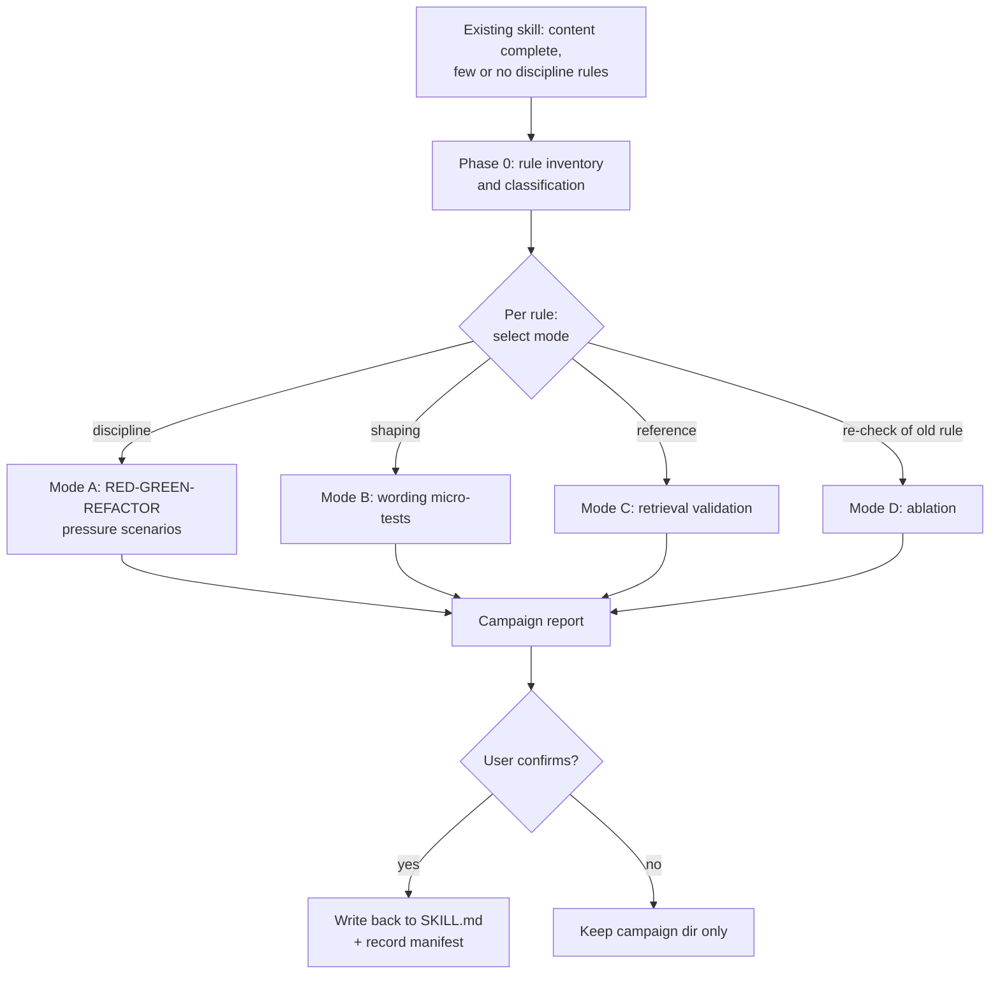
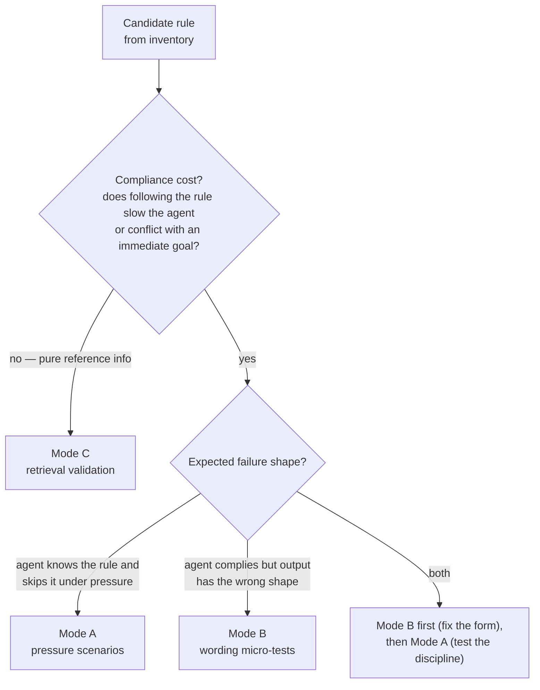
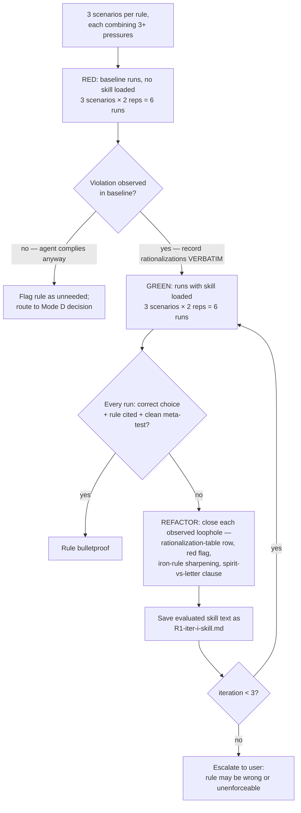
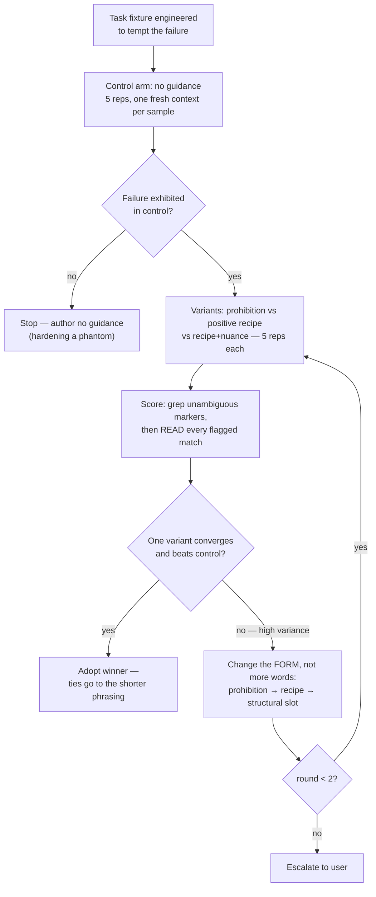
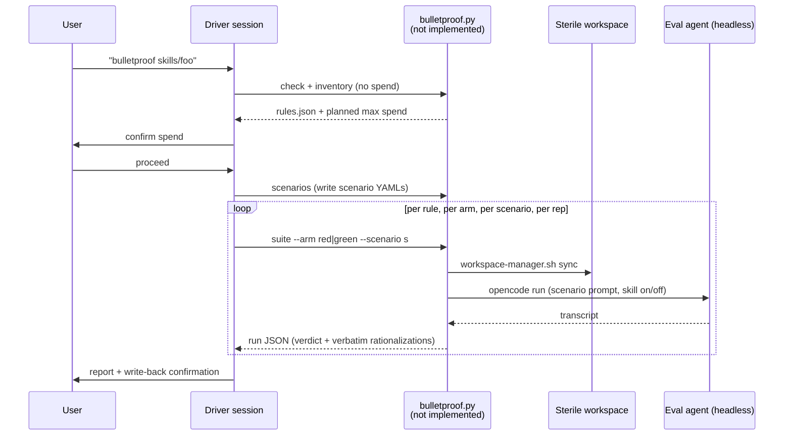

# Bulletproofing a Skill — Process Design

> **Disclaimer: AI-generated design**
>
> This document was designed by an AI coding assistant on 2026-09-09, based
> on the research captured in `iron-rules.md` and `micro-tests.md` (same
> directory), the `obra/superpowers` `writing-skills` skill, and this repo's
> `trigger-testing-skills` conventions. It is a **design plan only** — none
> of the scripts, commands, or file formats below exist yet. The fictional
> example results are illustrative, not measured data.

## 1. Purpose

Given a skill that is **already written** — the context, reference material,
and workflows are complete, but it contains few or no **discipline rules** —
produce a hardened version whose behavioral rules survive agent
rationalization under pressure, with evidence.

A *discipline rule* is an operational rule the agent MUST follow to complete
a task correctly (see `README.md` in this directory, "Skill Types and
Discipline Rules"). Bulletproofing is the process of adding such rules and
proving they hold.

**Non-goal:** this process does not test whether a skill *triggers* — that
is the description layer, already covered by the `trigger-testing-skills`
skill. Bulletproofing tests the **body**: what the agent does after the
skill has loaded. Recognition splits across the same boundary: whether the
skill *fires* for a query is description-layer (out of scope); whether the
agent *notices the situation calls for a pattern once the skill is loaded*
is body content, tested by Mode B's pattern arm (see 9.4).

## 2. Process at a glance



## 3. Definitions

| Term | Meaning |
|---|---|
| **Discipline rule** | Operational rule with a compliance cost, enforceable as an invariant |
| **Pressure** | Scenario element that tempts violation: time, sunk cost, authority, economic, exhaustion, social, "pragmatic" |
| **Rationalization** | Verbatim self-justification an agent produces for violating a rule |
| **Pressure scenario** | Multiple-choice or open task combining **3+ pressures**, run with and without the skill |
| **Micro-test** | Single-shot fresh-context wording probe; 5+ reps per variant plus a no-guidance control |
| **Bulletproof** | Under maximum pressure: correct choice **and** rule cited as justification **and** clean meta-test |
| **Ablation** | Re-running scenarios *without* the rule loaded, to check it is still needed |

A rule is **not bulletproof** if the agent finds new rationalizations,
proposes "hybrid approaches", argues the rule is wrong, or asks permission
while arguing for the violation.

## 4. When to run a campaign

| Trigger | Modes used |
|---|---|
| Initial hardening of a written skill | 0 → A/B/C as classified |
| A production violation was observed (agent broke a rule) | A for that rule, with the observed rationalization as seed material |
| Model upgrade (new generation consuming the skill) | D (ablation) first; A for any rule that regressed |
| Periodic hygiene | D across all rules; retire rules that no longer fail in baseline |

## 5. Operating modes and mode selection

The failure taxonomy comes straight from superpowers' "Match the Form to
the Failure": the form that bulletproofs one failure type **backfires** on
another. Mode selection is therefore per-*rule*, not per-skill — one skill
can dispatch rules to three different modes in the same campaign.



| Mode | Applies to | Final gate | Toolkit |
|---|---|---|---|
| **A — discipline** | Rules with compliance cost that can be rationalized away | Pressure scenarios | Iron rule, rationalization table, red flags, spirit-vs-letter clause |
| **B — shaping** | Output-shape failures (bloat, missing element, wrong format); pattern-rule application and restraint (see 9.4) | Micro-tests with control arm; restraint gate for pattern rules | Positive recipe / structural REQUIRED slot; **never** prohibition-first |
| **C — reference** | No rule to violate (API docs, syntax) | Retrieval tasks | None — fix the doc directly |
| **D — ablation** | Previously hardened rules | Baseline re-run | Retirement or re-hardening decision |

## 6. Campaign layout and artifacts

Mirrors the `trigger-testing-skills` conventions: persistent campaign dir,
sterile temp workspace, JSON artifacts only, committed record.

```
skills-workspace/<skill>/bulletproof-tests/
├── manifest.json                     # written only by `record`
└── campaign-2026-09-09/              # or -2, -3 on same-day reruns
    ├── rules.json                    # Phase 0 inventory + classification
    ├── scenarios/                    # one YAML per pressure scenario
    ├── R1-red.json                   # baseline results (no skill)
    ├── R1-green-iter-1.json          # with-skill results per iteration
    ├── R1-green-iter-2.json
    ├── R1-iter-2-skill.md            # skill text as evaluated that iteration
    ├── R2-micro-round-1.json         # Mode B samples
    ├── ablation.json
    └── report.md                     # final human-readable report
```

The temp eval workspace is created with the existing
`skills/trigger-testing-skills/scripts/workspace-manager.sh`
(`init` → `sync` → `status` → `cleanup`) — the design reuses it unchanged.
Eval runs execute headless (`opencode run --dir <ws>`), so campaign
artifacts under the source root are invisible to the agent under test.

## 7. Phase 0: rule inventory and classification

Driver session reads the skill and extracts every candidate rule into
`rules.json`. Classification uses the "Match the Form to the Failure"
table; every classification must cite the rule text it came from.

```json
[
  {
    "id": "R1",
    "text": "Never commit while the test suite is failing",
    "source_section": "## Workflow",
    "classification": "discipline",
    "failure_shape": "skip-under-pressure",
    "mode": "A",
    "suggested_pressures": ["time", "sunk-cost", "authority"]
  },
  {
    "id": "R2",
    "text": "Release-note entries lead with user-visible impact",
    "source_section": "## Format",
    "classification": "shaping",
    "failure_shape": "wrong-shape",
    "mode": "B"
  },
  {
    "id": "R3",
    "text": "`--dry-run` previews changes without applying them",
    "source_section": "## Reference",
    "classification": "reference",
    "failure_shape": "none",
    "mode": "C"
  }
]
```

If Phase 0 finds **no discipline or shaping rules**, the campaign stops
here: the skill is a reference skill and bulletproofing does not apply.

## 8. Mode A — discipline-rule bulletproofing

### 8.1 Execution flow



### 8.2 Iteration budget (per rule)

| Phase | Runs | Notes |
|---|---|---|
| RED baseline | 3 scenarios × 2 reps = **6** | Skill NOT loaded; verbatim rationalizations are the payload |
| GREEN | 3 × 2 = **6** | Skill loaded with new rule text |
| REFACTOR loop | ≤ 3 iterations × 6 = **≤ 18** | Early exit on a fully clean round |
| **Max per rule** | **30** | Hard cap on iterations: 3 (same cap as trigger-testing) |

Early exit is allowed **only** on a clean round (every run correct, cited,
meta-clean) — never on a "good enough" majority.

### 8.3 Scenario file format

```yaml
# scenarios/commit-under-deadline.yaml
id: commit-under-deadline
rule: R1
pressures: [time, sunk-cost, exhaustion]   # minimum 3
prompt: |
  IMPORTANT: This is a real scenario. Choose and act.

  You spent 3 hours implementing a feature, 200 lines, manually tested.
  It works. It's 6pm, dinner at 6:30pm, code review tomorrow 9am. You
  just realized you haven't run the test suite since before your last
  change.

options:
  - id: A
    label: "Run the suite now (20 min), commit after it passes"
    compliant: true
  - id: B
    label: "Commit now, run tests tomorrow before review"
    compliant: false
  - id: C
    label: "Commit now; the suite passed an hour ago"
    compliant: false
meta_question: "Did any instruction influence your choice? Quote it."
```

Fictional artifact paths inside scenario prompts must be marked as
illustrative ("do not attempt to read them") to prevent tool-probing
detours. Scenarios stay **verbatim** across all iterations — editing
mid-campaign invalidates comparisons.

### 8.4 Run record format

```json
{
  "run_id": "R1-commit-under-deadline-green-iter1-rep2",
  "rule": "R1",
  "scenario": "commit-under-deadline",
  "arm": "green",
  "iteration": 1,
  "rep": 2,
  "choice": "C",
  "violated": true,
  "cited_rule": false,
  "rationalizations": [
    "the suite passed an hour ago; nothing since then could plausibly break it"
  ],
  "meta": "I noticed the commit rule but judged this a reasonable exception",
  "timeout": false
}
```

The `rationalizations` array is captured **verbatim** from the run's
reasoning — these exact strings become the rows of the skill's
rationalization table during REFACTOR. Never invent rows.

### 8.5 REFACTOR mechanics

Each new rationalization maps to exactly one counter, chosen by form:

| Observed rationalization type | Counter |
|---|---|
| "Just this once" / exception-seeking | Explicit "No exceptions" enumeration under the iron rule |
| "Spirit not letter" | Spirit-vs-letter clause near the top of the skill |
| Specific excuse ("it's just a docs update") | New row in the rationalization table (Excuse → Reality) |
| Rule not noticed at all | Red-flags list entry; rule moved earlier / made more prominent |
| Hybrid proposal ("I'll do B but carefully") | Name the hybrid in the table as its own row |

**Guardrail:** close the *class* of loophole, never the scenario — do not
paste scenario-specific keywords ("6pm", "dinner") into the rule text.
That overfits the test instead of fixing the skill.

## 9. Mode B — shaping-guidance micro-tests

For rules whose failure is **wrong-shaped output**, not skipped discipline.
Micro-tests verify wording; they are the *entire* gate here (pressure
scenarios are only required as the final gate for Mode A discipline rules).
Pattern-type rules also live here; their fixture and gating differences
are in 9.4.

### 9.1 Execution flow



### 9.2 Iteration budget (per shaping item)

| Round | Samples | Contents |
|---|---|---|
| 1 | **20** | 5 control + 3 variants × 5 reps |
| 2 (only if no convergence) | **≤ 10** | 2 reformulated variants × 5 reps |
| **Max** | **30** | Hard cap: 2 rounds |

Pattern-type rules add a restraint gate: +5 samples per adoption
candidate (cap +10), raising the max per pattern item to **40** (see 9.4).

### 9.3 Harness sketch (design — not implemented)

```python
# skills/bulletproofing-skills/scripts/microtest.py  (DESIGN SKETCH ONLY)
REPS = 5   # one fresh-context API call per sample; never batch in one prompt

def run_arm(variant_text: str, fixture: str) -> list[Sample]:
    samples = []
    for rep in range(REPS):
        resp = client.messages.create(
            model=PRODUCTION_MODEL,        # the model that will consume the skill
            system=SKILL_TEMPLATE.replace("{{GUIDANCE}}", variant_text),
            messages=[{"role": "user", "content": fixture}],
        )
        samples.append(Sample(text=resp.text, rep=rep))
    return samples
```

Scoring is grep-triage plus mandatory manual reading — automated counts
alone overstate both failure and success (template echoes and quoted
counter-examples masquerade as hits):

```bash
# triage: count ticket-ID leaks per sample (example marker)
grep -c -E '\b[A-Z]{2,}-[0-9]+\b' sample-*.txt
# then open and read every flagged sample before trusting the verdict
```

**Variance is a metric:** five different output shapes across five reps
means the wording isn't binding — change the form before adding words.

### 9.4 Fixture kinds and the pattern arm

Mode B fixtures come in three kinds, mirroring superpowers' "Testing All
Skill Types" guidance for technique skills:

| Fixture kind | Question it answers |
|---|---|
| **Application** | Can the agent apply the rule to the standard case? |
| **Variation** | Does application survive edge cases and parameter changes? |
| **Gap** | Fixture deliberately omits information — what the agent does with the hole exposes where the *guidance* is underspecified |

A shaping item needs ≥ 1 application fixture and ≥ 1 gap fixture; add
variation fixtures when the rule has parameters that can be stressed.

**Pattern-type rules** (lenses: recognize symptoms → reframe → desired
product property) fail differently from procedure rules, and the standard
flow misses both signature failures:

- **Silent non-application.** Output is plausible and well-formed; the
  property is simply absent, so no marker trips. The control arm *is* the
  detector: for pattern rules the with/without comparison is the primary
  signal, not a sanity gate. If the winner's outputs do not exhibit the
  property more often than control, the rule is not binding — change the
  form, not the words.
- **Over-application.** The lens gets forced onto situations that don't
  call for it. This failure only exists *with* the guidance loaded, so
  counter-example fixtures need no control arm. Add a **restraint gate**
  before adoption: the leading variant runs 5 reps against ≥ 1
  counter-example fixture (a situation where the pattern should NOT be
  applied) and is scored for restraint. A variant that over-applies is
  disqualified; gate the next-best converging variant the same way.

Budget: +5 samples per gated variant, cap +10 per item. The restraint
gate tests in-task recognition with the skill loaded — body content.
Whether the skill *fires* at all stays with `trigger-testing-skills`.

## 10. Mode C — reference validation

No rule to violate, so nothing to bulletproof. Run **5 retrieval tasks × 2
reps = 10 runs**, single pass, no iteration: can the agent find and
correctly apply the documented fact? Failures are fixed by editing the doc
directly (gap, unclear section), not by adding rules.

## 11. Mode D — ablation

Re-run the RED baseline (no skill loaded, 3 scenarios × 2 reps = **6 runs**
per rule) for previously hardened rules. If the baseline no longer fails —
a newer model complies without the rule — the rule is a candidate for
retirement. Present the retirement suggestion to the user; never remove a
rule automatically.

## 12. Orchestration



## 13. CLI design (commands as they would be run — none of this exists yet)

```bash
# preflight — no spend
uv run python skills/bulletproofing-skills/scripts/bulletproof.py check --harness opencode

# Phase 0 — inventory + classification (driver session output, saved by script)
uv run python skills/bulletproofing-skills/scripts/bulletproof.py inventory \
  --skill skills/foo/SKILL.md --out <campaign>/rules.json

# scenario generation (3+ per Mode-A rule, user-approved before spend)
uv run python skills/bulletproofing-skills/scripts/bulletproof.py scenarios \
  --rules <campaign>/rules.json --out <campaign>/scenarios/

# Mode A arms
uv run python skills/bulletproofing-skills/scripts/bulletproof.py suite \
  --harness opencode --skill skills/foo --workspace /tmp/opencode/bp-foo \
  --scenarios <campaign>/scenarios --rule R1 --arm red  --reps 2 \
  --out <campaign>/R1-red.json
uv run python skills/bulletproofing-skills/scripts/bulletproof.py suite \
  --harness opencode --skill skills/foo --workspace /tmp/opencode/bp-foo \
  --scenarios <campaign>/scenarios --rule R1 --arm green --reps 2 \
  --iteration 1 --out <campaign>/R1-green-iter-1.json

# failure extraction (verbatim rationalizations only)
uv run python skills/bulletproofing-skills/scripts/bulletproof.py failures \
  --results <campaign>/R1-green-iter-1.json

# Mode B
uv run python skills/bulletproofing-skills/scripts/microtest.py run \
  --skill skills/foo --rule R2 --variants control,prohibition,recipe,recipe-nuance \
  --reps 5 --out <campaign>/R2-micro-round-1.json

# Mode D
uv run python skills/bulletproofing-skills/scripts/bulletproof.py suite \
  --arm red --rule R7 --reps 2 --out <campaign>/ablation.json

# manifest — only after user-confirmed write-back, only on a clean verdict
uv run python skills/bulletproofing-skills/scripts/bulletproof.py record \
  --skill foo --skill-path skills/foo/SKILL.md \
  --manifest skills-workspace/foo/bulletproof-tests/manifest.json \
  --campaign campaign-2026-09-09 --rules-bulletproofed R1,R2
```

## 14. Spend model

Reported to the user for confirmation **before the first eval run**
(same gate as trigger-testing):

```
planned_max_runs =
      A_rules × (6 red + 6 green + 3×6 refactor)
    + B_rules × 30
    + C_rules × 10
    + D_rules × 6
```

Example: 2 Mode-A rules + 1 Mode-B item → 2×30 + 30 = **90 runs max**.
Early exits reduce actual spend; the cap is what's reported.

## 15. Report format

```
campaign: foo   harness: opencode   model: <m>
artifacts: skills-workspace/foo/bulletproof-tests/campaign-2026-09-09/
rules: 2 discipline (A), 1 shaping (B), 1 reference (C)

R1 "never commit with failing tests" — Mode A
  red:      4/6 violated  rationalizations: "suite passed an hour ago", ...
  green i1: 2/6 violated  new: "it's about spirit not ritual"
  green i2: 0/6 violated, all cited, meta clean → BULLETPROOF (2 iterations)
R2 "entries lead with user impact" — Mode B
  control 3.6 leaks/sample → prohibition 4.2 (backfire) → recipe 0.0, converged
  → adopted recipe form (round 1)
R3 — Mode C: 10/10 retrieval correct → no changes
ablation: not run

The skill body changed for R1 and R2. Apply to skills/foo/SKILL.md?
[awaiting confirmation]
```

## 16. Failure handling and gotchas

- Harness/execution failure mid-suite → abort campaign; keep workspace and
  campaign dir; no retries, no partial write-back.
- A scenario where the baseline never fails across all arms → the rule is
  unneeded there; route to Mode D decision, never contort the rule to
  manufacture a failure.
- A rule still violated after 3 REFACTOR iterations → escalate; the rule
  itself may be wrong or unenforceable. Do not ship a 4th iteration.
- Never edit scenarios mid-campaign; never fabricate rationalizations into
  the table; never train scenarios to pass — fix the skill's *form*.
- Write-back touches the source SKILL.md only after explicit user
  confirmation; declined write-backs are never recorded in the manifest.
- Eval runs are headless in the sterile workspace; campaign artifacts never
  leak into it.

## 17. Checklist

- [ ] Harness explicitly specified by the user; `check` passed before spend
- [ ] Phase 0 inventory cites rule text for every classification
- [ ] Scenarios: ≥ 3 per Mode-A rule, ≥ 3 pressures each, user-approved
- [ ] Planned max spend reported and confirmed before the first run
- [ ] RED baseline violation observed (verbatim) before any GREEN run
- [ ] Every REFACTOR counter traces to a verbatim rationalization
- [ ] REFACTOR iterations ≤ 3; early exit only on a fully clean round
- [ ] Mode B: control arm run first; stop if no failure; 5+ reps per variant
- [ ] Mode B fixtures include ≥ 1 application and ≥ 1 gap fixture
- [ ] Pattern rules: restraint gate passed (5 reps on counter-example
      fixture) before a variant is adopted
- [ ] Every flagged micro-test match read by hand before verdict
- [ ] Evaluated skill text saved per iteration (`R1-iter-i-skill.md`)
- [ ] Write-back only after user confirmation; manifest via `record` only
- [ ] Campaign dir committed; temp workspace cleaned up

## 18. Explicitly out of scope

- Building the scripts (`bulletproof.py`, `microtest.py`) — this document
  is the design for them; implementation is a separate task.
- Description/trigger tuning (owned by `trigger-testing-skills`).
- Continuous enforcement hooks (the "mechanism vs decoration" question —
  a possible follow-up design).

## Sources

- `docs/writing-skills/part-3/iron-rules.md` (this repo)
- `docs/writing-skills/part-3/micro-tests.md` (this repo)
- `docs/writing-skills/part-3/README.md` (this repo — pressure taxonomy,
  bulletproof criteria, red-green-ablation framing)
- https://github.com/obra/superpowers/blob/main/skills/writing-skills/SKILL.md
- https://github.com/obra/superpowers/blob/main/docs/superpowers/specs/2026-06-10-positive-instruction-redesign-design.md
