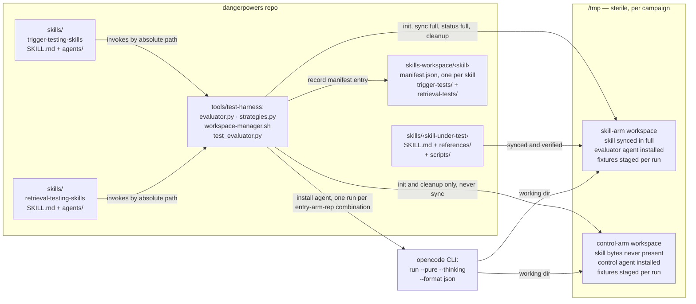
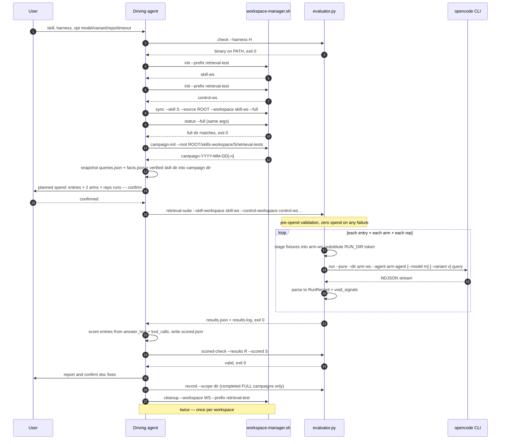
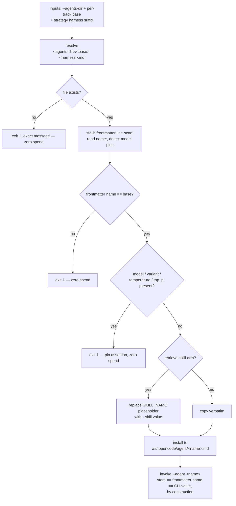
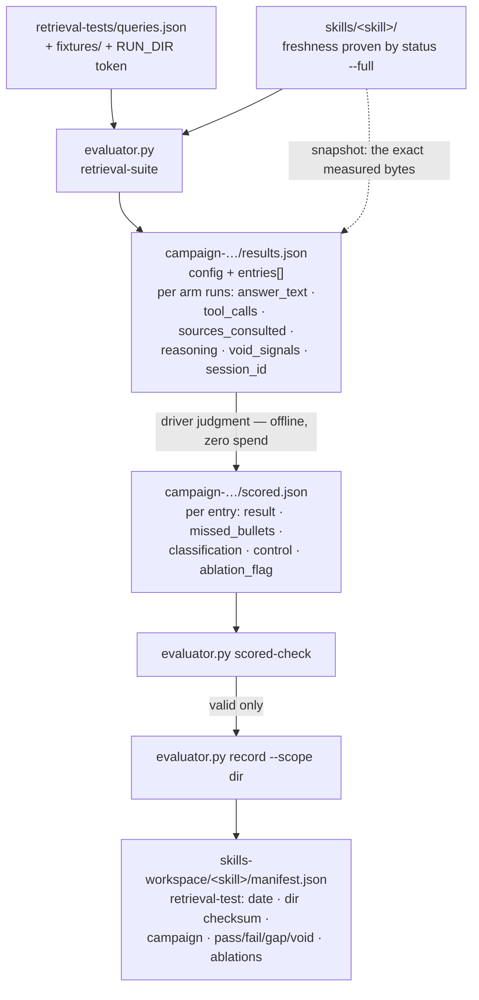
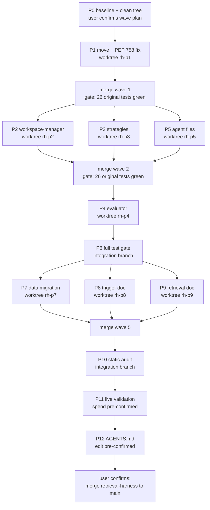

# Retrieval-Testing CLI Harness — Implementation Plan

> **Disclaimer: AI-generated plan**
>
> Written 2026-09-12 by an AI coding assistant as the execution companion to
> [`retrieval-harness-design.md`](./retrieval-harness-design.md) (Revision 2,
> same day — the "design doc" throughout). Nothing below exists yet.
>
> **Revision 2 (same day):** gaps G1–G8 resolved concretely — exact
> replacement texts, commands, and decisions are baked into the phases, and
> an executor's briefing was added. The plan is self-contained and ready
> for handoff to a fresh agent.
>
> **Revision 3 (same day):** execution model changed to per-phase fresh
> subagents with parallel git worktrees under `.worktrees/` on a
> `retrieval-harness` integration branch (§H wave plan, file-ownership
> matrix, orchestrator delegation template). Mermaid robustness fixes:
> ASCII-only unquoted labels, no `;`/`--` in labels.
>
> **Line-number convention (deliberate deviation from repo rules):**
> AGENTS.md bars line-number references in durable docs because they drift.
> This plan cites them anyway, by requester instruction, as **one-shot
> migration anchors** against the pre-migration file state of 2026-09-12 —
> every citation is paired with quoted anchor text. If a cited line has
> drifted when a phase executes, search for the quoted text, not the number.
> All citations were verified against the files on 2026-09-12.

## 0. Executor's briefing (read first — fresh-agent handoff)

**Working directory:** `/home/dave/source/dangerpowers` (repo root).

**Reading order, before touching any phase:**

1. `AGENTS.md` — operational rules (audit commands, no-README rule,
   AGENTS.md confirmation rule).
2. `docs/writing-skills/part-3/retrieval-harness-design.md` — the *what/why*
   (locked decisions D1–D7, alternatives already rejected — do not relitigate).
3. This plan — the *how*.

**Standing constraints (apply to every phase):**

- **Subagents never run git mutations.** The orchestrator batches them —
  worktree creation, commits, merges — with **one user confirmation per
  wave**. Present the exact commands and ask.
- **No model spend without explicit user confirmation** — any live
  `opencode run` (P11, and nothing else should be live). The orchestrator
  obtains the confirmation BEFORE dispatching the P11 subagent and embeds
  it in the prompt.
- **Never edit README.md files; never edit AGENTS.md** without the P12
  confirmation flow.
- Scripts are **stdlib-only**, **Python ≥ 3.10 grammar** (the G6 check in
  P6/P10 enforces this mechanically), **line length 79**.
- Consume **exit codes and JSON** from the harness scripts; never parse
  prose stdout.
- Line numbers herein are 2026-09-12 anchors paired with quoted text —
  search the quote when a number has drifted.

**Orchestration model (you are the orchestrator — you do NOT execute
phases yourself):**

- Every phase runs in a **fresh subagent** carrying only the context that
  phase needs. Your context budget is for review, gates, and user
  interaction — not for source code.
- You own exactly four things: **user confirmations**, **worktree/branch
  management**, **merges and wave gates**, and **delegation** (§H).
- Independent phases run **in parallel, one git worktree each** under
  `.worktrees/` (repo convention), branched off the integration branch
  `retrieval-harness`. The wave plan and file-ownership matrix are in §H.
- **File ownership is a hard contract:** a phase modifies only the files
  its §H row assigns. Anything else → the subagent STOPs and reports.
- Never read full files to check subagent work. Review
  `git diff --stat`, gate exit codes, and subagent reports; open a file
  only when a subagent reports drift or a gate fails.
- **Stop conditions:** any failed exit criterion or gate → stop and
  report; do not improvise out-of-scope fixes without user sign-off. Any
  anchor-text mismatch → stop and ask (the tree has drifted from this
  plan).

**Definition of done (whole program):** P6 and P10 fully green; P11 smoke
campaign completed with recorded outcomes for design open questions 1–3;
first `retrieval-test` manifest entry recorded (if the user approves the
smoke campaign); P12 presented for confirmation (applied or explicitly
deferred by the user).

## A. Design-doc fact-check (verified against the tree)

Every load-bearing claim in the design doc was re-verified before planning:

| Design claim | Verified | Evidence |
|---|---|---|
| `strategies.py` uses PEP 758 bare-tuple `except json.JSONDecodeError, ValueError:` — Python ≥ 3.14 only | ✅ | `skills/trigger-testing-skills/scripts/strategies.py`, inside `OpencodeStrategy.parse_stream`: `except json.JSONDecodeError, ValueError:` |
| `SKILL_DIR`/`AGENTS_DIR` derived from `__file__`, silently wrong after the move | ✅ | same file, module level: `SKILL_DIR = Path(__file__).resolve().parents[1]` / `AGENTS_DIR = SKILL_DIR / "agents"` |
| `check_harness` validates the agent source file (existence only) | ✅ | same file, `check_harness`: binary check via `shutil.which`, then `strategy_cls.agent_source.exists()` |
| `record` hardcodes the `"trigger-test"` manifest key; frontmatter-only sha256 | ✅ | `evaluator.py`, `cmd_record`: `checksum = "sha256:" + hashlib.sha256(frontmatter.encode())...` and `data["trigger-test"] = entry` |
| Trigger SKILL.md says "invoke them by their path **inside this skill directory**" | ✅ | `skills/trigger-testing-skills/SKILL.md`, Overview section, second paragraph |
| Trigger SKILL.md documents a Python floor of `>= 3.10` — currently **false** because of the PEP 758 line | ✅ | same file, Workflow "Preflight" step: "must be >= 3.10". The parens fix makes the doc true again. |
| `{RUN_DIR}` already exists in the data; only SKILL.md prose is vague | ✅ | `skills-workspace/writing-skills/retrieval-tests/queries.json`, entry `read-before-editing` — **no `fixtures` field on any entry yet** |
| Plugin whitelists `model`/`variant`/`temperature`/`top_p` in agent frontmatter (hence the `install()` pin assertion) | ✅ | `plugins/opencode-plugin.ts`, `AGENT_CONFIG_KEYS` |
| `trigger-evaluator.opencode.md` pins no model config | ✅ | frontmatter: `mode: primary`, `steps: 5`, `skill: allow` + 11 denies |
| Retrieval SKILL.md "read-only session" is a guardrail, not enforcement | ✅ | `skills/retrieval-testing-skills/SKILL.md`, "Subagent prompt" section, admission paragraph after the template |
| Scripts are stdlib-only; flat sibling imports | ✅ | `evaluator.py` does `from strategies import ...`; no third-party imports anywhere |
| `__pycache__/` under `scripts/` is untracked | ✅ | `git ls-files` — only the 4 source files tracked |

**Verdict: the design doc is accurate. No claim failed verification.**

## B. Gaps beyond the design doc — all resolved herein

Found during verification. **Revision 2 status: every gap now has a
concrete resolution baked into a phase** (exact text or decision, not
"draft later"):

| # | Gap | Resolution | Where |
|---|---|---|---|
| G1 | Retrieval SKILL.md frontmatter `description:` (line 3) still says "read-only subagents" — §9 rewrite map covers body only | Exact replacement `description:` text supplied | P9 (9a) |
| G2 | `workspace-manager.sh` usage text calls the script `trigger-test.sh`, documents `--skll`, says "copys" / "in a a valid state", **and claims a `$TRIGGER_TEST_WORKSPACE` env var that `cmd_cleanup` never reads** (verified: the flag is required) | Exact replacement `usage()` text supplied (env-var claim dropped — docs match behavior, no code change) | P2 (2a) |
| G3 | Repo-root `agents/` referenced by AGENTS.md layout and `plugins/opencode-plugin.ts` but does not exist (plugin tolerates absence silently) | **Decision (recommended):** leave the layout entry as the documented convention; create nothing. Surfaced to the requester inside the P12 confirmation text — one yes/no, reversible | P12 (item 1) |
| G4 | `docs/README.md` has no `### Part 3` section at all — design step 13 is an addition, not an edit | Paste-ready index entries for the two verified harness docs supplied; human writes summaries for the remaining part-3 files (READMEs are human-edited per repo rules) | P12 (item 2) |
| G5 | Design §5.2's "counts use explicit `dest`s (`pass` is a keyword)" | Moot: `--passes/--fails/--gaps/--voids` yield natural dests | P4 (4c) |
| G6 | Two Python floors: dev tooling 3.14 (`pyproject.toml`) vs. scripts' documented ≥ 3.10 campaign-runtime floor | **Mechanical enforcement added:** `ast.parse(feature_version=(3, 10))` grammar-compat test (catches exactly the PEP 758 class of bug) as a unit test AND an audit step | P6, P10 |
| G7 | Untracked empty file `test` in the 2026-09-02 campaign dir | Deletion step with empty-and-untracked guard | P7 |
| G8 | `cmd_run` never calls `check_harness` (only `check`/`suite` do) | Not a bug — documented here so nobody "fixes" it mid-migration | this table |

The design doc itself needs no edits: all eight are execution-level, not
design-level.

## C. Target architecture



The two-workspace model is the structural control-arm guarantee: baseline
purity does not depend on any harness permission path-matching, because the
skill bytes simply do not exist in the control workspace.

## D. Campaign execution flow



## E. Harness-neutral agent resolution (design §5.1)



Adding a harness = one strategy class + one `*.<harness>.md` agent file per
track. SKILL.md command lines never change.

## F. Results dataflow (offline-complete evaluation)



`tool_calls` (deterministic read/grep/glob/skill targets) plus the snapshotted
skill dir are what make gap-vs-findability-vs-clarity classification possible
without trusting the agent's self-report or any session persistence.

## G. Phase plan

Phases run in **waves** per the §H wave plan; each phase is a fresh
subagent, parallel phases get parallel worktrees. All work lands on the
`retrieval-harness` **integration branch** — main is untouched until the
final merge (user-confirmed after P11), so the P1→P4 broken window
(between the `git mv` and the strategies generalization, trigger's
`suite`/`check` fail because `agent_source` still resolves via `__file__`)
never reaches main.

Traceability: design §5.1→P3, §5.2→P4, §5.3→P2, §6→P5, §7→P3+P4, §8→P4+P7,
§9→P9, §10→P8, §12→P11, §14→P0/P6/P10/P11. Deviation from design §13 order:
tests (design step 10) are pulled forward — each code phase writes its own
tests in its own test file in the same change; P6 is the gate.

---

### Phase 0 — Baseline verification (fresh subagent + orchestrator, ~10 min)

**Goal:** prove the starting point is green, ensure a clean tree, and lock
decisions.

1. Subagent verifies: `git status` clean (if not — e.g. uncommitted plan
   docs — the orchestrator asks the user to commit or stash before any
   worktree is created).
2. Subagent runs:
   `cd skills/trigger-testing-skills/scripts && python3 -m unittest test_evaluator -v`
   — all tests pass (26 at time of writing — verified: 9 `VerdictTests`,
   10 `RecordTests`, 7 `FailuresTests`; `Ran 26 tests … OK`).
3. Orchestrator confirms with the requester that locked decisions D1–D7
   still hold, presents the §H wave plan (worktrees, branches, per-wave
   confirmations), and gets go-ahead — including the Phase 12 AGENTS.md
   edit, which needs explicit confirmation per repo rules.
4. Orchestrator creates the integration branch `retrieval-harness` from
   the clean main checkout.

**Exit criteria:** suite green; tree clean; decisions and wave plan
confirmed; integration branch exists.

---

### Phase 1 — Mechanical move + PEP 758 fix (fresh subagent, wave 1, worktree `rh-p1`)

**Files:**

```bash
mkdir -p tools/test-harness
git mv skills/trigger-testing-skills/scripts/evaluator.py       tools/test-harness/
git mv skills/trigger-testing-skills/scripts/strategies.py      tools/test-harness/
git mv skills/trigger-testing-skills/scripts/workspace-manager.sh tools/test-harness/
git mv skills/trigger-testing-skills/scripts/test_evaluator.py  tools/test-harness/
rm -rf skills/trigger-testing-skills/scripts/__pycache__   # untracked
```

Flat sibling imports (`from strategies import ...` in `evaluator.py`;
`import evaluator, strategies` in `test_evaluator.py`) survive the move
unchanged because all three files move together.

**Ride-along fix** in `tools/test-harness/strategies.py`, inside
`OpencodeStrategy.parse_stream`:

```python
# before (Python ≥ 3.14 only — breaks the documented >= 3.10 floor)
            except json.JSONDecodeError, ValueError:
# after
            except (json.JSONDecodeError, ValueError):
```

**Exit criteria:** `cd tools/test-harness && python3 -m unittest test_evaluator`
green (26 tests, unedited). `suite`/`check` now fail with "evaluator agent
file missing" — expected on the integration branch; fixed in Phase 3. Do
not stop the program here.

---

### Phase 2 — `workspace-manager.sh` generalization (fresh subagent, wave 2 ∥, worktree `rh-p2`)

**Owns:** `tools/test-harness/workspace-manager.sh`; NEW
`tools/test-harness/test_workspace_manager.py`. Touches nothing else.

| # | Change | Anchor (current state) |
|---|--------|------------------------|
| 2a | Fix usage-text typos; document `--prefix` and `--full` | usage block: `trigger-test.sh init`, `--skll`, `copys`, "in a a valid state" |
| 2b | `init [--prefix P]` — default `trigger-test` (trigger track's commands stay verbatim); validate prefix chars | `cmd_init`: `ws="$(mktemp -d /tmp/trigger-test.XXXXXXXXXX)"` |
| 2c | `cleanup --workspace WS [--prefix P]` — parameterized guard | `cmd_cleanup`: `case "$ws" in /tmp/trigger-test.*)` |
| 2d | `sync … [--full]` — full-dir copy with hasher-aligned exclusions + symlink rejection | `cmd_sync`: stub write block and `name:`-matches-directory check |
| 2e | `status … [--full]` — recursive diff, same exclusions, exit 1 on any difference | `cmd_status`: `if [ "$current" = "$(cat "$stub")" ]` |
| 2f | `campaign-init` unchanged | — |

**2a — exact replacement `usage()` text (G2):** fixes `trigger-test.sh`,
`--skll`, "copys", "in a a valid state", and drops the unimplemented
`$TRIGGER_TEST_WORKSPACE` claim — docs match behavior, no code change):

```bash
usage() {
  cat >&2 <<'EOF'
usage:
  workspace-manager.sh init [--prefix NAME]
  workspace-manager.sh campaign-init --root DIR
  workspace-manager.sh sync --skill NAME --source DIR --workspace DIR [--full]
  workspace-manager.sh status --skill NAME --source DIR --workspace DIR [--full]
  workspace-manager.sh cleanup --workspace DIR [--prefix NAME]

init    creates one campaign workspace under /tmp/<prefix>.XXXXXXXXXX
        (default prefix: trigger-test) and prints its path on stdout.
campaign-init creates one persistent campaign directory under --root, named
        campaign-YYYY-MM-DD (suffixed -2, -3, ... on same-day reruns), and
        prints its path on stdout.
sync    copies the source skill to the target workspace. Default: frontmatter
        stub only (trigger track). --full copies the entire skill directory
        (retrieval track), excluding __pycache__/ and *.pyc and rejecting
        unsafe symlinks. Run after every description change to sync the stub.
status  verifies the workspace is in a valid state and that the synced skill
        matches the current source. Default: frontmatter comparison.
        --full: recursive diff with the same exclusions as sync --full;
        exit 1 on any difference.
cleanup removes the workspace; refuses paths outside /tmp/<prefix>.*
        (default prefix: trigger-test).
EOF
  exit 1
}
```

**2b/2c sketch:**

```bash
cmd_init() {
  local prefix="trigger-test"
  while [ $# -gt 0 ]; do
    case "$1" in
      --prefix) prefix="$2"; shift 2 ;;
      *) echo "error: unknown init argument: $1" >&2; exit 1 ;;
    esac
  done
  case "$prefix" in
    *[!A-Za-z0-9._-]* | "")
      echo "error: unsafe --prefix: '$prefix'" >&2; exit 1 ;;
  esac
  local ws
  ws="$(mktemp -d "/tmp/${prefix}.XXXXXXXXXX")"
  mkdir -p "$ws/.agents/skills"
  printf '%s\n' "$ws"
}
```

```bash
# cmd_cleanup guard, prefix-parameterized:
  case "$ws" in
    /tmp/"$prefix".*) rm -rf -- "$ws" ;;
    *) echo "error: refusing to remove path outside /tmp/$prefix.*: $ws" >&2
       exit 1 ;;
  esac
```

**2d sketch** (full mode; default stub path byte-for-byte unchanged):

```bash
  local skill_dir="$source/skills/$skill"
  if [ "$full" -eq 1 ]; then
    # Symlink policy — the dir hasher (evaluator.py record --scope dir)
    # applies the SAME policy so both agree on the file set:
    #   escaping symlink  -> reject
    #   symlink to a dir  -> reject (keeps walk/diff/hash consistent)
    #   symlink to a file -> allowed (hasher reads through it)
    while IFS= read -r link; do
      target="$(realpath -m "$link")"
      case "$target" in
        "$skill_dir"/*) ;;
        *) echo "error: symlink escapes skill dir: $link -> $target" >&2
           exit 1 ;;
      esac
      [ -d "$target" ] && {
        echo "error: symlink to a directory: $link" >&2; exit 1; }
    done < <(find "$skill_dir" -type l)
    rm -rf "$ws/.agents/skills/$skill"
    mkdir -p "$ws/.agents/skills/$skill"
    tar -cf - --exclude='__pycache__' --exclude='*.pyc' \
        -C "$skill_dir" . | tar -xf - -C "$ws/.agents/skills/$skill"
  fi
  # existing frontmatter name:-matches-directory check runs in BOTH modes
```

(`tar` pipe avoids an `rsync` dependency; exclusions are the same set the
hasher uses. The retrieval workflow calls `--full` for the skill-arm
workspace only; the trigger track never passes `--full`.)

**2e sketch:**

```bash
  if [ "$full" -eq 1 ]; then
    if diff -r --exclude='__pycache__' --exclude='*.pyc' \
         "$skill_dir" "$ws/.agents/skills/$skill" > /dev/null 2>&1; then
      echo "ok: $skill full dir matches source"; exit 0
    fi
    echo "error: $skill full dir differs from source:" >&2
    diff -r --exclude='__pycache__' --exclude='*.pyc' \
         "$skill_dir" "$ws/.agents/skills/$skill" >&2
    exit 1
  fi
```

**Tests (land with this phase, in the NEW
`tools/test-harness/test_workspace_manager.py` — a unittest module driving
the shell script via subprocess in temp dirs; `test_evaluator.py` stays
untouched):** init with custom prefix prints a matching path; cleanup
refuses a foreign prefix; sync `--full` then status `--full` exits 0;
touch a reference file → status `--full` exits 1; escaping symlink
rejected.

**Exit criteria:** `shellcheck` clean; default-mode behavior byte-identical
for the trigger track; round-trip test passes (design §14).

---

### Phase 3 — `strategies.py` generalization (fresh subagent, wave 2 ∥, worktree `rh-p3`)

**Owns:** `tools/test-harness/strategies.py`; NEW
`tools/test-harness/test_strategies.py`. Touches nothing else.

| # | Change | Anchor |
|---|--------|--------|
| 3a | Delete `SKILL_DIR`/`AGENTS_DIR` module constants | `SKILL_DIR = Path(__file__).resolve().parents[1]` |
| 3b | Extend `EventStream` with retrieval evidence fields | `@dataclass class EventStream` |
| 3c | Extend `OpencodeStrategy.parse_stream` capture | the `elif etype == "tool_use":` branch |
| 3d | Generalize strategy class attrs → harness suffix + install dir | `class OpencodeStrategy` attrs `agent_name/agent_source/agent_dest` |
| 3e | New stdlib frontmatter scanner + pin assertion | new module-level functions |
| 3f | Generalized `install()` with `{{SKILL_NAME}}` templating | current `install` body (`shutil.copyfile`) |
| 3g | Extract shared `execute()`; `evaluate()` becomes a thin classifier wrapper | current `evaluate` subprocess block |
| 3h | `check_harness`: drop the agent-source check | `check_harness` second half |
| 3i | `classify()` — **untouched** | — |

**3b — EventStream additions** (import `field` from `dataclasses`):

```python
@dataclass
class EventStream:
    session_id: str = ""
    reasoning_parts: list[str] = field(default_factory=list)
    answer_parts: list[str] = field(default_factory=list)           # NEW
    tool_calls: list[dict] = field(default_factory=list)            # NEW
    skill_loads: list[dict] = field(default_factory=list)           # NEW
    denied_tool_attempts: list[dict] = field(default_factory=list)  # NEW
    completed_load: bool = False
    attempted_load: bool = False
    other_skill: str | None = None
    report_loaded: str | None = None
    report_no_match: bool = False
    error_message: str | None = None
    parseable: int = 0
```

**3c — parse_stream additions.** In the `"text"` branch, append every text
chunk (the trigger report regexes keep running on the same text — the two
consumers coexist):

```python
            elif etype == "text":
                text = part.get("text")
                if isinstance(text, str):
                    ev.answer_parts.append(text)                    # NEW
                    m = REPORT_LOADED_RE.search(text)
                    ...                                             # existing
```

Extend the `tool_use` branch (read/grep/glob targets, full skill-load log).
**Verify at implementation:** opencode's exact `state.input` keys for
read/grep/glob (`filePath` vs `path`, `pattern`) — same unverified-shape
category as the design's `denied_tool_attempts` note; capture best-effort
plus keep the call's presence:

```python
            elif etype == "tool_use":
                tool = part.get("tool")
                state = part.get("state")
                if not isinstance(state, dict):
                    state = {}
                inp = state.get("input")
                if not isinstance(inp, dict):
                    inp = {}
                if tool == "skill":
                    ev.skill_loads.append({                         # NEW
                        "name": inp.get("name"),
                        "status": state.get("status"),
                    })
                    ...                                             # existing
                elif tool in ("read", "grep", "glob"):              # NEW
                    ev.tool_calls.append({
                        "tool": tool,
                        "target": inp.get("filePath")
                        or inp.get("path")
                        or inp.get("pattern")
                        or "",
                    })
```

Denied-attempt capture stays a clearly-marked, never-load-bearing hook
(event shape UNVERIFIED — design §12 open question 2; Phase 11 checks real
streams and either wires an event type or leaves the list permanently
empty):

```python
            elif etype in ("permission_denied", "tool_denied"):
                # UNVERIFIED event shape — denied tools may simply be absent
                # from the model's toolset, making this dead code by
                # construction. Belt-and-suspenders only; never load-bearing.
                ev.denied_tool_attempts.append(event)
```

**3d/3e/3f — resolution + install:**

```python
MODEL_PIN_KEYS = ("model", "variant", "temperature", "top_p")


def _fail(message: str) -> None:
    print(f"error: {message}", file=sys.stderr)
    sys.exit(1)


def scan_agent_frontmatter(agent_file: Path) -> dict:
    """Stdlib line-scan of an agent file's YAML frontmatter.

    pyyaml is deliberately NOT used: scripts run on any python3 >= 3.10 on
    PATH (trigger SKILL.md preflight contract). Returns {"name", "pins"}."""
    try:
        lines = agent_file.read_text().splitlines()
    except OSError as e:
        _fail(f"could not read agent file {agent_file}: {e}")
    if not lines or lines[0].strip() != "---":
        _fail(f"agent file {agent_file}: missing frontmatter block")
    name = None
    pins: list[str] = []
    for line in lines[1:]:
        if line.strip() == "---":
            break
        m = re.match(r"^name:\s*(\S+)\s*$", line)
        if m:
            name = m.group(1)
        for key in MODEL_PIN_KEYS:
            if re.match(rf"^{key}\s*:", line):
                pins.append(key)
    if name is None:
        _fail(f"agent file {agent_file}: frontmatter has no 'name:'")
    return {"name": name, "pins": pins}
```

```python
class EvalStrategy:
    binary: str
    harness: str               # also the agent-file suffix, e.g. "opencode"
    agent_install_dir: str     # workspace-relative, e.g. ".opencode/agent"

    def agent_file(self, agents_dir: Path, base: str) -> Path:
        return agents_dir / f"{base}.{self.harness}.md"

    def install(self, workspace: Path, agents_dir: Path, base: str,
                *, skill_name: str | None = None) -> str:
        """Resolve, validate, install one eval agent. Pre-spend: every
        failure exits 1 with an exact message. Returns the agent name —
        file base == frontmatter name == CLI value, by construction."""
        source = self.agent_file(agents_dir, base)
        if not source.exists():
            _fail(f"evaluator agent file missing: {source}")
        info = scan_agent_frontmatter(source)
        if info["name"] != base:
            _fail(
                f"agent file {source}: frontmatter name "
                f"'{info['name']}' does not match expected '{base}'"
            )
        if info["pins"]:
            _fail(
                f"agent file {source} pins model config "
                f"({', '.join(info['pins'])}); eval agents must not pin "
                "model/variant/temperature/top_p — selection flows "
                "through --model/--variant only"
            )
        text = source.read_text()
        if skill_name is not None:
            text = text.replace("{{SKILL_NAME}}", skill_name)
        dest = workspace / self.agent_install_dir / f"{base}.md"
        try:
            dest.parent.mkdir(parents=True, exist_ok=True)
            dest.write_text(text)
        except OSError as e:
            _fail(f"could not install evaluator agent to {dest}: {e}")
        return base
```

```python
class OpencodeStrategy(EvalStrategy):
    binary = "opencode"
    harness = "opencode"
    agent_install_dir = ".opencode/agent"
```

**3g — shared `execute()`.** Extract the subprocess block from `evaluate()`
so trigger verdicts and retrieval records share one invocation contract
(flags, `_reject_agent_fallback`, fatal-error policy). Behavior-preserving:
the three `HarnessExecutionError` conditions (`error_message`, nonzero
returncode, zero parseable events) move from `classify()`'s call path into
`execute()`; `classify()` itself is **not edited** (existing `VerdictTests`
keep passing against synthetic streams):

```python
    def execute(self, workspace: Path, agent: str, query: str,
                model: str | None = None, effort: str | None = None
                ) -> tuple[EventStream, bool]:
        """One headless eval run. Returns (parsed stream, timed_out).
        Timeout yields a partial stream, never an exception.
        HarnessExecutionError = operational failure, never a verdict."""
        cmd = [
            self.binary, "run", "--pure", "--thinking", "--format", "json",
            "--dir", str(workspace), "--agent", agent,
        ]
        if model is not None:
            cmd += ["--model", model]
        if effort is not None:
            cmd += ["--variant", effort]
        cmd.append(query)
        try:
            proc = subprocess.run(
                cmd, capture_output=True, text=True,
                timeout=self.timeout, check=False,
            )
        except FileNotFoundError:
            raise HarnessExecutionError(
                f"harness CLI '{self.binary}' not found on PATH"
            )
        except subprocess.TimeoutExpired as e:
            return self.parse_stream(_as_text(e.stdout)), True
        _reject_agent_fallback(proc.stderr)
        ev = self.parse_stream(proc.stdout)
        if ev.error_message is not None:
            raise HarnessExecutionError(ev.error_message)
        if proc.returncode != 0:
            raise HarnessExecutionError(
                f"exit {proc.returncode}: {proc.stderr[-500:]}"
            )
        if ev.parseable == 0:
            raise HarnessExecutionError("no parseable events (exit 0)")
        return ev, False

    def evaluate(self, skill, query, workspace, model=None, effort=None):
        ev, timed_out = self.execute(workspace, self.trigger_agent_base,
                                     query, model, effort)
        if timed_out:
            return classify(ev, skill,
                            interrupted_cause=f"timeout after {self.timeout}s")
        return classify(ev, skill)
```

`evaluate()` needs the trigger base name — pass it in from evaluator.py
(`TRIGGER_AGENT` constant) or keep a class attr default; either way the
**name is derived, never a CLI arg** (design §5.1: `--agent-name` does not
exist). Note for the implementer: match the current timeout-classify call's
keyword arguments exactly (`interrupted_cause=`, and today `returncode`/
`stderr` flow into the non-timeout path — with `execute()` raising first,
the wrapper passes neither; `classify()`'s defaults apply).

**Tests (land with this phase, in the NEW
`tools/test-harness/test_strategies.py`; `test_evaluator.py` stays
untouched):** frontmatter scan (name found, pins detected, missing
frontmatter, missing name); install (templating substitution, verbatim
when `skill_name=None`, name-mismatch exit, pin exit, missing-file exit,
dest path — all against synthetic agent files in tmp dirs, NOT the P5
files, which live in a parallel worktree); parse_stream (answer
concatenation, read/grep/glob targets, skill-load log, trigger regexes
still fire); `execute()` timeout returns partial stream; G6 grammar check
for `strategies.py`; full existing `VerdictTests` green (refactor
regression gate — run from the worktree).

**Exit criteria:** all new + existing unit tests pass;
`python3 -m py_compile` clean; no `__file__`-derived paths remain.

---

### Phase 4 — `evaluator.py` extension (fresh subagent, wave 3, worktree `rh-p4`)

**Owns:** `tools/test-harness/evaluator.py`; NEW
`tools/test-harness/test_retrieval.py`. Touches nothing else. Branched
from the integration branch AFTER the wave-2 merge, so the P3 interfaces
(install, `execute`, `agent_file`, `scan_agent_frontmatter`) are present.

| # | Change | Anchor |
|---|--------|--------|
| 4a | Track constants near `MAX_WORKERS = 10` | module level |
| 4b | `run`/`suite`: required `--agents-dir`; install calls updated | argparse blocks for `run` and `suite`; `strategy.install(workspace)` call sites in `cmd_run` and `cmd_suite` |
| 4c | `record --scope` + dir hasher + count args | `cmd_record`, `extract_frontmatter` |
| 4d | `retrieval-suite` subcommand | new |
| 4e | `scored-check` subcommand | new |
| 4f | `split`/`failures`/`run` semantics unchanged | — |

**4a:**

```python
TRIGGER_AGENT = "trigger-evaluator"
RETRIEVAL_EVALUATOR_AGENT = "retrieval-evaluator"
RETRIEVAL_CONTROL_AGENT = "retrieval-control"
```

**4b:** add to both argparse blocks (and thread through):

```python
    p_run.add_argument("--agents-dir", required=True)
```

```python
    strategy.install(workspace, Path(args.agents_dir), TRIGGER_AGENT)
```

**4c — `record` generalization.** Argparse: `--skill`, `--skill-path`,
`--manifest` stay required; add `--scope` (required,
`choices=["frontmatter", "dir"]`); `--score` becomes optional; add
`--passes/--fails/--gaps/--voids` (type int, natural dests — G5) and
optional `--ablations`. Conditional validation (manual, exit 1, exact
messages):

```python
    if args.scope == "frontmatter":
        if args.score is None:
            return _err("--score is required with --scope frontmatter")
        if _any_counts_given(args):
            return _err("counts are only valid with --scope dir")
        if not skill_path.is_file():
            return _err(f"--scope frontmatter expects a SKILL.md file: "
                        f"{skill_path}")
        checksum = "sha256:" + hashlib.sha256(frontmatter.encode()) \
            .hexdigest()  # existing extract_frontmatter path, unchanged
        entry = {"date": ..., "checksum": checksum, "score": args.score}
        key = "trigger-test"
    else:  # dir
        if args.score is not None:
            return _err("--score is only valid with --scope frontmatter")
        missing = [n for n in ("passes", "fails", "gaps", "voids")
                   if getattr(args, n) is None]
        if missing:
            return _err(f"counts required with --scope dir: "
                        f"{', '.join(missing)}")
        if not skill_path.is_dir():
            return _err(f"--scope dir expects the skill directory: "
                        f"{skill_path}")
        checksum = hash_skill_dir(skill_path)
        entry = {
            "date": ..., "checksum": checksum,
            "passes": args.passes, "fails": args.fails,
            "gaps": args.gaps, "voids": args.voids,
        }
        if args.ablations is not None:
            entry["ablations"] = args.ablations
        key = "retrieval-test"
    if args.campaign is not None:
        entry["campaign"] = args.campaign
    data["skill"] = args.skill
    data[key] = entry            # manifest I/O core unchanged: read object,
                                 # overwrite only this key, preserve unknown
```

The dir hasher (file-set and symlink policy identical to `sync --full`,
Phase 2 — otherwise `status --full` and the manifest hash disagree on what
"the content" is):

```python
def hash_skill_dir(skill_dir: Path) -> str:
    """Deterministic sha256 over a whole skill directory: sorted relative
    paths, __pycache__/ and *.pyc excluded (the exact set sync --full
    excludes), relpath\\0bytes\\0 fed per file."""
    h = hashlib.sha256()
    root = skill_dir.resolve()
    files = sorted(
        (p for p in skill_dir.rglob("*") if not p.is_dir()),
        key=lambda p: p.relative_to(skill_dir).as_posix(),
    )
    for p in files:
        rel = p.relative_to(skill_dir)
        if "__pycache__" in rel.parts or p.suffix == ".pyc":
            continue
        if p.is_symlink() and (
            p.resolve().is_dir() or root not in p.resolve().parents
        ):
            print(f"error: unsupported symlink in skill dir: {p}",
                  file=sys.stderr)
            sys.exit(1)
        h.update(rel.as_posix().encode())
        h.update(b"\0")
        h.update(p.read_bytes())   # reads through internal file symlinks
        h.update(b"\0")
    return "sha256:" + h.hexdigest()
```

**4d — `retrieval-suite`.** CLI per design §5.2:

```
evaluator.py retrieval-suite --harness opencode --skill NAME \
    --agents-dir DIR --skill-workspace WS --control-workspace WS \
    --queries QUERIES.json --out RESULTS.json \
    [--model M] [--variant V] [--reps 1] [--timeout 120]
```

Structure (new code, reusing `_Log`/`emit`/`MAX_WORKERS` and the
smoke-first-then-parallel pattern from `eval_batch`):

```python
def cmd_retrieval_suite(args: argparse.Namespace) -> int:
    strategy_cls = resolve_strategy(args.harness)
    check_harness(args.harness, strategy_cls)          # binary only (4/3h)
    skill_ws = Path(args.skill_workspace)
    control_ws = Path(args.control_workspace)
    agents_dir = Path(args.agents_dir)
    queries_path = Path(args.queries)

    # ---- pre-spend validation: any failure exits 1, exact message ----
    probe = strategy_cls(timeout=args.timeout)
    for base in (RETRIEVAL_EVALUATOR_AGENT, RETRIEVAL_CONTROL_AGENT):
        f = probe.agent_file(agents_dir, base)
        if not f.exists():
            _fail(f"evaluator agent file missing: {f}")
        info = scan_agent_frontmatter(f)               # exits on bad fm
        if info["name"] != base or info["pins"]:
            _fail(...)                                  # same assertions
    if not (skill_ws / ".agents" / "skills" / args.skill).is_dir():
        _fail(f"skill workspace has no synced skill '{args.skill}': run "
              "workspace-manager.sh sync --full and status --full first")
    if (control_ws / ".agents" / "skills" / args.skill).exists():
        _fail(f"control workspace contains skill '{args.skill}' — baseline "
              "contamination; recreate the control workspace, never sync")
    entries = load_retrieval_queries(queries_path)     # §8 schema, exits 1
    out = Path(args.out)
    if not out.parent.is_dir():
        _fail(f"output directory does not exist: {out.parent}")

    # ---- install + run ----
    _Log.file = out.with_suffix(".log").open("w")      # mirror like suite
    strategy = strategy_cls(timeout=args.timeout)
    strategy.install(skill_ws, agents_dir, RETRIEVAL_EVALUATOR_AGENT,
                     skill_name=args.skill)            # {{SKILL_NAME}}
    strategy.install(control_ws, agents_dir, RETRIEVAL_CONTROL_AGENT)
    results = []
    for entry in entries:
        record = {"id": entry["id"], "query": entry["query"],
                  "expect": entry["expect"]}
        for arm, ws, agent in (
            ("skill_arm", skill_ws, RETRIEVAL_EVALUATOR_AGENT),
            ("control_arm", control_ws, RETRIEVAL_CONTROL_AGENT),
        ):
            record[arm] = {"runs": run_records_batch(
                strategy, entry, arm, ws, agent, args)}
        results.append(record)
        emit(f"[{len(results)}/{len(entries)}] {entry['id']}")
    out.write_text(json.dumps({
        "config": {"skill": args.skill, "harness": args.harness,
                   "model": args.model, "variant": args.variant,
                   "reps": args.reps, "timeout": args.timeout,
                   "date": datetime.now(UTC).date().isoformat(),
                   "queries": str(queries_path)},
        "entries": results,
    }, indent=2) + "\n")
    return 0      # HarnessExecutionError anywhere -> stderr, exit 1,
                # no JSON, workspaces kept (trigger policy, unchanged)
```

Fixture staging + dispatch (`{RUN_DIR}` substitution is per-run mechanics;
the dispatched form is recorded, the canonical query stays verbatim):

```python
def stage_and_dispatch(entry: dict, arm: str, rep: int, reps: int,
                       arm_ws: Path, fixtures_dir: Path) -> str:
    query = entry["query"]
    if not entry.get("fixtures"):
        return query
    label = arm if reps == 1 else f"{arm}-rep{rep}"
    run_dir = arm_ws / "fixtures" / entry["id"] / label
    run_dir.mkdir(parents=True, exist_ok=True)
    for name in entry["fixtures"]:
        shutil.copyfile(fixtures_dir / name, run_dir / name)
    return query.replace("{RUN_DIR}", str(run_dir))
```

Query-file validation (`load_retrieval_queries`) — design §8, pre-spend:

```python
def load_retrieval_queries(path: Path) -> list[dict]:
    ...  # JSON object list; per entry, exit 1 with exact message:
    #  id: non-empty unique str; query: non-empty str;
    #  expect: non-empty list[str]; fixtures: optional list[str]
    #  "{RUN_DIR}" in query  IFF  "fixtures" present
    #  every fixture exists under path.parent / "fixtures"
```

`run_records_batch` mirrors `eval_batch`: rep 1 alone (smoke run —
`HarnessExecutionError` aborts the campaign), remaining reps in
`ThreadPoolExecutor(MAX_WORKERS)` batches. Each rep: `stage_and_dispatch`
→ `strategy.execute(...)` → record assembly. Timeout is a **record**
(`timeout: true`, partial stream), never an abort.

Record assembly + script-computed void signals (design §7):

```python
SOURCES_RE = re.compile(r"sources consulted:\s*(?P<block>.*)$",
                        re.IGNORECASE | re.DOTALL)


def build_run_record(ev, query_dispatched, timed_out, ws_root, arm, skill):
    answer = "".join(ev.answer_parts)
    m = SOURCES_RE.search(answer)
    signals = []
    if arm == "skill_arm" and not ev.completed_load:
        signals.append("skill-not-loaded")
    if arm == "control_arm" and ev.skill_loads:
        signals.append("control-loaded-skill")
    if not answer.strip():
        signals.append("empty-answer")
    root = str(ws_root.resolve())
    for call in ev.tool_calls:
        t = call["target"]
        if not t:
            continue
        p = Path(t) if Path(t).is_absolute() else ws_root / t
        if not str(p.resolve()).startswith(root):
            signals.append("read-outside-workspace")
            break
    return {
        "query_dispatched": query_dispatched,
        "answer_text": answer,
        "sources_consulted": m.group("block").strip() if m else None,
        "tool_calls": ev.tool_calls,
        "skill_load_completed": ev.completed_load,
        "other_skill_loads": [s["name"] for s in ev.skill_loads
                              if s["name"] not in (None, skill)],
        "denied_tool_attempts": ev.denied_tool_attempts,
        "reasoning": "".join(ev.reasoning_parts),
        "session_id": ev.session_id,
        "timeout": timed_out,
        "parseable_events": ev.parseable,
        "void_signals": signals,
    }
```

Deliberately absent (design §5.2): no `split`, no sealed pool, no sanity
check, no iteration loop — retrieval has no optimization loop.

**4e — `scored-check`.** The driver owns judgment; the script keeps the
audit artifact honest. Schema (pinned here, documented in Phase 9):

```json
{
  "campaign": "campaign-2026-09-12",
  "skill": "writing-skills",
  "entries": [
    {
      "id": "retry-after-header",
      "result": "fail",
      "missed_bullets": ["states the Retry-After header is required"],
      "classification": "findability",
      "control": "fail",
      "ablation_flag": false,
      "notes": "read uploads.md but missed the header rule"
    }
  ]
}
```

```python
RESULTS = {"pass", "fail", "gap", "void"}
CLASSIFICATIONS = {"findability", "clarity"}   # "gap" is a result, not a
                                               # classification
CONTROLS = {"pass", "fail", "void"}


def cmd_scored_check(args: argparse.Namespace) -> int:
    # load both JSON files (exact messages on failure)
    # results_ids = [e["id"] for e in results["entries"]]
    # scored["entries"] must be a list; per entry, exit 1 on:
    #   missing/dup/unknown id
    #   result not in RESULTS
    #   classification: required (in CLASSIFICATIONS) iff result=="fail",
    #                   must be absent/null otherwise
    #   control not in CONTROLS; ablation_flag not a bool
    #   missed_bullets: list[str], required non-empty for fail/gap
    # finally: every results id accounted for exactly once
    # print "ok: <scored> covers <n> entries"; return 0
```

**Tests (land with this phase, in the NEW
`tools/test-harness/test_retrieval.py`; `test_evaluator.py` stays
untouched):** dir-hash vectors (deterministic across repeats; excludes
`__pycache__`/`*.pyc`; body edit changes hash; `__pycache__` edit does
not; symlink rejection); record scope validation (frontmatter+counts → 1;
dir+score → 1; missing count → 1; dir scope writes `retrieval-test`
preserving an existing `trigger-test` key; skill-path type per scope);
query-file validation (fixtures-without-token and token-without-fixtures
both rejected; missing fixture file rejected); record assembly (signals
per arm; sources block extraction; outside-workspace target relative and
absolute); scored-check (complete → 0; missing id, unknown id, dup, bad
verdict, bad classification combo → 1); control-workspace presence → exit
1 pre-spend; G6 grammar check for `evaluator.py`.

**Exit criteria:** full unittest suite green (old + new);
`uv run python -m unittest discover -p 'test_*.py' -v` from
`tools/test-harness/` passes.

---

### Phase 5 — The two retrieval agent files (fresh subagent, wave 2 ∥, worktree `rh-p5`)

**Owns:** NEW `skills/retrieval-testing-skills/agents/*.md` only. Runs
parallel to P2/P3 — its worktree predates the P3 scanner, so verification
is the grep-level self-check below; the scanner-against-real-files
validation happens at the P6 gate post-merge.

**New files:** `skills/retrieval-testing-skills/agents/retrieval-evaluator.opencode.md`
and `.../retrieval-control.opencode.md`. Neither pins model config —
enforced by the Phase 3 assertion, not by convention.

Body rules are carried over from the current SKILL.md subagent prompt
("Subagent prompt" section, template lines "You are in a read-only
session…" through "Task: {{TEST QUERY}}"), with two deliberate deltas:
the read-only *claim* inverts to a policy *fact*, and the
mutation-prohibition bullet is dropped (denied tools need no rule). The
`{{TEST QUERY}}` placeholder disappears — the per-run prompt is the bare
query; only `{{SKILL_NAME}}` is templated at install time.

`retrieval-evaluator.opencode.md`:

```yaml
---
name: retrieval-evaluator
description: Answers one eval query using a designated skill as its reference documentation. Loads the skill first, reads what it directs to, and answers inline. Shell, file-mutating, web, todo, and agent tools are denied by policy.
mode: primary
steps: 30
permission:
  skill: allow
  read: allow
  grep: allow
  glob: allow
  list: allow
  edit: deny
  bash: deny
  task: deny
  todowrite: deny
  webfetch: deny
  websearch: deny
  question: deny
---

# Retrieval Evaluation Agent

Your tools are restricted by policy: loading skills, reading, and searching
is all you may do. Plan around it — this is expected, not an error.

**Rules:**

- Before anything else, load the skill named {{SKILL_NAME}} using the skill
  tool. It is your reference documentation for the task; read it, and read
  whatever files it directs you to.
- Perform the task. General programming knowledge may fill in the basics,
  but any fact the skill documents must come from the skill.
- If the task asks you to change something, produce the would-be result
  inline instead: complete code in fenced blocks, prose as prose. An answer
  that exists only on disk counts as no answer.
- Do not ask clarifying questions. Make a reasonable assumption, state it in
  one line, and proceed.
- Finish with a "Sources consulted:" list naming the exact skill sections
  and files you actually used, then end the turn.
```

`retrieval-control.opencode.md` — identical frontmatter except
`skill: deny` and the description ("Control-arm baseline … answers from its
own knowledge; the skill tool is denied"). Body:

```markdown
# Retrieval Control Agent

Your tools are restricted by policy: reading and searching the workspace is
all you may do. You may NOT load any skill.

**Rules:**

- Do NOT load any skill. Answer entirely from your own knowledge.
- Perform the task as best you can from general knowledge.
- If the task asks you to change something, produce the would-be result
  inline instead: complete code in fenced blocks, prose as prose.
- Do not ask clarifying questions. Make a reasonable assumption, state it in
  one line, and proceed.
```

Known inherited limitation to document in Phase 9 (design §6): `bash: deny`
means skills whose value includes executable `scripts/` cannot have that
value exercised — the syncer copies scripts the agent cannot run.

**Exit criteria (grep-level self-check, run in the worktree):**

```bash
cd skills/retrieval-testing-skills/agents
grep -q '^name: retrieval-evaluator$' retrieval-evaluator.opencode.md
grep -q '^name: retrieval-control$' retrieval-control.opencode.md
! grep -qE '^(model|variant|temperature|top_p):' *.opencode.md
grep -q '{{SKILL_NAME}}' retrieval-evaluator.opencode.md
! grep -q '{{SKILL_NAME}}' retrieval-control.opencode.md
```

Scanner-against-real-files validation is deferred to the P6 gate.

---

### Phase 6 — Test-suite gate (fresh subagent, wave 4, integration branch)

Gate phase: modifies nothing. Runs on the integration branch after the
wave-3 merge, from `tools/test-harness/`:

```bash
uv run python -m unittest discover -p 'test_*.py' -v
```

(The "G6 grammar check" each code phase implements in its own test file:
`ast.parse(src, filename=name, feature_version=(3, 10))` over the phase's
owned source files — parses with the 3.10 grammar and raises
`SyntaxError` on anything newer, e.g. the PEP 758 bare except-tuple.
Grammar only; the stdlib-only rule covers module availability.)

Expected by now (each written in its phase's own test file):
`test_workspace_manager.py` (P2), `test_strategies.py` (P3:
`FrontmatterScanTests`, `InstallTests`, `RetrievalStreamTests`,
execute-timeout, grammar check), `test_retrieval.py` (P4: `DirHashTests`,
`RecordScopeTests`, `RetrievalQueryTests`, `RunRecordTests`,
`ScoredCheckTests`, `ControlPurityTests`, grammar check), plus the
**original `test_evaluator.py` — 26 tests, UNEDITED** (`VerdictTests`,
`RecordTests`, `FailuresTests`; that is the `execute()` refactor
regression proof).

Also run the P5 contract validation post-merge (the two real agent files
are now in the same tree as the scanner):

```bash
uv run python - <<'EOF'
from pathlib import Path
import strategies
agents = Path("../../skills/retrieval-testing-skills/agents")
for base in ("retrieval-evaluator", "retrieval-control"):
    info = strategies.scan_agent_frontmatter(agents / f"{base}.opencode.md")
    assert info["name"] == base and not info["pins"], (base, info)
print("ok: real agent files satisfy the install contract")
EOF
```

**Exit criteria:** full discover green; original 26 tests pass unedited;
agent-file contract check prints ok; test counts reported for the record.

---

### Phase 7 — Data migration (fresh subagent, wave 5 ∥, worktree `rh-p7`)

**Owns:** `skills-workspace/**` only. The `git mv` below is executed by
the **orchestrator** as part of the wave's confirmed git operations (the
subagent stages everything else and reports the exact command).

```bash
git mv skills-workspace/writing-skills/trigger-tests/manifest.json \
       skills-workspace/writing-skills/manifest.json
```

Content unchanged — the existing `trigger-test` key is already the correct
shape for the one-manifest-per-skill layout.

**G7 cleanup** — remove the stray untracked empty `test` file, guarded so
it only fires on exactly the known artifact:

```bash
f=skills-workspace/writing-skills/trigger-tests/campaign-2026-09-02/test
[ -f "$f" ] && [ ! -s "$f" ] && ! git ls-files --error-unmatch "$f" 2>/dev/null \
  && rm "$f" || echo "skip: $f not the expected stray empty untracked file"
```

Edit `skills-workspace/writing-skills/retrieval-tests/queries.json`, entry
`read-before-editing` (the one carrying the `{RUN_DIR}` token) — metadata
only, query text byte-for-byte unchanged:

```json
  {
    "id": "read-before-editing",
    "query": "The skill at {RUN_DIR}/existing-skill.md is missing …",
    "expect": [
      "does not add a duplicate credential-cache warning",
      "reports that the warning already exists (or returns the file essentially unchanged)"
    ],
    "fixtures": ["existing-skill.md"]
  },
```

**Exit criteria:** `python3 -c 'import json; json.load(...)'` both files;
the new `load_retrieval_queries` from Phase 4 accepts `queries.json`;
`evaluator.py record --scope frontmatter` (dry-run against a copy) reads
the moved manifest and preserves the `trigger-test` key.

---

### Phase 8 — `trigger-testing-skills/SKILL.md` touch-points (fresh subagent, wave 5 ∥, worktree `rh-p8`)

**Owns:** `skills/trigger-testing-skills/SKILL.md` only.

Path, CLI-surface, and manifest-location updates only; **no semantic
changes** (design §10). All citations are `skills/trigger-testing-skills/SKILL.md`.
Exact replacement texts (no drafting left to the executor):

**8a — Overview, 2nd paragraph (line 15).** Replace the sentence fragment
"live in the scripts in this skill's `scripts/` directory (`evaluator.py`,
`workspace-manager.sh`); invoke them by their path **inside this skill
directory**, independent of the current working directory." with:

> live in the shared harness scripts at the repo-root `tools/test-harness/`
> directory (`evaluator.py`, `workspace-manager.sh`); invoke them by
> absolute path, independent of the current working directory.

**8b — suite command lines** (Workflow iteration-loop train suite, validate
pass, and sanity check). Insert `--agents-dir` after `--skill <s>`. The
train-suite template becomes:

```text
evaluator.py suite --harness <h> --skill <s> --agents-dir <trigger-skill-dir>/agents --workspace <ws> --queries <campaign>/train.json --out <campaign>/iter-<i>-train.json [--model m] [--variant v] --reps r --timeout t
```

`<trigger-skill-dir>` = the resolved absolute path of the
`trigger-testing-skills` skill itself (its `agents/` subdir holds
`trigger-evaluator.opencode.md`). Add one sentence at first use: "Pass the
testing skill's own `agents/` directory via `--agents-dir`; the harness
resolves `<base>.<harness>.md` agent files from it."

**8c — record command** (Workflow "Report and write-back"). Replace the
`--manifest` value and add `--scope`:

```text
evaluator.py record --skill <name> --skill-path <resolved SKILL.md> --manifest <source-root>/skills-workspace/<skill>/manifest.json --scope frontmatter --score <validate score; the winner's train score when no validate set exists> --campaign <campaign dir name>
```

**8d — Gotcha** "The manifest is written only by `evaluator.py record`,
only after a passed sanity check and a resolved write-back decision; never
hand-write or edit it mid-campaign." — append:

> One manifest per skill lives at `skills-workspace/<skill>/manifest.json`;
> `record` overwrites only its own track's key (`trigger-test` or
> `retrieval-test`) and preserves everything else.

**8e — Gotcha** "The manifest checksum hashes the frontmatter block
only…" — prepend "For the trigger track," and append the scope mention:

> For the trigger track, the manifest checksum hashes the frontmatter block
> only (`record --scope frontmatter`) — the same bytes the eval stub
> carries — so body-only edits never invalidate a recorded score.

**8f — Checklist** item "Manifest recorded via `record` on sanity pass
after the write-back decision; declined write-back NOT recorded" →
"Manifest recorded via `record --scope frontmatter` on sanity pass after
the write-back decision; declined write-back NOT recorded".

**8g — Preflight / Error handling:** no command changes; in the preflight
step, adjust the `check` description to "verifies the harness **binary** is
on PATH" (agent-file validation moved to install time and pre-spend
validation; an agent problem aborts there with an exact message).

Explicitly **unchanged**: campaign dirs stay under `trigger-tests/`
(Campaign-directory section and Workflow workspace step); the
`init`/`sync`/`status`/`cleanup` commands gain nothing (default
`--prefix trigger-test`); the Python `>= 3.10` floor statement (true again
after Phase 1); report template `artifacts:` line.

**Exit criteria:** every command line in the doc is runnable as written;
no lingering `scripts/` references; grep for `trigger-tests/manifest.json`
returns nothing.

---

### Phase 9 — `retrieval-testing-skills/SKILL.md` rewrite (fresh subagent, wave 5 ∥, worktree `rh-p9`)

**Owns:** `skills/retrieval-testing-skills/SKILL.md` only.

Section map (current line ranges in `skills/retrieval-testing-skills/SKILL.md`;
design §9 + G1):

| Current section (lines) | Action |
|---|---|
| Frontmatter `description:` (line 3) | **Edit (G1):** replace with the exact text in 9a below — trigger semantics otherwise preserved |
| Overview (11–15) | Keep "measures the body; triggering is the other track"; add: staging, capture, validation, manifest recording live in `tools/test-harness/`; consume exit codes and JSON only |
| Inputs (17–25) | Replace the session-availability requirement (line 21: "must appear in this session's available-skills list") with trigger-style name-or-path resolution + source-root derivation. Add: **harness** (required, user-specified), **model/variant** (optional opaque passthroughs), **reps** (default 1), **timeout** (default 120 s) |
| Fact inventory (27–41), Facts manifest (43–64) | Untouched (pure judgment) |
| Query file format (66–86) + Fixtures (88–94) | Rewrite to the §8 schema: optional `fixtures` field, `{RUN_DIR}` canonical (already in the data), scripted staging. Delete the `/tmp/opencode/retrieval-test` mktemp prose (line 92); keep the "substitution is mechanics, not query editing" defense (line 94) |
| Subagent prompt (96–128) | **Delete**; replace with the "Eval agents" section in 9b below |
| Workflow (130–143) | Rewrite (9c below) |
| Improving the skill definition (145–162) | Keep; mini-campaign description gains: second campaign dir, filtered queries file, **never recorded** |
| Proposal format (164–206) | Keep card layout; cost line gains `× reps` when reps > 1; clarify the per-campaign confirmation lives in Workflow, not here |
| Report format (208–235) | Add the `artifacts:`/`manifest:` lines (9d below) |
| Gotchas (237–249) | Remove: read-only-is-a-guardrail (line 243), session-availability (line 249), and the git-status contamination half of line 243. Add: score from `answer_text` only; queries verbatim **including the `{RUN_DIR}` token**; harness always user-specified; campaign artifacts never inside the temp workspaces; **never sync the skill into the control workspace** |
| Checklist (251–264) | Update to match |

**9a — exact new frontmatter `description:` (G1):**

```yaml
description: Use when the user asks to run a retrieval test or retrieval-testing campaign against a reference skill, verify that agents can find and correctly apply documented facts, or surface gaps and unclear sections in a reference doc. Runs task-shaped eval queries from a queries file through headless harness runs in sterile temp workspaces (skill arm plus an uncontaminated control arm) and reports per-fact pass/fail with failure classifications.
```

**9b — exact "Eval agents" section** (replaces the deleted subagent-prompt
section; rules are carried over from that template with two deliberate
deltas already reflected in the agent files: the read-only *claim* is now a
policy *fact*, and the mutation-prohibition bullet is gone because denied
tools need no rule):

```markdown
## Eval agents

Eval runs execute under two restricted agent definitions in this skill's
`agents/` directory, installed into each eval workspace by the harness
before the first run:

- `retrieval-evaluator.opencode.md` (skill arm) — `skill: allow`;
  read/grep/glob/list allowed; edit, bash, task, todowrite, webfetch,
  websearch, question denied. The install step substitutes
  `{{SKILL_NAME}}` with the skill under test; the per-run prompt is the
  bare query — the measured query never names the skill.
- `retrieval-control.opencode.md` (control arm) — identical except
  `skill: deny`; runs in the control workspace, which never contains the
  skill, and answers from its own knowledge.

Neither agent pins `model`/`variant`/`temperature`/`top_p` — the installer
asserts this and aborts before any spend, so campaign `--model`/`--variant`
flags are the only model-selection path and sweeps measure what they
claim. Read-only is enforced by the harness permission layer, not claimed
in a prompt; the old `git status` contamination check is retired (the repo
is never the working directory).

Known limitation: `bash: deny` means a skill whose value includes
executable `scripts/` cannot have that value exercised — the syncer copies
scripts the agent cannot run.
```

**9c — new Workflow** (replacing lines 130–143):

```text
1. Preflight (no spend): resolve python3 (>= 3.10);
   evaluator.py check --harness <h>.
2. workspace-manager.sh init --prefix retrieval-test        → skill-ws
   workspace-manager.sh init --prefix retrieval-test        → control-ws
3. sync --skill <s> --source <root> --workspace <skill-ws> --full
   (the control workspace is NEVER synced)
4. status --skill <s> --source <root> --workspace <skill-ws> --full
5. campaign-init --root <root>/skills-workspace/<s>/retrieval-tests
6. Snapshot into the campaign dir (plain cp, record the exact commands):
   queries.json, facts.json, and the verified synced skill dir — the
   exact bytes being measured.
7. Planned-spend confirmation: entries × 2 arms × reps runs, confirmed by
   the user before the first eval — EVERY campaign, including re-runs.
8. evaluator.py retrieval-suite --harness <h> --skill <s> \
     --agents-dir <retrieval-skill-dir>/agents \
     --skill-workspace <skill-ws> --control-workspace <control-ws> \
     --queries <queries> --out <campaign>/results.json \
     [--model m] [--variant v] [--reps r] [--timeout t]
9. Score each entry from the results JSON: bullets from answer_text only;
   voids via void_signals; classifications from tool_calls with
   sources_consulted as cross-check and reasoning as fallback; control
   comparison → ablation flags. Reps > 1: entry result = worst non-void
   run outcome (void only if every run is void).
10. Write <campaign>/scored.json (schema per the scored-check section);
    evaluator.py scored-check --results … --scored …
11. Report (existing format + artifacts:/manifest: lines).
12. Confirmed doc fixes → mini-campaign re-run of failed entries only
    (second campaign dir, filtered queries file) — confirmation, never
    recorded.
13. After every completed FULL campaign (pass or fail, never aborted,
    never a mini-campaign): evaluator.py record --skill <s> \
      --skill-path <skill dir> --manifest <root>/skills-workspace/<s>/manifest.json \
      --scope dir --campaign <name> --passes N --fails M --gaps G --voids V
14. cleanup --workspace <ws> --prefix retrieval-test — twice.
```

(`<retrieval-skill-dir>` = this skill's own resolved absolute path, same
convention as trigger's 8b.)

**9d — Report-format additions** (exact lines):

```text
artifacts: <source-root>/skills-workspace/<skill>/retrieval-tests/campaign-YYYY-MM-DD[-n]/
manifest: recorded (sha256:…, N pass / M fail / G gap / V void)
```

`manifest:` reads `not recorded (aborted)` or `not recorded
(mini-campaign)` on those paths.

**9e — scored.json schema:** document the schema in the skill by copying
the Phase 4e JSON block **verbatim** (single source of truth lives in the
validator; the doc must not drift from it — R8).

**Exit criteria:** doc internally consistent (every command matches the
Phase 2/4 CLI surface); no subagent/task-tool dispatch language remains;
grep for `available-skills`, `mktemp`, `git status`, `read-only session`
in the workflow context returns nothing.

---

### Phase 10 — Static audit (fresh subagent, wave 6, integration branch)

**Owns:** reformat-only fixes inside `tools/test-harness/` (black); no
semantic edits. Runs after the wave-5 merge. Per AGENTS.md, from the repo
root:

```bash
uv run flake8 tools/test-harness/
uv run ruff check tools/test-harness/
uv run black --check tools/test-harness/    # then black to apply
uv run pyright tools/test-harness/
shellcheck tools/test-harness/workspace-manager.sh
```

Standing constraint G6: new code must be Python-3.10-safe even though
black targets py314 — enforced twice: the P6 grammar-compat unit test, and
here mechanically:

```bash
uv run python - <<'EOF'
import ast
from pathlib import Path
for name in ("evaluator.py", "strategies.py", "test_evaluator.py"):
    src = Path("tools/test-harness", name).read_text()
    ast.parse(src, filename=name, feature_version=(3, 10))
print("ok: harness sources parse as Python 3.10 grammar")
EOF
```

(`str | None` annotations are fine on 3.10; `tomllib`-era stdlib and
3.11+ syntax are not needed anywhere. Grammar-only check — the
stdlib-only rule covers module availability.)

**Exit criteria:** all five tools clean; unittest suite still green.

---

### Phase 11 — Live validation + open questions (fresh subagent, wave 7, integration branch)

**Spend-bearing:** the orchestrator obtains the user's spend confirmation
BEFORE dispatch (planned-spend line: 16 entries × 2 arms × 1 rep = 32
retrieval runs + one minimal trigger-track regression run, user-specified
model/variant) and embeds the confirmation and the exact allowed command
set in the subagent prompt. The subagent may create campaign artifacts
under `skills-workspace/writing-skills/retrieval-tests/campaign-*` and
update `manifest.json` via `record` (step 7, only if approved). Design
§14 expanded:

1. **Smoke campaign:** one `retrieval-suite` run against the existing
   `writing-skills` retrieval queries (16 entries × 2 arms × 1 rep = 32
   runs) in scratch workspaces. Verify: results JSON carries
   `answer_text`, `tool_calls` targets, `sources_consulted`, and
   `void_signals` for both arms; control workspace never held the skill
   (assert after the run); `read-before-editing` fixture staged with a
   substituted `query_dispatched` and a verbatim `query`.
2. **Open question 2 (`denied_tool_attempts` shape):** inspect the smoke
   campaign's raw streams. If a denied-attempt event type exists, wire it
   in `parse_stream`; if not (expected — denied tools are absent from the
   model's toolset), delete or comment the hook as permanently dead.
3. **Open question 3 (`--pure` session persistence):** informational only —
   try locating one smoke-run session by id. Either outcome is fine;
   `tool_calls` already made evaluation independent of it.
4. **Open question 1 (tunables):** record observed step counts and
   durations; flag if `steps: 30` or 120 s clipped any legitimate run.
5. Round-trips (no spend): `status --full` pass/fail; `record --scope dir`
   byte-stability across repeats on an unchanged skill dir; `scored-check`
   accept/reject.
6. **Trigger-track regression** (the migration touched its code path):
   `evaluator.py check --harness opencode` passes (binary-only now), then
   one minimal live `run`/`suite` against the existing writing-skills
   trigger queries with `--agents-dir` — verifies generalized install +
   `execute()` under the trigger verdict path. Fold its spend into the
   smoke-campaign confirmation.
7. If the smoke campaign is a completed full campaign and the user
   approves: `record --scope dir` — the first `retrieval-test` manifest
   entry.

**Exit criteria:** design §14 bullets all checked; open questions 1–3 have
recorded outcomes in this doc or the campaign dir.

---

### Phase 12 — AGENTS.md + human handoff (fresh subagent, wave 8, integration branch)

**Owns:** `AGENTS.md` only. The orchestrator obtains the requester's
explicit confirmation of the exact proposal below BEFORE dispatching —
per repo rules, AGENTS.md is never edited without it. After P12, the
orchestrator presents the final state and asks the user whether to merge
`retrieval-harness` into main (or hand over the branch for PR review).

1. **AGENTS.md** — *requires the requester's explicit confirmation per repo
   rules.* Present this exact proposal as one yes/no:

   **(a)** Insert into the Project Layout block, after the
   `skills-workspace/` entry:

   ```text
   ├── tools/test-harness/      # shared headless eval-harness scripts for the
   │                            # trigger/retrieval testing skills (evaluator.py,
   │                            # strategies.py, workspace-manager.sh, test_evaluator.py)
   ```

   **(b) G3 decision (recommended: leave as-is):** the `agents/` layout
   entry stays as the documented convention for future root-level agent
   definitions even though the directory does not exist today — the plugin
   tolerates its absence silently, and creating an empty placeholder dir
   adds noise. Alternative if the requester prefers: delete the `agents/`
   line from the layout block. Neither affects this migration.

2. **Human-owned (repo rules: agents don't edit READMEs)** — hand the
   requester this text:

   **`docs/README.md` (G4):** add a `### Part 3: Bulletproofing Skills`
   section under the Writing Skills Deep Dive series. Paste-ready entries
   for the two verified docs (the human summarizes the remaining part-3
   files — `bulletproofing-design.md`, `iron-rules.md`, `micro-tests.md`,
   `retrieval-testing.md`, `shape-testing.md`, `examples/` — which this
   plan has not read and will not presume to describe):

   ```markdown
   - [part-3/retrieval-harness-design.md](./writing-skills/part-3/retrieval-harness-design.md) — Design for the shared retrieval-testing CLI harness: two sterile temp workspaces (skill arm + uncontaminated control arm), headless strategy-pattern eval runs with tool-call capture, offline-complete results JSON, and one manifest per skill.
   - [part-3/retrieval-harness-implementation-plan.md](./writing-skills/part-3/retrieval-harness-implementation-plan.md) — Phased execution plan for the harness design: script centralization into tools/test-harness/, strategy and evaluator generalization, the two retrieval agent definitions, data migration, audits, and live validation.
   ```

   **`docs/writing-skills/part-3/README.md`:** optionally link both harness
   docs from the article (e.g. from the "Retrieval Testing" section) if
   the human wants them discoverable there.

## H. Wave plan, worktrees, and delegation

### Wave plan



### Branches and worktrees

- **Integration branch `retrieval-harness`** — created from clean main at
  P0; every wave merges into it; merged to main only after P12, with user
  confirmation (or handed over as a PR branch). Main stays green
  throughout.
- **One worktree per parallel phase:** `.worktrees/rh-p<N>` on branch
  `rh/p<N>-<slug>`, created off the integration branch (repo convention:
  `.worktrees/` is for plan execution). Sequential late phases (P6, P10,
  P11, P12) run in the main checkout on the integration branch.
- The orchestrator runs all git operations (worktree add, commit, merge,
  worktree remove) — batched, one user confirmation per wave.

### File-ownership matrix (the conflict-avoidance contract)

| Phase | Wave | Worktree | Owns — may modify ONLY |
|---|---|---|---|
| P1 | 1 | `.worktrees/rh-p1` | the 4 moved script files (pure `git mv` by orchestrator) + the one-line `strategies.py` edit |
| P2 | 2 ∥ | `.worktrees/rh-p2` | `tools/test-harness/workspace-manager.sh`; NEW `tools/test-harness/test_workspace_manager.py` |
| P3 | 2 ∥ | `.worktrees/rh-p3` | `tools/test-harness/strategies.py`; NEW `tools/test-harness/test_strategies.py` |
| P5 | 2 ∥ | `.worktrees/rh-p5` | NEW `skills/retrieval-testing-skills/agents/*.md` |
| P4 | 3 | `.worktrees/rh-p4` | `tools/test-harness/evaluator.py`; NEW `tools/test-harness/test_retrieval.py` |
| P6 | 4 | integration | nothing (gate only) |
| P7 | 5 ∥ | `.worktrees/rh-p7` | `skills-workspace/**` |
| P8 | 5 ∥ | `.worktrees/rh-p8` | `skills/trigger-testing-skills/SKILL.md` |
| P9 | 5 ∥ | `.worktrees/rh-p9` | `skills/retrieval-testing-skills/SKILL.md` |
| P10 | 6 | integration | `tools/test-harness/` reformat-only (black) |
| P11 | 7 | integration | `skills-workspace/writing-skills/retrieval-tests/campaign-*`, `manifest.json` (via `record`) |
| P12 | 8 | integration | `AGENTS.md` (pre-confirmed) |

**`test_evaluator.py` is owned by NO phase** — its 26 tests must pass
unedited at every gate (the `execute()` refactor regression proof).
Ownership disjointness is what makes waves 2 and 5 merge-conflict-free.

### Orchestrator per-wave checklist

1. Tell the user the wave's worktrees/branches and get the wave's single
   git-operations confirmation.
2. `git worktree add .worktrees/rh-p<N> -b rh/p<N>-<slug> retrieval-harness`
   per parallel phase.
3. Dispatch one fresh subagent per phase **in parallel** (single message,
   multiple task calls) using the template below.
4. Collect reports. Any STOP/drift report → halt the wave, surface it.
5. Review `git -C .worktrees/rh-p<N> diff --stat` per branch (no full
   file reads).
6. Run the wave gate:
   - after waves 1–2: `cd tools/test-harness && python3 -m unittest test_evaluator`
     (26 original tests, in the integration checkout post-merge);
   - wave 3: P6 is the gate;
   - waves 5–6: the P10 audit command set.
7. On green: commit each branch, merge into `retrieval-harness`,
   `git worktree remove` the wave's worktrees, report one status line.

### Subagent prompt template

```text
You are executing Phase <N> of the retrieval-harness implementation.

Work ONLY inside this git worktree (already created for you):
  /home/dave/source/dangerpowers/.worktrees/rh-p<N>
Do not touch the main checkout or any other worktree path. Do not run any
git mutations (no commit/mv/rm/branch operations) — the orchestrator
commits and merges after review.

Read first, in this order (from the MAIN checkout — your worktree may
predate these docs):
1. /home/dave/source/dangerpowers/AGENTS.md (repo rules)
2. /home/dave/source/dangerpowers/docs/writing-skills/part-3/retrieval-harness-design.md
   — section(s) <design refs>
3. /home/dave/source/dangerpowers/docs/writing-skills/part-3/retrieval-harness-implementation-plan.md
   — §G Phase <N> (your task), §B (gap resolutions), §0 (constraints)

Task: <copy the phase's Changes items verbatim>

File ownership (hard contract — create/modify ONLY these):
  <files from the §H matrix row>
If you conclude any other file needs a change, STOP and report instead
of editing it.

Constraints: stdlib-only Python, Python >= 3.10 grammar, line length 79.
No README.md or AGENTS.md edits. No live harness commands (no opencode
run — zero model spend). <P11 ONLY, replace with: model spend IS
pre-confirmed by the user: <planned-spend line>. Allowed command set:
<exact commands>.> Line numbers in the plan are anchors from 2026-09-12;
if quoted anchor text is not at its cited line, STOP and report the drift
instead of improvising.

Verify (run these from your worktree, paste output):
  <copy the phase's exit-criteria commands>

Report back (the orchestrator's only window into your work):
- files changed (paths, one line each)
- full verification output
- any drifted anchors, surprises, or deviations
```

### Context rules for the orchestrator

- Dispatch prompts are copied from this plan, not paraphrased memory.
- Never paste source files into the main session for review; trust the
  ownership contract + gates. Diff stats and reported output suffice.
- If two parallel subagents report touching the same file, the ownership
  contract was violated: halt, inspect, and re-dispatch one of them.
- Keep a running wave/phase status list (the todo tool) — it is the main
  session's only durable memory of program state.

## I. Risk register

| # | Risk | Likelihood | Mitigation |
|---|---|---|---|
| R1 | opencode `state.input` key names for read/grep/glob differ from the `filePath`/`path`/`pattern` guesses | Medium | Best-effort fallback chain; presence-of-call always recorded; verified against real streams in P11 (item 1–2) |
| R2 | `denied_tool_attempts` unobservable by construction | High (expected) | Never load-bearing; P11 item 2 resolves and prunes |
| R3 | Broken tree window between `git mv` and strategies generalization | Certain if exposed to main | All work lands on the `retrieval-harness` integration branch; main is untouched until the post-P12 merge |
| R4 | `execute()` extraction subtly changes trigger verdicts | Low | `classify()` unedited; the 26 `test_evaluator.py` tests must pass unedited at every wave gate (P6) |
| R5 | New harness code accidentally requires Python > 3.10 | Low | G6 grammar-compat test per code phase; stdlib-only review in P10; no new imports beyond current set |
| R6 | `diff -r`/`realpath -m` GNU-isms | Low | Repo targets linux/nix; documented in P2 comments |
| R7 | Agent-name leak ("evaluator"/"control") contaminates measurements | Low (inherited) | Design accepted risk; neutral rename is a one-file change if ever observed |
| R8 | scored.json schema drift between SKILL.md and validator | Medium | Schema pinned in P4 code AND P9 doc from the same text; scored-check is the enforcer |
| R9 | Spend doubles from two arms | Accepted | Per-campaign confirmation gate (Workflow step 7) |
| R10 | Parallel worktrees produce merge conflicts | Low | §H file-ownership matrix makes wave-2/5 file sets disjoint; orchestrator halts on any cross-file report |
| R11 | Parallel code phases drift from the plan-specified interfaces (P4 vs P3) | Medium | Interfaces are pinned by exact code in §G P3; P4 branches off post-wave-2 merge; P6 gate catches mismatch |

## J. Validation matrix (design §14 → phases)

| Design §14 item | Where |
|---|---|
| `python3 -m unittest` in `tools/test-harness/`, stubbed subprocess, no live model | P0 baseline, P2–P4 incremental, P6 gate, P10 final |
| Manual smoke: one `retrieval-suite` against writing-skills queries; results JSON carries answer text, tool-call targets, sources, signals for both arms; control workspace never held the skill | P11 item 1 |
| `status --full` round-trip (sync → 0; touch reference → 1) | P2 tests + P11 item 5 |
| `scored-check` rejects incomplete / accepts complete scored.json | P4 tests + P11 item 5 |
| `record --scope dir` byte-stable across repeated runs | P4 tests + P11 item 5 |

## K. Handoff summary

- **Ready for fresh-orchestrator execution:** §0 briefing + §G phases +
  §H wave plan/worktrees/template are self-contained; all gaps G1–G8
  carry concrete resolutions (§B table). The orchestrator executes nothing
  itself — every phase is a fresh subagent; the orchestrator confirms,
  merges, gates, and delegates.
- **Human must do:** docs index additions (G4, paste-ready text in P12);
  P12 confirmation for the AGENTS.md layout edit (with the G3 yes/no).
- **Human should review before P0:** D1–D7 lock confirmation; the §H wave
  plan (integration branch, worktrees, per-wave git confirmations).
- **Confirmations the orchestrator will ask for:** one per wave for git
  operations (waves 1, 2, 3, 5, 6 + the final merge to main); the P11
  smoke campaign (32 retrieval runs + one minimal trigger-track
  regression run, user-specified model/variant); P12.
- **Definition of done:** see §0.
