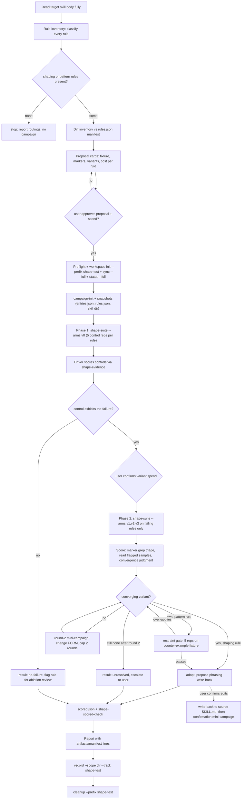

# Implementation Plan: Full-Campaign `shape-testing-skills`

Status: decisions confirmed with user (2026-09-13); revised after independent
review (2026-09-13); ready to implement.

Expands the simplified illustrative skill at
`docs/writing-skills/part-3/examples/skills/shape-testing-skills/SKILL.md`
(single-rule micro-test) into a full campaign skill that inventories and
tests **every** shaping rule in a target skill, following the harness CLI,
workspace-management, and restricted-agent mechanisms of
`skills/retrieval-testing-skills/`.

## Confirmed decisions

1. **Location**: new skill at `skills/shape-testing-skills/`. The docs
   example stays untouched — it is illustrative blog material.
2. **Context delivery**: on-disk variant swap + skill-tool load. Per-arm
   modified `SKILL.md` bytes are written into the sterile workspace; the
   eval agent loads the skill via the skill tool, exactly as production
   consumes it. (Rejected: prompt injection of "Project conventions" with
   an all-tools-denied agent.)
3. **Scope**: shaping + pattern rules. Pattern rules run the restraint-gate
   sub-track (counter-example fixture, +5 samples per gated variant, cap
   +10). Discipline/reference/technique rules are recorded in the manifest
   as excluded with a routing reason.
4. **Spend gating**: two-phase, gate on the control. Phase 1 runs 5 control
   reps per rule for ALL rules; only rules whose control exhibits the
   failure get a phase-2 variant run, after a second spend confirmation.

Post-review decisions (2026-09-13):

5. **Restraint-gate dispatch**: a `--fixture-key application|counter-example`
   flag on `shape-suite` (default `application`); the gate runs the winner
   arm against `fixtures.counter-example` from the same entries file.
   Pattern entries carry a `restraint_markers` dict for scoring the gate.
6. **gap/variation fixtures dropped from v1 scope** — the simplified skill
   marks them optional; the entries schema has `application` (always) and
   `counter-example` (pattern only), nothing else.
7. **Per-rule sample caps kept**: 30 samples per rule, 40 for pattern rules
   (restated from the simplified skill; see Spend model below).
8. **Existing rules only**: the campaign inventories and tests rules that
   exist in the skill body. Guidance not yet authored has no anchor span
   and is out of scope — use the simplified single-rule flow manually.

## The multi-rule attribution invariant

The simplified skill forbids testing two rules at once ("rules interact;
testing two at once makes attribution impossible"). The full campaign
licenses many rules per campaign with a stricter, mechanizable invariant:

> At any moment, the workspace skill differs from the intact skill by
> exactly **one** rule's section.

Consequence: **`shape-suite` serializes entries × arms strictly** — one
entry, one arm, one byte-state at a time; restore the original synced
bytes before the next arm. Only the 5 reps *within* one arm batch
parallelize (they share identical bytes, read-only). This differs from
`cmd_retrieval_suite`, which runs its two arms in parallel — the shape
track must NOT copy that structure.

## Deliverables

| Deliverable | Path | Mirrors |
|---|---|---|
| New campaign skill | `skills/shape-testing-skills/SKILL.md` | `skills/retrieval-testing-skills/SKILL.md` structure/conventions |
| Restricted eval agent | `skills/shape-testing-skills/agents/shape-evaluator.opencode.md` | retrieval evaluator agent (iron-law style) |
| Harness subcommands | `tools/test-harness/evaluator.py`: `shape-suite`, `shape-evidence`, `shape-scored-check`; extend `record` with a `shape-test` track | `retrieval-suite`, `retrieval-evidence`, `scored-check`, `record --scope dir` |
| Unit tests | `tools/test-harness/test_shape.py` (unittest, py310-safe) | `test_retrieval.py` |
| Workspace conventions | `<source-root>/skills-workspace/<skill>/shape-tests/` | `…/retrieval-tests/` |
| AGENTS.md tweak | one line in Project Layout (include shape track in test-harness description) — requires user confirmation per repo rules | — |

`workspace-manager.sh` and `strategies.py` need **no changes**:
`init/sync/status/campaign-init/cleanup` are reused with
`--prefix shape-test`, and the opencode strategy's `install()`/`execute()`
are already generic over agent base names.

## Conceptual mapping (retrieval track → shape track)

| Retrieval track | Shape track |
|---|---|
| Fact inventory (`facts.json`) | **Rule inventory** (`rules.json`): every body rule classified `shaping` / `pattern` / `discipline` / `reference` / `technique`; only shaping+pattern in scope; others recorded as `excluded` with a routing reason ("discipline → pressure-testing track"). Diff baseline, rebuilt fresh every campaign. |
| `queries.json` entries (id/query/expect) | **`entries.json`**: one entry per rule under test: verbatim `section` span (for variant swap), `fixtures` (`application` required; `counter-example` for pattern restraint gates — the simplified skill's optional gap/variation kinds are dropped from v1), `markers` (grep tokens for wrong *and* right shapes), `restraint_markers` (pattern entries only), `variants` (v1..v3, max 3; v0 control implicit = section omitted). |
| skill arm vs control arm (skill absent) | **v0 control = same body with the rule's section omitted**; v1–v3 = variant text swapped into that section. The control is the *absence of the rule*, not absence of the skill — so only **one** sterile workspace is needed, not two, and only **one** agent file (all arms load the skill). |
| rubric bullets scored from `answer_text` | marker grep triage over `answer_text` + **convergence judgment** across 5 reps; read every flagged sample by hand (grep is triage, not verdict) |
| `pass`/`fail`/`gap`/`void` + `findability`/`clarity` | `adopted` / `no-failure` (control clean → ablation flag) / `unresolved` (no convergence after 2 rounds) / `void` |
| mini-campaign re-runs, never recorded | round-2 mini-campaigns (changed FORM, cap 2) and post-write-back confirmation mini-campaigns, never recorded |
| 1 rep default, 120 s timeout | **5 reps per arm default**, 120 s timeout; abort with partial output → `void`, abort after a complete inline answer still scores |

## Spend model

Per rule, round 1: 5 control + 5 × variants (1–3) = 10–20 samples.
Round 2 (FORM change, cap 2 rounds) plus restraint gates fit under the
simplified skill's per-rule caps: **30 samples per rule, 40 for pattern
rules** (pattern: round 1 20 + gate +5/gated variant, cap +10, leaves
round-2 headroom). Proposal cards show the cost as a formula:
`5 + 5×variants per failing rule`, pattern `+5 per gated variant, cap +10`.

## Campaign flow



Phase 1/Phase 2 gating preserves the simplified skill's "control arm is
the stopping signal" rule across many rules without burning variant spend
on rules whose failure does not reproduce.

## File schemas

**`rules.json`** (persisted manifest, diff baseline — mirror of
`facts.json`):

```json
{
  "skill": "react-component-conventions",
  "generated": "2026-09-13",
  "rules": [
    {"id": "R-styling-01", "section": "Styling", "kind": "shaping",
     "statement": "styling lives in a co-located CSS module, never inline",
     "entries": ["css-modules-not-inline"]}
  ],
  "excluded": [
    {"id": "R-general-01", "section": "Workflow", "kind": "discipline",
     "reason": "compliance-cost rule — pressure-testing track, not shaping"}
  ]
}
```

Rule ids are section-anchored (`R-<section-slug>-<nn>`) so doc edits never
renumber other sections — same stability rule as fact ids.

**`entries.json`** (the `queries.json` analog):

```json
[
  {
    "id": "css-modules-not-inline",
    "rule": "R-styling-01",
    "kind": "shaping",
    "section": "## Styling\n\nComponents use css modules, never use inline styles",
    "fixtures": {
      "application": "Write a React component called `PriceTag` for our store UI.\n\n- Props: name (string), price (number), salePrice (optional number)\n- Shows the product name and price; when on sale, shows the old price struck through next to the sale price, plus a \"SALE\" badge\n- The badge turns a darker red on hover\n\nRespond with the complete file(s), each prefixed by its path."
    },
    "markers": {
      "inline_style": "style=\\{\\{",
      "hover_hack": "onMouseEnter|onMouseLeave",
      "css_module_import": "import styles from",
      "module_css_block": "\\.module\\.css"
    },
    "variants": {
      "v1": "Never use inline styles or `style` props.",
      "v2": "Every component ships as two files: `Name.tsx` and `Name.module.css`. All class names come from `import styles from './Name.module.css'`. Interactive states (hover, focus, active) are CSS pseudo-classes.",
      "v3": "Every component ships as two files: `Name.tsx` and `Name.module.css`. …unless a style is truly one-off."
    }
  }
]
```

Harness validation (all pre-spend, exact-message exit 1, mirroring
`load_retrieval_queries`): unique ids; `kind ∈ {shaping, pattern}`;
`fixtures.application` always present and the only other fixture key
allowed is `counter-example`, required exactly when `kind == "pattern"`;
`restraint_markers` (grep tokens for over-application) required exactly
when `kind == "pattern"`; 1–3 variants; marker dict non-empty; and —
critically — **`section` must appear verbatim exactly once in the synced
skill body** (the file with its frontmatter block removed; spans
overlapping frontmatter are never matched). Doc drift aborts before
spend. Because the span must exist, entries can only test rules already
in the skill — guidance not yet authored is out of scope by design.

**Campaign layout** (persistent, committed — same convention as
retrieval-tests):

```
skills-workspace/<skill>/shape-tests/
├── rules.json                     # inventory manifest (diff baseline)
├── entries.json                   # canonical entries
├── campaign-YYYY-MM-DD[-n]/
│   ├── entries.json  rules.json   # snapshots (plain cp, commands recorded)
│   ├── <skill>/                   # snapshot of verified synced skill dir
│   ├── results-control.json       # phase 1
│   ├── results-control.log
│   ├── entries-failing.json       # filtered entries driving phase 2
│   ├── results-variants.json      # phase 2
│   ├── results-variants.log
│   ├── results-restraint.json     # pattern restraint gates (if any)
│   ├── results-restraint.log
│   ├── scored.json
│   └── report.md
└── campaign-YYYY-MM-DD-2/         # mini-campaigns (round 2, confirmation):
                                   # second campaign-init dir + filtered
                                   # entries file; never recorded
```

## Harness CLI (exact commands)

```bash
# 1. preflight (no spend)
python3 --version                                    # >= 3.10
tools/test-harness/evaluator.py check --harness opencode

# 2. one sterile workspace (v0 is an arm, not a workspace)
WS=$(tools/test-harness/workspace-manager.sh init --prefix shape-test)
tools/test-harness/workspace-manager.sh sync   --skill <s> --source <root> --workspace $WS --full
tools/test-harness/workspace-manager.sh status --skill <s> --source <root> --workspace $WS --full
CAMP=$(tools/test-harness/workspace-manager.sh campaign-init \
         --root <root>/skills-workspace/<s>/shape-tests)

# 3. snapshots: entries.json, rules.json, and the synced skill dir (plain cp)

# 4. phase 1 — controls only, 5 reps/rule, arm-tagged progress lines
tools/test-harness/evaluator.py shape-suite --harness opencode --skill <s> \
  --agents-dir skills/shape-testing-skills/agents \
  --workspace $WS --entries <entries.json> \
  --arms v0 --out $CAMP/results-control.json \
  [--model m] [--variant v] [--reps 5] [--timeout 120]

# 5. driver scores controls via shape-evidence; user confirms variant spend

# 6. phase 2 — variants, failing rules only (filtered entries file)
tools/test-harness/evaluator.py shape-suite --harness opencode --skill <s> \
  --agents-dir skills/shape-testing-skills/agents \
  --workspace $WS --entries $CAMP/entries-failing.json \
  --arms v1,v2,v3 --out $CAMP/results-variants.json \
  [--model m] [--variant v] [--reps 5] [--timeout 120]

# 7. restraint gate (pattern rules, leading variant only): same entries
#    file, winner arm, counter-example fixture key, separate out file
tools/test-harness/evaluator.py shape-suite --harness opencode --skill <s> \
  --agents-dir skills/shape-testing-skills/agents \
  --workspace $WS --entries <entries.json> \
  --arms <winner> --fixture-key counter-example \
  --out $CAMP/results-restraint.json \
  [--model m] [--variant v] [--reps 5] [--timeout 120]

# 8. evidence + offline scoring (zero spend)
tools/test-harness/evaluator.py shape-evidence \
  --results $CAMP/results-variants.json [--entry <id>] [--arm vN]
tools/test-harness/evaluator.py shape-scored-check \
  --results $CAMP/results-control.json --results $CAMP/results-variants.json \
  --scored $CAMP/scored.json \
  [--adopted A --no-failure N --unresolved U --voids V]

# 9. record (completed full campaigns only) + cleanup
tools/test-harness/evaluator.py record --skill <s> --skill-path <skill dir> \
  --manifest <root>/skills-workspace/<s>/manifest.json \
  --scope dir --track shape-test --campaign <name> \
  --adopted A --no-failure N --unresolved U --voids V
tools/test-harness/workspace-manager.sh cleanup --workspace $WS --prefix shape-test
```

### `shape-suite` mechanics (on-disk swap)

Pre-spend gates (all exit 1 with an exact message before any harness
invocation, mirroring `cmd_retrieval_suite`): harness CLI on PATH; agent
file exists, frontmatter `name:` matches the base name, no
`model/variant/temperature/top_p` pins; the skill is synced in the
workspace (`$WS/.agents/skills/<s>/` present); entries-file validation
(schema above, including the verbatim section-span assertion against the
synced body); `--fixture-key` is `application` or `counter-example` and
the keyed fixture exists on every selected entry; `--arms` parses to a
subset of `{v0} ∪ variants`; `--reps`/`--timeout` ≥ 1; out directory
exists.

Then, **strictly serially** per entry, per selected arm (the multi-rule
attribution invariant above — never the retrieval track's arm-parallel
structure):

1. Reads the synced `$WS/.agents/skills/<s>/SKILL.md` bytes and splits
   them into frontmatter block + body.
2. Asserts the entry's `section` span appears **verbatim exactly once**
   in the body (doc drift → exit 1 pre-spend).
3. Rewrites the workspace copy (frontmatter preserved byte-for-byte):
   v0 = span removed **together with exactly one following blank line**
   (the byte-exactness spec the unit tests assert); vN = span replaced by
   the variant text. Verifies the rewrite before dispatching.
4. Runs 5 reps — smoke rep first, then `ThreadPoolExecutor` batches of at
   most `MAX_WORKERS = 10` — with arm-tagged progress lines
   (`[ v0 ]`…`[ v3 ]`). The per-run prompt is the **bare fixture text**
   keyed by `--fixture-key` (never rule text, markers, or expected
   shape). `skill=` is passed to the strategy for **every** arm so
   load-signal detection works on all arms.
5. Restores the original synced bytes before the next arm, and on abort.

The campaign snapshot of the *verified* synced skill dir is taken at
setup, before any arm rewriting — the recorded checksum (via the existing
`hash_skill_dir`) therefore reflects the unmodified source, with per-arm
variant text pinned by the snapshotted `entries.json`. The setup-time
`status --full` gate is unchanged.

**Results JSON**: entries mirror the retrieval shape but keyed by arm —
`entry.arms = {"v0": {"runs": [...]}, "v1": {"runs": [...]}, …}`. The
results `config` block mirrors retrieval's — `skill`, `harness`, `model`,
`variant`, `reps`, `timeout`, `date`, entries-file path — so every run is
attributable to the exact model selection that produced it (model sweeps
stay honest), plus the entry's `markers`/`restraint_markers` so
`shape-evidence` can triage without re-reading the entries file. Run records reuse `build_run_record`'s fields plus
`"arm": "v0"…`, with the builder **adapted, not reused as-is**: its
`skill-not-loaded` / `control-loaded-skill` signals are keyed on the
retrieval arm names, so the shape track generalizes it —
`skill-not-loaded` fires for every shape arm whose run lacks a completed
load (`control-loaded-skill` does not exist on this track). Void signals:
`skill-not-loaded`, `empty-answer`, `read-outside-workspace`. `timeout`
stays a separate boolean field as in the retrieval schema — it is NOT a
void signal: an abort after a complete inline answer still scores; abort
+ partial/empty output is caught by `empty-answer` plus driver judgment.
No `git status` contamination check — the permission layer enforces
read-only, same as the retrieval track's retired check.

### `record` extension

`--track` (default `retrieval-test`, back-compatible) selects the manifest
key and count vocabulary; shape manifests become:

```json
{"skill": "…", "shape-test": {"date": "…", "checksum": "sha256:…",
 "adopted": 2, "no-failure": 1, "unresolved": 0, "voids": 0,
 "campaign": "campaign-2026-09-13"}}
```

## Eval agent

Exactly one file: `skills/shape-testing-skills/agents/shape-evaluator.opencode.md`.
No separate control agent is needed, because the v0 control (rule's
section omitted) is still the *skill being loaded*, just with different
bytes — all four arms run under one agent.

- **Frontmatter**: identical permission profile to the retrieval
  evaluator — `skill: allow`, `read`/`grep`/`glob`/`list: allow`,
  `edit`/`bash`/`task`/`todowrite`/`webfetch`/`websearch`/`question`/
  `external_directory: deny`, `mode: primary`, `steps: 30`. No model pins
  (the installer asserts this pre-spend; `--model`/`--variant` are the only
  selection path).
- **Body**: the pressure-tested retrieval-agent skeleton (iron law, red
  flags, rationalization table) with two adaptations: the load-first rule
  names `{{SKILL_NAME}}` (substituted at install), and the red flags
  target *convention hunting* ("the repo must have a real component
  template / house style somewhere — I'll look") rather than fact hunting.
  Inline-artifact output rules come from the simplified skill's subagent
  prompt ("each file as a fenced code block prefixed by its path; end the
  turn after the artifact").

A **calibration pilot** (one rule from `writing-skills`, per the blog's
example) runs before the first real campaign to pressure-test the agent
file, exactly as the retrieval agent needed two bulletproofing rounds
(10/17 → 0/17 voids).

## Scoring artifacts

- **`shape-evidence --results … [--entry id] [--arm vN]`**: prints per
  entry/arm/rep the answer text, void signals, session id, and **marker
  triage counts** (markers carried from the snapshotted entries into the
  results config). Triage only — the driver reads every flagged sample by
  hand and judges **convergence across the 5 reps**, per the simplified
  skill's adoption rule (ties → shorter phrasing). For pattern rules the
  v0-vs-winner property-frequency comparison is the primary detector, not
  a sanity gate.
- **Adoption discipline** (driver rules, documented in the skill —
  restated from the simplified skill): a prohibition arm is a measurement
  instrument, never a candidate — `adopted` may only name a recipe /
  structural arm even when a prohibition suppresses the banned token;
  ties go to the shorter phrasing; a pattern-rule variant is adoptable
  only after passing the restraint gate.
- **`scored.json`** per entry: `id`, `kind` (`shaping` | `pattern` —
  carried so the check can enforce gate rules without reading the entries
  file), `result ∈ {adopted, no-failure, unresolved, void}`;
  `adopted_arm` required iff `adopted`; `restraint_gate ∈ {pass, fail}`
  required exactly when `kind == "pattern"` and `result == "adopted"`;
  per-arm marker counts; notes.
- **`shape-scored-check --results … [--results …] --scored …`**: accepts
  the phase result files as repeated `--results` flags (one file for a
  phase-1-only campaign). Entry-id coverage is **union with dedupe**: an
  id appearing in N result files is still scored exactly once, and every
  union id must be covered. Beyond schema: `adopted_arm` must name a
  non-v0 arm key present in that entry's results, the `restraint_gate`
  rule above, and the
  `--adopted/--no-failure/--unresolved/--voids` count gate (all four
  together, matching the report summary) before `record`.

## Report format (multi-rule)

The simplified skill's single-rule report becomes a campaign report: one
header, one per-rule block, then campaign-level sections:

    shape test: react-component-conventions — 2026-09-13
    entries: skills-workspace/<skill>/shape-tests/entries.json (4 rules)
    artifacts: <source-root>/skills-workspace/<skill>/shape-tests/campaign-YYYY-MM-DD[-n]/
    manifest: recorded (sha256:…, A adopted / N no-failure / U unresolved / V void)

    ## css-modules-not-inline (shaping) — adopted v2
    arm              inline-style  hover-hack  css-module  shape across 5 reps
    V0 control       4/5           2/5         1/5         noisy — failure exists
    V1 prohibition   1/5           4/5         1/5         displaced, not fixed (measurement only)
    V2 recipe        0/5           0/5         5/5         converged → ADOPT
    notes: …
    write-back: replace the Styling section of <skill>/SKILL.md with the
    V2 text from entries.json [awaiting user confirmation]

    ## <pattern-rule-id> (pattern) — adopted v2, restraint gate pass
    …(same table, plus gate line: counter-example 5 reps, over-application 0/5)

    no-failure (ablation review):
    <rule-id> — control never exhibited the failure; re-check next campaign.

    unresolved:
    <rule-id> — no convergence after 2 rounds; escalate (restructure or
    mechanical enforcement instead of prose).

    summary: 2 adopted / 1 no-failure / 1 unresolved / 0 void (4 rules)

`manifest:` reads `not recorded (aborted)` or `not recorded
(mini-campaign)` on those paths — only a completed full campaign is
recorded.

## Final workflow (skill's numbered steps)

1. Inputs: skill name-or-path → source root; harness (user-specified, no
   default); model/variant (optional `--model`/`--variant` passthroughs —
   the only selection path, since the eval agent pins no model config and
   the installer asserts that pre-spend); reps (5); timeout (120). Run
   with the model that will consume the skill in production, at default
   temperature; re-check adopted phrasings on model upgrades via the
   ablation track.
2. Read the skill body fully; build the **rule inventory** fresh; classify
   every rule; diff against `rules.json` (new → propose entries; changed →
   flag re-test; deleted → propose pruning). No shaping/pattern rules →
   stop, report routings.
3. Present **proposal cards** (one per entry: covered rule, classification
   confirmation, full fixture text, markers (and `restraint_markers` for
   pattern entries), variant texts, `why:` line, cost formula
   `5 + 5×variants per failing rule`, pattern `+5 per gated variant cap
   +10`, per-rule cap 30 / 40 pattern) — user approves.
4. Preflight: `python3 >= 3.10`; `evaluator.py check --harness`.
5. `workspace-manager.sh init --prefix shape-test` (one workspace);
   `sync --full`; `status --full`.
6. `campaign-init --root <root>/skills-workspace/<s>/shape-tests`;
   snapshot `entries.json`, `rules.json`, synced skill dir (record the
   exact `cp` commands).
7. **Spend confirmation #1**: rules × 5 control reps.
8. `shape-suite --arms v0 --out $CAMP/results-control.json`.
9. Score controls via `shape-evidence`. Rules with no control failure →
   `no-failure` + ablation flag; **stop those rules, author nothing**.
10. **Spend confirmation #2**: failing rules × variants (1–3) × 5 reps.
11. `shape-suite --arms v1,v2,v3 --entries $CAMP/entries-failing.json
    --out $CAMP/results-variants.json`.
12. Score: marker triage → hand-read flagged samples → convergence verdict
    per rule. Pattern-rule winners: restraint gate (`shape-suite --arms
    <winner> --fixture-key counter-example --out results-restraint.json`,
    5 reps, scored against `restraint_markers`); a variant that
    over-applies is disqualified, gate the next-best converging variant
    the same way. Adoption discipline applies: prohibition arms are never
    adoptable; ties go to the shorter phrasing.
13. Non-converging rules → round-2 mini-campaign (changed FORM, new
    entries file, second campaign dir, **never recorded**), cap 2 rounds →
    else `unresolved`, escalate.
14. `scored.json` → `shape-scored-check` with counts.
15. Report (multi-rule format above: per-rule blocks with per-arm tables,
    no-failure/unresolved sections, `artifacts:`/`manifest:` lines, and a
    write-back section per adopted rule).
16. `record --scope dir --track shape-test --adopted … --no-failure …
    --unresolved … --voids …` — completed full campaigns only.
17. Write-backs to the source `SKILL.md` only on explicit confirmation;
    confirmation mini-campaign afterwards.
18. `cleanup --workspace $WS --prefix shape-test`.

## Phased implementation

Six phases, executed in order. **Each phase has a verification gate that
must pass before the next phase begins** — a failed gate means fix and
re-verify within the phase, never carry a defect forward.

| # | Phase | Gate (must pass to proceed) |
|---|---|---|
| 1 | Harness subcommands | existing test suite green; pre-spend exit paths exercised |
| 2 | Unit tests | full unittest discovery green, incl. new `test_shape.py` |
| 3 | Eval agent + calibration pilot | pilot campaign completes with 0 void runs |
| 4 | SKILL.md | house-convention checks + no-spend workflow walkthrough |
| 5 | Audits | flake8 / ruff / black / pyright / unittest all exit 0 |
| 6 | AGENTS.md | user confirms the diff |

### Phase 1 — Harness subcommands (`evaluator.py`)

Work: `shape-suite`, `shape-evidence`, `shape-scored-check`, and
`record --track` (default `retrieval-test`, back-compatible).
`shape-suite` reuses the smoke-rep-then-parallel-rep-batches pattern at
the **rep level only** — entries × arms are strictly serialized (the
attribution invariant; NOT retrieval's arm-parallel structure) — and
adapts `build_run_record` so `skill=` is passed and `skill-not-loaded`
fires for every arm. `run_records_batch` itself is not reusable as-is
(it reads `args.queries` and file-staged fixtures); write the shape
equivalent following its structure. `--model`/`--variant` are forwarded
by the existing strategy `execute()` — verify, don't rebuild.

Verification gate (no spend):

- `uv run python -m unittest discover tools/test-harness` — all existing
  tests still pass (no regressions in trigger/retrieval tracks).
- `uv run pyright tools/test-harness/evaluator.py` — clean.
- Exercise every new pre-spend exit path by hand against synthetic
  fixtures under `/tmp`: a synced workspace + entries file with (a) a
  section span not present in the body, (b) a span occurring twice,
  (c) a pattern entry missing `counter-example`/`restraint_markers`,
  (d) `--fixture-key counter-example` on a shaping entry, (e) an
  agent file with a model pin — each must exit 1 with its exact message
  before any harness invocation.
- `record --track` omission still writes a `retrieval-test` key
  (back-compat), verified against a throwaway manifest copy.

### Phase 2 — Unit tests (`test_shape.py`)

Work: unittest suite, py310-safe grammar (black targets py310): entries
validation (schema, verbatim section-span against a body with
frontmatter stripped, pattern counter-example + `restraint_markers`
pairing, variant caps, `--fixture-key` validation), arm byte-assembly
exactness (v0 removes the span plus exactly one following blank line;
vN replaces it; frontmatter bytes preserved), serialization order,
`shape-scored-check` rules (multi-`--results` union-dedupe,
`adopted_arm`/gate rules, count gate), `record --track shape-test`,
results-config model/variant recording.

Verification gate:

- `uv run python -m unittest discover tools/test-harness` — full suite
  green, new tests included; the repo's py310 grammar guard test passes.

### Phase 3 — Eval agent + calibration pilot

Work: author `skills/shape-testing-skills/agents/shape-evaluator.opencode.md`
(retrieval-evaluator permission profile and iron-law skeleton, adapted
to convention-hunting). Then run a **calibration pilot**: one shaping
rule from `writing-skills`, full two-phase flow (control gate, then
variants if the control fails), exercising `shape-suite`,
`shape-evidence`, and `shape-scored-check` end-to-end. The pilot is a
calibration run — never recorded in any manifest. Bulletproof the agent
body between pilot rounds, exactly as the retrieval agent needed two
rounds (10/17 → 0/17 voids).

Verification gate:

- The agent installs cleanly through the `shape-suite` pre-spend checks
  (frontmatter name match, no model pins).
- A full pilot pass completes with **0 void runs** (no `skill-not-loaded`,
  no `empty-answer`, no `read-outside-workspace`, no timeout-partials);
  if any void appears, pressure-test the agent body and re-run until a
  full pass is clean.
- `shape-scored-check` exits 0 on the pilot's `scored.json`; the pilot
  report shows per-arm marker counts and a convergence verdict.

### Phase 4 — `SKILL.md`

Work: author `skills/shape-testing-skills/SKILL.md` per the house
conventions (frontmatter: `disable-model-invocation: true`, slash
`true`, autoinvoke `false`), encoding the 18-step workflow, schemas,
report format, gotchas, and checklist from this plan.

Verification gate (no spend):

- Frontmatter fields present and valued per convention; no line-number
  references anywhere (repo rule); any mermaid diagram validated with
  `mermaidx`.
- Review pass against the `writing-skills` skill's own conventions.
- Dry walkthrough of the workflow on a real target skill (e.g.
  `writing-skills` itself) through inputs → rule inventory → proposal
  cards → preflight — stopping before any spend — confirming the skill
  text is executable as written.

### Phase 5 — Audits

Verification gate (all exit 0):

```bash
uv run flake8 tools/test-harness/
uv run ruff check tools/test-harness/
uv run black --check tools/test-harness/
uv run pyright tools/test-harness/
uv run python -m unittest discover tools/test-harness
```

### Phase 6 — AGENTS.md

Work: one-line Project Layout update (include the shape track in the
test-harness description).

Verification gate: **explicit user confirmation of the diff before
editing** (repo rule), then the change lands exactly as confirmed.
