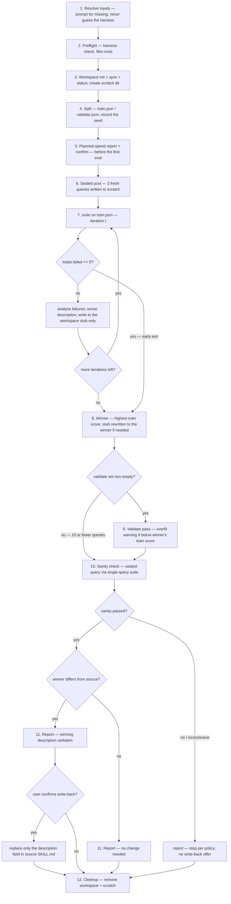

# Trigger Testing Skills

## Overview

Run a trigger-test campaign for one skill: split its query set into train/validate, run headless eval reps against a sterile temp workspace, iteratively revise the description (workspace stub only), validate once against the winner, sanity-check with a sealed fresh query, and write the winning description back to the source only after the user confirms. Triggering is non-deterministic, so the measurement is always the Wilson-lower-bound score over repeated runs, never a single run.

The skill contributes judgment only. Looping, counting, splitting, and scoring all live in the scripts in this skill's `scripts/` directory (`evaluator.py`, `workspace-manager.sh`); invoke them by their path inside this skill directory, independent of the current working directory. Consume only exit codes and JSON files — never parse prose stdout. Single-query testing for manual debugging remains available via `evaluator.py run` (see `run --help`).

## Inputs

Collect all inputs before starting. Prompt the user for any required one that is missing.

- **Skill** (required) — the skill under test, as a name or a path. Resolve a name via the driving session's skill-registry metadata (which exposes each registered skill's file location), falling back to `./skills/<name>/SKILL.md`; a path points at the skill dir (or its `SKILL.md`) directly. A skill registered as built-in has no filesystem location and cannot be tested — surface that and stop. Derive the **source root** from the resolved location: the directory containing that `skills/` directory, for every layout (for `<root>/.opencode/skills/<name>`, the source root is `<root>/.opencode`, so artifacts live at `<root>/.opencode/skills-workspace/`). If the resolved skill is not under a directory named `skills/`, no source root can be derived — stop and surface that.
- **Harness** (required) — e.g. `opencode`. The user MUST specify it; if missing, ask. Never auto-detect installed harnesses.
- **model / variant** (optional) — passed to eval executions only. The campaign-driving model is the session's current model.
- **reps** (default 3), **timeout** (default 30s), **max-iterations** (default 3; hard cap 3 — clamp a higher requested value to 3 and tell the user), **train-frac** (default 0.6), **seed** (optional).
- **queries path** (default `<source-root>/skills-workspace/<skill>/trigger-tests/queries.json`; create `skills-workspace/` there if missing).

## Campaign scratch

Create a scratch dir outside the eval workspace (`mktemp -d /tmp/trigger-test-campaign.XXXXXXXXXX`) to hold the split files, per-round result JSON, and the sealed pool. Keeping these out of the temp workspace preserves the sterile testbed — a wandering eval run must not discover the query file with its labels or the sealed pool. Remove the scratch dir at cleanup, with the same path-prefix paranoia as workspace-manager: only ever `rm -rf` a path matching `/tmp/trigger-test-campaign.*`.

## Workflow

The flow at a glance:



1. **Resolve inputs.** Prompt for missing required ones. Never guess the harness.
2. **Preflight** (no spend):
   a. Resolve the Python interpreter (`python3`, else `python`, on PATH; must be >= 3.10) and use it for every script invocation. Then run `evaluator.py check --harness <harness>`; on failure, stop and surface the exact message.
   b. Resolve the target skill (registry-metadata location for names, else explicit path); its `SKILL.md` must exist, else stop. Derive the source root from its location and create `<source-root>/skills-workspace/<skill>/trigger-tests/` if missing.
   c. The queries file must exist; else **offer to generate** an initial set per the query-design conventions below — the user reviews and approves before anything is saved.
3. **Workspace.** `workspace-manager.sh init` → `sync --skill <skill> --source <source-root> --workspace <ws>` → `status` (must pass before any eval). Create the scratch dir.
4. **Split.** `evaluator.py split --queries <queries> --out-dir <scratch> [--train-frac f] [--seed s]`. Record the seed from `<scratch>/split.json`.
5. **Planned spend.** Report the planned maximum spend (`train_size × reps × max-iterations + validate_size × reps + reps` sanity), with the train/validate sizes read from `<scratch>/split.json`, and ask the user to proceed. This is the last confirmation before the first eval; everything before it is token-free local scripting.
6. **Sealed pool.** Generate 3 fresh should-trigger queries per the query-design conventions below; they must be self-contained by construction. Write them to `<scratch>/sealed-pool.json`. They are never shown to the optimization loop and never used for training.
7. **Iteration loop** (`i = 1..max-iterations`):
   a. `evaluator.py suite --harness <h> --skill <s> --workspace <ws> --queries <scratch>/train.json --out <scratch>/iter-<i>-train.json [--model m] [--variant v] --reps r --timeout t`. On exit 1: abort the campaign (see "Error handling").
   b. Read the result JSON. Record `{iteration, description, train score}` in context, where `description` is the one this iteration's suite evaluated — the source description for iteration 1, otherwise the revision written at the end of the previous iteration. If `totals.score` is null (all runs void): abort as broken conditions (see "Error handling"). Otherwise, if `totals.failed == 0`: **early exit** — a perfect train round ends the loop immediately.
   c. Otherwise analyze failures (below), revise the description (guardrails below), and write the revision **to the workspace stub only**.
8. **Winner selection.** Highest `totals.score` across iterations; ties go to the earlier iteration. If the winner is not the current stub contents, rewrite the stub to the winner's description before continuing.
9. **Validate pass** (skipped when `validate.json` is empty — the <= 10 queries case): `suite --queries <scratch>/validate.json --out <scratch>/validate-results.json`. If the validate score is below the winner's train score, flag an **overfit warning** in the report (informational only; no restart, no automatic action). An all-void validate pass aborts the campaign like a train round.
10. **Sanity check.** Take the first entry of the sealed pool, write it as a single-query file `<scratch>/sanity.json` (`[{"query": ..., "shouldTrigger": true}]`), run `suite --queries <scratch>/sanity.json --out <scratch>/sanity-results.json`. Pass = `triggered` observed in >= 60% of non-void runs; all-void = inconclusive (reported as such, not failed). On failure: stop — report the failure, offer no write-back, never restart the loop, never train on sealed-pool queries. The user decides what to do next.
11. **Report and write-back.** Present the report (below), including the winning description verbatim. If the winner differs from the source description and the sanity check passed, ask the user to confirm applying it; on confirmation, replace only the `description` field in the source SKILL.md (at its resolved location) frontmatter, preserving every other field and the body byte-for-byte. If the winner IS the original description, report that no change is needed (no write-back offer).
12. **Cleanup.** On completion (pass or fail): `workspace-manager.sh cleanup --workspace <ws>` and remove the scratch dir. On abort/error: keep both and print their paths for debugging.

### Query-design conventions (for generated query sets and the sealed pool)

Vary should-trigger queries across coverage axes: phrasing formality ("write a PRD" vs. "draft the requirements doc"), explicitness (names the domain vs. describes a need without naming the skill), detail level (bare one-liner vs. buried in a long message), and complexity (single-step vs. one link in a larger chain). Make them substantive enough that the skill would genuinely help — a bare trivial ask may never trigger any description. Make them realistic: real-looking file paths and names, personal stakes and backstory, concrete details, casual register. For negatives, aim for near-misses that share the skill's vocabulary but ask for something else; reject zero-overlap weak negatives — a pass against them proves nothing. Generated queries must be self-contained by construction (no references to files or context that don't exist in a bare workspace).

### Failure analysis

Check the `timeouts` counts **before** analyzing failures: under the restricted evaluator agent, toil-driven timeouts are structurally impossible, so a cluster of `timeouts` (passes resting on interrupted-run intent, or voids) points at infrastructure — slow provider, step cap — not the description. Investigate conditions (or raise `--timeout`) instead of revising the description on that evidence.

Apply these categories to the reasoning captured in the suite JSON:

| Failure | Likely cause | Action |
|---------|-------------|--------|
| Should-trigger query didn't fire | description too narrow | broaden scope or add context about when the skill is useful |
| Should-not query false-triggered | description too broad | add specificity about what the skill does NOT do; clarify boundary with adjacent skills |
| Same query fails repeatedly after tweaks | local minimum | structurally reframe the description (change the skeleton, not the adjectives) |

Eval agents see frontmatter-only stubs, never the skill body, so a body/label conflict cannot explain failures under this harness. If a should-not query false-triggers across structurally different framings, suspect the setup (wrong skill stubbed, contaminated workspace) and surface it to the user instead of iterating.

**Suspect-query flag.** A should-trigger query that fails under *every* candidate description across *every* iteration is probably a query-side problem — bad label, a statement that asks for nothing, or dependence on context the bare workspace lacks — not a description problem. Flag such queries in the report (with the per-query `timeouts` count as corroboration) and recommend the user prune or rewrite them in queries.json. Never contort the description to chase a query with this signature; never rewrite the query or fabricate workspace files for it.

**Revision guardrails.** Fix the category, not the query; never paste failed-query keywords into the description. Imperative phrasing; user intent over implementation; err pushy; keep it concise (1024-char hard cap); never first person. When word swaps stall, change the sentence skeleton, not the adjectives.

### Description revision mechanics

The stub is tiny, so revisions rewrite the whole stub file: frontmatter with the same `name` (and any other pre-existing fields) and the revised `description`, no body. Never edit the source file during the loop, so `workspace-manager.sh status` would correctly report "out of date" mid-campaign — `status` runs only once, right after the initial `sync`.

## Report format

```
campaign: writing-skills   harness: opencode   model: <m>   variant: <v>
train: 9 queries   validate: 7 queries   reps: 3   seed: 42   iterations run: 2 of 3

iter 1: train score 0.593  (16 pass / 8 fail / 3 void)
        failure categories: mostly too-narrow (implicit asks); one local minimum
iter 2: train score 0.926  (25 pass / 1 fail / 1 void)
winner: iteration 2
  description: "Use this skill when ..."
validate: score 0.810  (17 pass / 2 fail / 2 void)   [overfit warning if below train]
sanity: "<sealed query>" -> triggered 3/3 -> pass
suspect queries: "turn this outline into a skill" — failed under all candidates in
  all iterations (timeouts: 2); likely query-side, consider pruning or rewriting

The winning description differs from the source. Apply it to
skills/writing-skills/SKILL.md? [awaiting confirmation]
```

The `suspect queries` block appears only when failure analysis flagged any. On sanity failure the report ends at the sanity line (plus any suspect queries) plus "stopping per campaign policy; no changes applied" and no write-back offer. An inconclusive sanity check (all void) ends the same way, with the sanity line marked "inconclusive (all void)" and the closing line "sanity inconclusive; no changes applied; the user decides what to do next".

## Error handling

- `check` failure → stop in preflight, surface the exact message.
- Evaluator agent install failure (missing source asset, workspace not writable) → the script exits 1 before any spend; surface the message and stop.
- An opencode "agent not found / falling back to default agent" warning on stderr → the tooling raises `HarnessExecutionError`: the suite aborts and no JSON is written (a run under the wrong agent is contamination, not data). Treat as a campaign abort.
- `split` / query-file validation failure → stop before spend, surface the message.
- `suite` exit 1 (harness execution failure, e.g. provider 429) → abort the campaign: surface the stderr error, keep workspace and scratch, print their paths, apply nothing. No retries.
- Suite totals with 0 scored runs (all void) → broken conditions: abort as above (a campaign of timeouts measures nothing). Applies to train rounds and the validate pass alike, and is checked before the zero-failures early exit; the sanity check is the only exception (all-void = inconclusive).
- Sanity inconclusive (all void) → reported as inconclusive; not a pass, not a restart; the user decides.

## Gotchas

- The harness is always user-specified; never infer it from the environment.
- Eval reps run under the restricted `trigger-evaluator` agent, installed into each workspace by the evaluator itself; never run reps as the default agent and never re-add `--auto`.
- A `triggered` verdict resting on interrupted-run intent (`timeout: true`) is a pass but weaker evidence; check the `timeouts` counts before trusting a score.
- Revisions touch the workspace stub only; the source file changes only on confirmed write-back at the end.
- Never restart the loop after a sanity failure; never train on sealed-pool queries.
- Never fabricate workspace files for a query, and never rewrite a query to make it pass — a query that fails under every candidate is flagged as suspect in the report, not fixed mid-campaign.
- The validate set runs once, at the end, against the winner; it is not part of the optimization loop.
- Keep queries verbatim across the whole campaign; editing mid-campaign invalidates comparisons.
- Early exit only on a perfect train round; never on a "good enough" majority.

## Checklist

- [ ] Harness explicitly specified by the user; `check` passed before any spend
- [ ] Evaluator agent installed per workspace by `run`/`suite` (strategy.install); an agent-fallback warning aborts, never runs under the default agent
- [ ] Planned-spend report confirmed by the user
- [ ] Workspace synced and `status` clean before the first suite run
- [ ] Split seed recorded; sealed pool written before iteration 1
- [ ] Every suite run's JSON read from `--out`; no prose parsing
- [ ] Early exit only on zero train failures; max 3 iterations
- [ ] Winner = highest train score; stub matches winner before validate/sanity
- [ ] Validate once; overfit warning if below winner's train score
- [ ] Sanity via single-query suite; failure stops with no write-back offer
- [ ] Suspect queries (failed under every candidate in every iteration) flagged in the report
- [ ] Write-back only after explicit user confirmation
- [ ] Workspace + scratch removed on completion; kept and reported on abort
